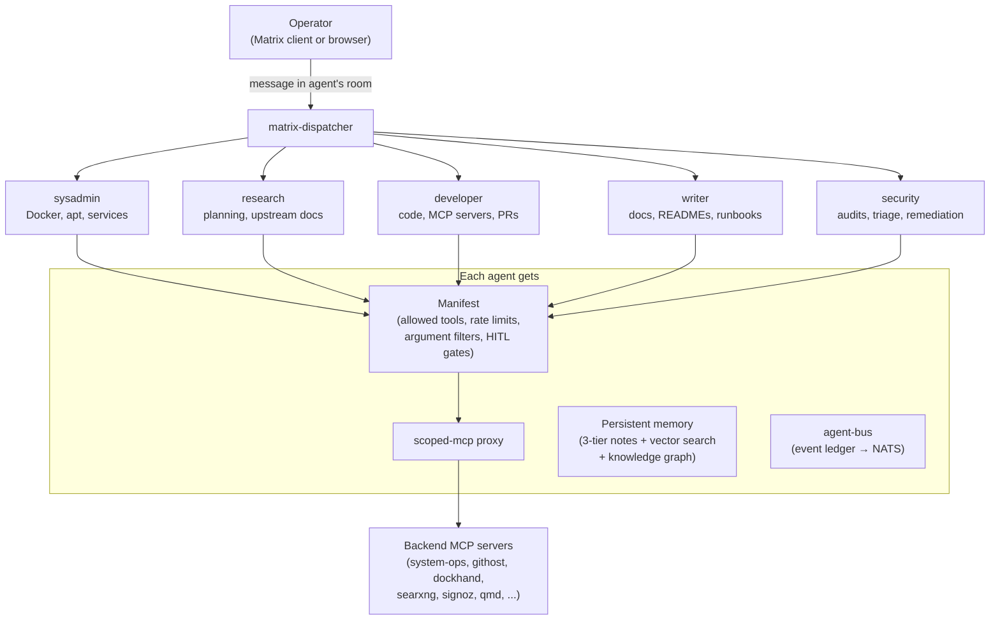

# homelab-agent

[](LICENSE)
[](https://claude.ai)
[](https://claude.ai/code)


A platform for running a team of AI agents on a single server. Five agents — sysadmin, developer, researcher, writer, security — work semi-autonomously or fully unattended, coordinating through a task queue and communicating over Matrix. Each agent gets a scoped tool surface controlled by a manifest, persistent multi-tier memory backed by open-source infrastructure ([Milvus](docs/components/memory/memory-stack.md) for vector search, [OpenSearch](docs/components/memory/memory-stack.md) for full-text, [Neo4j](docs/components/memory/graphiti.md) for knowledge graph), and an event ledger that tracks every cross-agent handoff.

The agents build the platform. Research plans a feature, developer writes the code, writer documents it, security audits the result — then the new tool becomes available to the agents that built it. [searxng-mcp](https://github.com/TadMSTR/searxng-mcp), [scoped-mcp](https://github.com/TadMSTR/scoped-mcp), and [githost-mcp](https://github.com/TadMSTR/githost-mcp) were all built this way.

This repo documents every piece of that stack and the decisions behind it. Use it as a reference to build your own.

The host is **forge** — a [Minisforum MS-A2](https://www.minisforum.com/product/ms-a2/) running Debian 13 with 60+ containers and 30+ PM2 background services.

> The earlier claudebox-era build is archived at tag `archive/claudebox-v1`.

---

## Start Here

Three entry points depending on what you're after.

**Building your own?** Read this page for the architecture, then follow [`docs/phases/`](docs/phases/) in order — each phase doc explains what was deployed, why, and what went wrong. The Docker stacks in [`docker/`](docker/) have `.env.example` files ready to copy.

**Operating or extending an existing setup?** Jump straight to [`docs/components/`](docs/components/) — 76 per-service docs covering config, ports, dependencies, health checks, and restart procedures.

**Wiring up agents?** Start with [AGENTS.md](AGENTS.md) for the agent roster and tool scoping model, then look at the sanitized manifests in [`manifests/`](manifests/) and Claude Code project configs in [`claude-code/`](claude-code/).

---

## Architecture

Three layers, each independently useful. You can run just the Docker services without agents, or add agents later.

```
┌────────────────────────────────────────────────────────────────┐
│  Layer 3: Multi-Agent Claude Code Engine                       │
│  5 resident agents · scoped-mcp · Matrix dispatch             │
│  agent-bus · memory pipeline · knowledge graph                 │
├────────────────────────────────────────────────────────────────┤
│  Layer 2: Docker Service Stack (60+ containers, 22 stacks)     │
│  SWAG/Authentik · Ollama (NVIDIA GPU) · Langfuse · SigNoz      │
│  Synapse · SearXNG · Milvus · Graphiti · Temporal · NATS       │
├────────────────────────────────────────────────────────────────┤
│  Layer 1: Host                                                 │
│  Minisforum MS-A2 · AMD Ryzen 9 9955HX (16c/32t) · 96 GB      │
│  NVIDIA RTX 2000 Ada · 5.4 TB NVMe · Debian 13 trixie         │
└────────────────────────────────────────────────────────────────┘
```

### Layer 1 — Host

| | |
|-|-|
| **Machine** | Minisforum MS-A2 |
| **CPU** | AMD Ryzen 9 9955HX — 16 cores / 32 threads |
| **RAM** | 96 GB DDR5 |
| **Storage** | 1.8 TB + 3.6 TB NVMe (Btrfs) |
| **GPU** | NVIDIA RTX 2000 Ada (Ollama inference) + AMD iGPU (Grafana rendering) |
| **OS** | Debian 13 trixie |

### Layer 2 — Docker Services

60+ containers across 22 compose stacks. Full per-service documentation is in [`docs/components/`](docs/components/README.md).

| Category | Key Services | Count |
|----------|-------------|-------|
| **Foundation** | [SWAG](docs/components/foundation/swag.md) (reverse proxy + SSL), [Authentik](docs/components/foundation/authentik.md) (SSO), [Vault](docs/components/foundation/vault.md) (secrets) | 5 |
| **Observability** | [Grafana](docs/components/observability/grafana-alloy.md) + Loki + Alloy, [SigNoz](docs/components/observability/signoz.md) (APM), [Langfuse](docs/components/observability/langfuse.md) (LLM traces) | 13 |
| **AI & Search** | [Ollama](docs/components/ai-search/ollama.md) (local inference), [SearXNG](docs/components/ai-search/searxng.md), [Firecrawl](docs/components/ai-search/firecrawl.md), [Reranker](docs/components/ai-search/reranker.md) | 10 |
| **Memory** | [Milvus](docs/components/memory/memory-stack.md) (vector), [OpenSearch](docs/components/memory/memory-stack.md) (full-text), [Graphiti + Neo4j](docs/components/memory/graphiti.md) (knowledge graph) | 8 |
| **Agent Infra** | [Synapse](docs/components/agent/synapse.md) (Matrix), [NATS](docs/components/agent/nats.md) (event bus), [task-queue-mcp](docs/components/agent/task-queue-mcp.md) | 13 |
| **CI/CD** | [Woodpecker CI](docs/components/cicd/woodpecker.md), [Temporal](docs/components/cicd/temporal.md) (workflow engine) | 6 |

Deployment order and stack dependencies are documented in [`docker/README.md`](docker/README.md).

### Layer 3 — Multi-Agent Engine

This is the part that ties everything together. Five resident agents run as scoped Claude Code projects, each with a dedicated Matrix room and a manifest-controlled tool surface.



**How it works:**

- **[scoped-mcp](docs/components/agent/scoped-mcp.md)** reads each agent's manifest and proxies only the allowed tools. Agents never see credentials — secrets are injected from Vault at proxy level. Rate limits, argument filters, and response redaction are enforced per-agent.

- **[Matrix dispatch](docs/components/agent/matrix-dispatcher.md)** polls each agent's room for operator messages and routes them into the right Claude Code project. Send a message from any Matrix client; the agent picks it up and replies in-thread.

- **[Persistent memory](docs/components/memory/memory-architecture.md)** — a three-tier system (session → working → distilled) with four search paths: hybrid vector+BM25 via [memsearch](docs/components/memory/memsearch.md), full-text keyword via [OpenSearch](docs/components/memory/memory-stack.md), structured metadata queries, and a temporal [knowledge graph](docs/components/memory/graphiti.md) for entity relationships.

- **[agent-bus](docs/components/agent/agent-bus.md)** logs every cross-agent event (handoffs, task completions, audit requests) to a JSONL trail, federated to NATS JetStream.

- **[task-queue](docs/components/agent/task-queue-mcp.md)** handles cross-agent work — research hands off build plans to developer, developer hands off doc updates to writer, writer files tickets back when gaps are found.

---

## What's In This Repo

```
docs/components/   — Per-service operational reference (76 docs)
docs/phases/       — Build completion records (23 phases)
docs/operations/   — Operational runbooks
CHANGELOG.md       — Build history summary
docker/            — Docker Compose stacks with .env.example templates
scripts/           — Maintenance and monitoring scripts
manifests/         — Sanitized agent manifest examples
claude-code/       — Claude Code project configs and CLAUDE.md examples
pm2/               — PM2 ecosystem config and process documentation
```

The build phases in [`docs/phases/`](docs/phases/) tell the story of how this platform was assembled — what was deployed in what order, what broke, and what design decisions came out of it. If you're planning a similar build, start there.

## Prerequisites

To replicate this stack:

- A machine with 32 GB+ RAM (96 GB recommended if running 5 agents with local LLMs)
- An NVIDIA GPU for local Ollama inference, or a remote Ollama API endpoint
- Debian/Ubuntu with Docker CE + Compose
- A domain name — SWAG uses DNS-01 validation via Cloudflare (no port forwarding required)
- Claude Pro or Max subscription + Anthropic API key (for the agent engine)

The observability and service stacks run without the GPU. The agents run without local Ollama — they call the Anthropic API directly. Local inference matters for embeddings, reranking, and query expansion, and for cost when running many concurrent agent sessions.

## License

MIT
