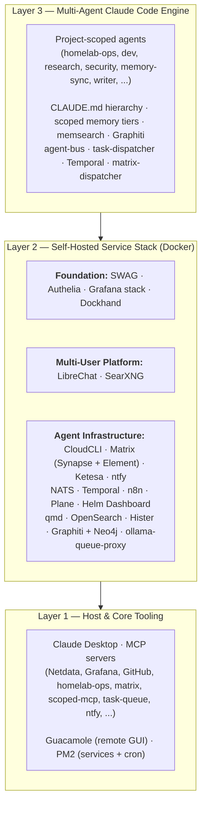
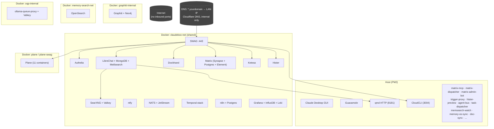
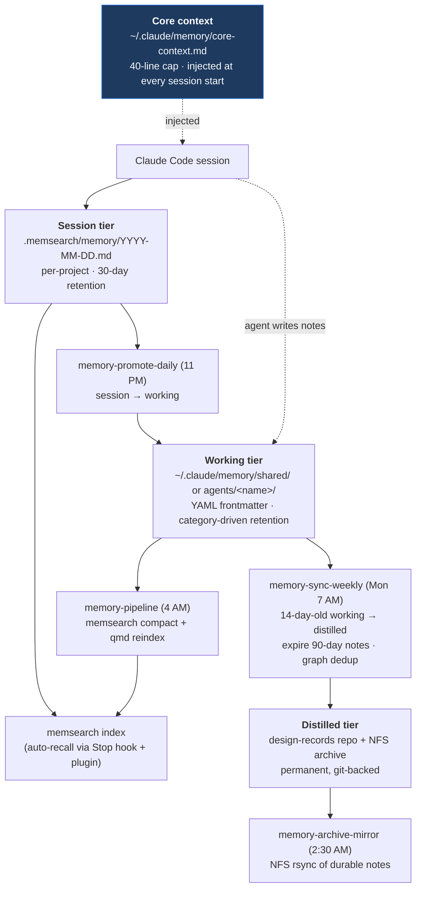
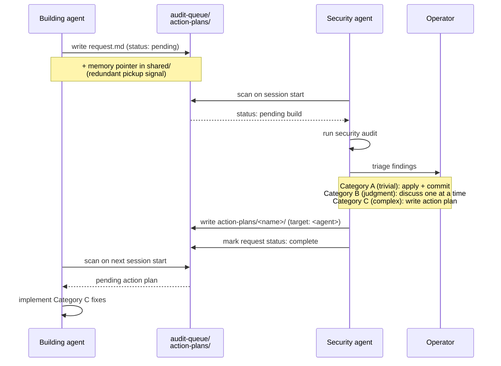
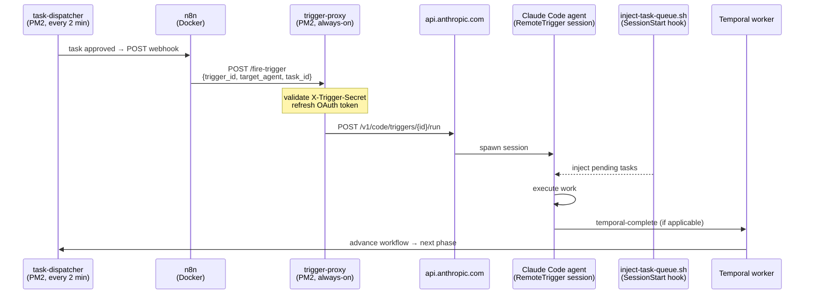
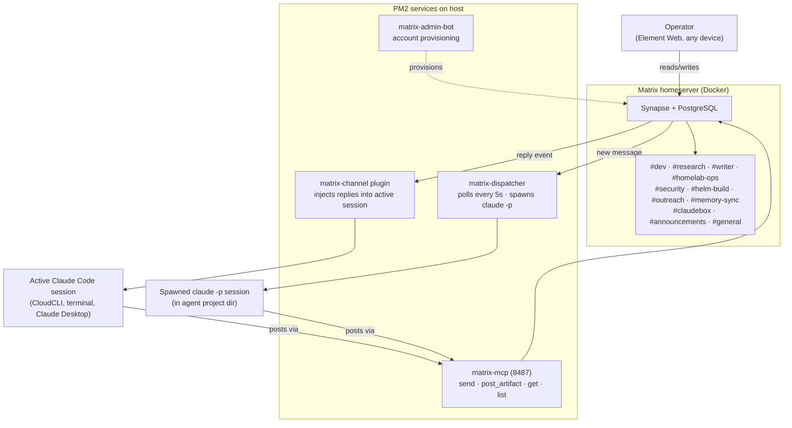
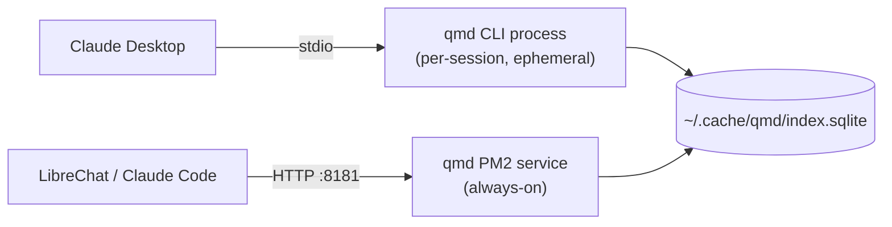

# Architecture

This document expands on the architecture overview in the [main README](../README.md#architecture) with detail on data flows, network topology, and how the three layers interconnect. Read the README first — this doc assumes you're familiar with the layer model and component list.

Diagrams are written in [Mermaid](https://mermaid.js.org/) and render natively on GitHub. Update them by editing the fenced `mermaid` blocks below — no separate tool, no export step.

## System Overview



Each layer is independently useful. Layer 1 alone (Claude Desktop + MCP servers) is a meaningful upgrade over a browser tab. Layer 1 + Layer 2 gives you a self-hosted multi-user AI platform behind SSO. Layer 3 is opinionated infrastructure for running Claude Code agents on top of the rest.

## Network Topology

Most containers share a `claudebox-net` Docker bridge network. Security-sensitive services run on dedicated networks for blast-radius containment — only SWAG and the specific dependents reach into them. No ports are exposed to the internet.



SWAG handles SSL via DNS validation (Cloudflare API), not HTTP challenge. The domain resolves to a LAN IP — internal-only access with real SSL certificates.

## Data Flows

### Request Flow (User → Service)

When someone accesses `chat.yourdomain` in a browser:

1. DNS resolves to the host's LAN IP (Cloudflare DNS record, local network only)
2. SWAG receives the HTTPS request on port 443
3. SWAG checks Authelia for authentication (via `auth_request` in the nginx proxy conf)
4. Authelia validates the session cookie or redirects to the login page
5. On success, SWAG proxies to the target container (e.g., `librechat:3080`)

This flow is identical for every service behind SWAG. Adding a new service means: deploy the container on `claudebox-net`, add a SWAG proxy conf, uncomment the Authelia lines. Two minutes of work.

### Memory Flow (Knowledge Accumulation)

This is the core data flow that makes the system self-improving. Memory is organized into tiers with automated promotion between them.



The tiers serve different purposes: **session** is raw auto-captured context for immediate recall, **working** is agent-curated knowledge with category-driven retention (transient findings expire at 90 days; design-records, decision-records, and research findings never expire), and **distilled** is permanent knowledge promoted from working notes that survived the 14-day soak.

A fourth surface sits outside the pipeline: **core context** (`~/.claude/memory/core-context.md`). This is a permanent, manually-managed file containing user profile, active projects, key constraints, and recent decisions. It's updated via the `core-memory-update` skill and injected at every session start via a `SessionStart` hook (`inject-core-context.sh`) before any tool calls run. The 40-line cap keeps it under ~2KB so it never crowds out working memory injection.

The timing is deliberate: each step depends on the previous one having settled. PM2 cron handles the scheduling.

### Build Plan Handoff (Research → Implementation)

Research agents investigate, compare, and design — but don't execute infrastructure changes. When research produces an actionable plan:

1. The research agent writes a structured plan to a known directory
2. The plan includes a `handoff.md` with the target agent chat, status, and key decisions already made
3. The implementing agent checks for pending plans on session start
4. Status transitions: `pending` → `in-progress` → `complete`

This separation keeps research exploratory (no risk of accidental changes) and gives implementing agents a reviewed, pre-validated starting point. The handoff file is deliberately minimal — just enough context to start, with a path to the full plan for depth.

The build plan handoff is one instance of a broader inter-agent communication pattern. The security audit workflow uses the same mechanics bidirectionally — see [Inter-Agent Communication](components/inter-agent-communication.md).

### Security Audit Flow (Building Agent ↔ Security Agent)

After completing a build plan that deploys network-exposed services, modifies auth config, or adds Docker containers, the implementing agent writes a completion report to the security agent's queue. The security agent picks it up on session start, runs an audit, triages findings with the user, and routes action plans back to the appropriate agent.



Not every build triggers an audit — only those with real network or auth surface. Pure documentation changes and memory-only builds skip it. A resource monitor job sends a push notification if any handoff stays `pending` for more than 7 days.

### Autonomous Build Pipeline (End-to-End)

The autonomous pipeline wires task queue events to agent sessions without human dispatch. When a task is approved, the dispatcher notifies n8n, which triggers a RemoteTrigger session on claude.ai — no manual chat required.



**BuildPipelineWorkflow** in the Temporal worker orchestrates the full research → build → security audit → triage → fix → close sequence as a durable workflow. Each phase is a Temporal activity dispatched through the same task queue → n8n → trigger-proxy → agent chain, so the entire pipeline runs autonomously once the initial workflow is started.

**Components involved:**
- [Task Dispatcher](components/task-dispatcher.md) — routes approved tasks, posts n8n webhooks
- [Trigger Proxy](components/trigger-proxy.md) — OAuth bridge for n8n → RemoteTrigger calls
- [n8n](components/n8n.md) — workflow engine that sequences the trigger chain
- [Helm Temporal Worker](components/helm-temporal-worker.md) — BuildPipelineWorkflow durable orchestration

### Agent Communications Layer

Every agent has a Matrix room. Operator messages route into agent sessions; agent activity routes back as threaded replies. Three distinct invocation paths converge on the same room set.



**Three invocation paths to know:**

1. **Active session, agent posts out** — running session calls `mcp__matrix__send_matrix_message` via matrix-mcp to push activity updates and artifacts to its room.
2. **Active session, operator replies in** — operator types in Element Web; matrix-channel plugin polls the room and injects the reply as user input into the live session. Used for permission relay during long-running work.
3. **No session, operator starts one** — operator types in any agent's room; matrix-dispatcher spawns `claude -p` in that agent's project directory and streams the response back. Threaded replies resume prior sessions via SQLite session store. Bang-prefix commands (`!sessions`, `!recap`, `!mirror`, `!cancel`, `!help`) cover session management without spawning.

`task-dispatcher.py` routes lifecycle events (submit, approve, reject, complete, handoff) into Matrix rooms. ntfy is retained only for dead-letter events and pending-approval notifications where the operator must act before the pipeline can continue.

See [matrix.md](components/matrix.md) and [matrix-dispatcher.md](components/matrix-dispatcher.md) for the full component docs.

### Memory Search Options

Three tools provide memory search with different access patterns:

| Tool | Access pattern | Scope |
|------|---------------|-------|
| **memsearch** | Automatic, in-session | Session memory files — auto-injected into Claude Code context via plugin |
| **qmd** | On-demand, MCP tool call | Repos, infrastructure docs, distilled agent memory — explicit queries |
| **Hister** | Browser UI or MCP endpoint | Full memory corpus (~500 files) — independent of any live Claude session |
| **memory-search-mcp** | MCP tool call (personal-agent only) | OpenSearch full-text over all memory note bodies |

They complement rather than compete. memsearch handles automatic recall during sessions; qmd handles structured document search; Hister is the human-readable window into what the agents know, accessible from any browser without starting a Claude Code session; memory-search-mcp is the deep keyword/phrase search for one specific agent that needs it. See [hister](components/hister.md) and [memory-lifecycle](components/memory-lifecycle.md).

### Search Flow (qmd Dual Transport)

qmd serves two clients through different transports against the same index.



The stdio instance is ephemeral (launched per-session by Claude Desktop). The HTTP instance is persistent (PM2 managed, always-on). They don't conflict because SQLite handles concurrent reads gracefully — writes only happen during reindexing, which runs at a different time.

## Storage Architecture

The host uses local NVMe for the OS, Docker, and all active workloads. NFS mounts from a storage server provide bulk storage and backup targets. The storage server is optional — everything runs fine without NFS, you just lose off-host backups and shared state.

```
Host (NVMe):
  /opt/appdata/<stack>/     ← Docker persistent data
  ~/.cache/qmd/             ← qmd search index
  ~/.memsearch/             ← memsearch vector DB
  ~/.claude/memory/         ← Agent memory files
  ~/repos/                  ← Git repositories
  ~/docker/                 ← Docker compose files (version controlled)

NFS (optional, from storage server):
  /mnt/storage/host-backup/ ← Backup target for docker-stack-backup
  /mnt/storage/memory-archive/ ← Append-versioned mirror of durable memory notes
```

The `~/docker/` directory is a git repo. This is critical — AI agents (via Claude Desktop, Claude Code, or LibreChat) have filesystem access and will edit compose files, `.env` files, and proxy confs directly. Version control means every change is tracked, diffable, and reversible. If an agent makes a bad edit that breaks a stack, `git diff` shows exactly what changed and `git checkout` recovers it. Treat this the same way you'd treat infrastructure-as-code in a production environment.

The docker-stack-backup PM2 job rsyncs `/opt/appdata/` to the NFS mount nightly. If the NFS mount is unavailable, the backup job fails gracefully and the resource-monitor alerts via push notification.

## Security Model

This is a homelab, not an enterprise. The security model reflects that — good enough for a household, not trying to pass an audit.

**External access:** None. No ports are exposed to the internet. The domain is DNS-only (Cloudflare manages the DNS records, but traffic never routes through Cloudflare). Access is LAN-only, or via VPN/Guacamole if you need remote access.

**Authentication:** Authelia provides SSO for all web services. File-based user backend — no LDAP, no database, just a YAML file with bcrypt-hashed passwords. One-factor auth. This is appropriate for a single-user or small household setup. If you need multi-factor or a proper identity provider, Authelia supports both — but it's overkill for most homelabs.

**API keys and secrets:** Stored in `.env` files alongside Docker compose files, and in the Claude Desktop config for MCP servers. Not checked into git (the public repo uses placeholder values). In a more paranoid setup, you'd use a secrets manager — but for a homelab, `.env` files with restrictive permissions are fine.

**Per-agent tool scoping:** [scoped-mcp](components/scoped-mcp.md) sits between agents and backend MCP servers. Each agent gets its own server process with a manifest declaring which modules load, what filesystem/database/topic scopes are allowed, and which credentials inject. Agents never see token values, and every tool call is written to a structured audit log. This matters specifically because the agent fleet shares infrastructure — without scoping, every agent could touch every other agent's files, ntfy topic, and SQL store.

**Network isolation:** Most containers share `claudebox-net`. Security-sensitive services (OpenSearch, Plane, Graphiti, ollama-queue-proxy's Valkey) run on dedicated networks so a compromise in the shared network doesn't reach them. Synapse's `/_synapse/admin/` path is restricted to LAN CIDRs at the SWAG layer, not just by Synapse's native admin token enforcement.

**Docker socket access:** Dockhand mounts the Docker socket for container management. This is a known risk surface — any container with socket access can potentially control other containers. Dockhand runs behind Authelia, so unauthorized access requires bypassing SSO first.

**MCP server access:** MCP servers that access external services (Unraid, TrueNAS, InfluxDB) use API keys with minimal permissions. The Unraid key is viewer-only (read access). The TrueNAS and InfluxDB keys are limited to their respective APIs. No MCP server has write access to anything it shouldn't.

## Scaling Considerations

This architecture is designed for a single host. If you need to scale:

**Multiple hosts for Docker services:** Move individual stacks to separate hosts. SWAG can proxy to remote hosts — just change the upstream from a container name to an IP address. Authelia stays on the SWAG host.

**Separate machine for Claude Code agents:** The Layer 3 agent engine (CLAUDE.md hierarchy, memsearch, PM2 jobs) can run on a different machine than the Docker services. qmd's HTTP transport handles this naturally — point LibreChat at the remote qmd host instead of localhost.

**Remote build host for build agents:** [helm-ops-mcp](components/helm-ops-mcp.md) demonstrates the pattern for operating on a second machine — same tool surface as homelab-ops, SSH transport instead of local HTTP. The build agent on claudebox writes to the remote host as if it were local.

**Multiple Claude Desktop instances:** MCP servers are per-instance. If you run Claude Desktop on multiple machines, each needs its own MCP config. Shared state (memory files, context repo) should live on a network-accessible filesystem.

In practice, a single mini PC handles everything described in this repo without breaking a sweat. Scaling is a future problem.

---

## Related Docs

- [Main README](../README.md) — architecture overview and component list
- [Architecture decisions](decisions.md) — rationale behind major choices
- [Getting started](getting-started.md) — setup order and stopping points
- [MCP servers reference](../mcp-servers/README.md) — Layer 1 tool integrations
- [Component docs](components/) — per-service deep dives
- [PM2 ecosystem config](../pm2/ecosystem.config.js.example) — service scheduling and dependencies
