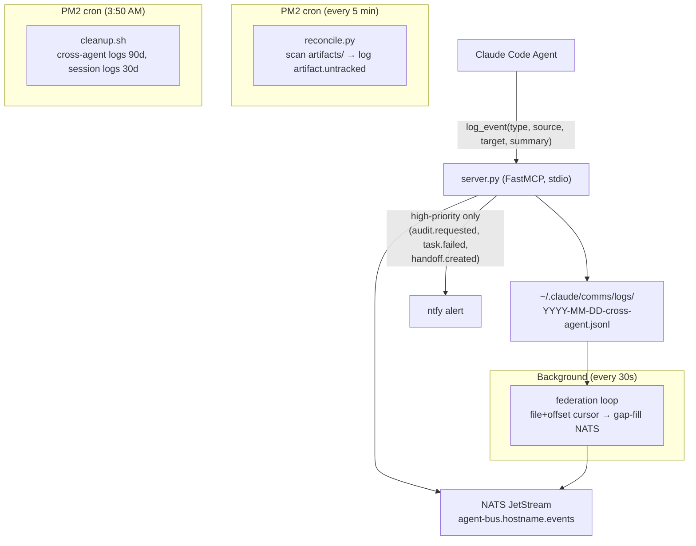

# Agent Bus

The Agent Bus is a FastMCP MCP server that provides a unified inter-agent event log for the claudebox multi-agent setup. Agents call `log_event` when they produce or consume cross-agent work items — task handoffs, audit requests, build completions, diagnose sessions. Events are appended to local JSONL files and federated to NATS JetStream in the background.

**Repo:** `TadMSTR/agent-bus-mcp`  
**Deploy path:** `~/repos/personal/agent-bus/`  
**Transport:** stdio (MCP only — no port binding)  
**Storage:** `~/.claude/comms/`

## Why

Before the agent bus, inter-agent events existed only in session notes and memory files — no queryable history, no real-time observability. A security agent completing an audit had no structured way to signal that to the Grafana dashboard or to NATS consumers. The bus adds:

- A common write path (MCP tool + Python client) for all agents
- JSONL event log queryable by type, source, target, or timestamp
- NATS federation for downstream consumers (Grafana, Helm Dashboard, future agents)
- Reconciler coverage for artifacts written without a corresponding log event

## How It Works



## Storage Layout

```
~/.claude/comms/
├── logs/
│   ├── YYYY-MM-DD-cross-agent.jsonl   # inter-agent events
│   └── YYYY-MM-DD-session.jsonl       # session-scoped (memory, skills)
├── artifacts/
│   ├── build-plans/                   # plan.md, handoff.md per build
│   ├── audit-requests/                # request.md per audit target
│   ├── audit-reports/                 # report.md + handoff per audit
│   ├── diagnose-sessions/             # session notes from diagnose skill
│   └── handoffs/                      # generic cross-agent handoffs
├── federation-cursor.json             # NATS federation offset tracker
└── .reconcile-cursor                  # reconciler mtime watermark
```

## MCP Tools

### `log_event`

The primary write path. Called by Claude Code agents directly via the `agent-bus` MCP server.

```python
log_event(
    event_type="audit.requested",
    source="claudebox",
    target="security",
    summary="Security audit request: helm-temporal-worker",
    artifact_path="/home/ted/.claude/comms/artifacts/audit-requests/helm-temporal-worker/request.md",
)
```

`scope` defaults to `"cross-agent"`. Events in the CROSS_AGENT_EVENTS set always route to the cross-agent log regardless of the scope parameter.

### `query_events`

Query the log with filters. Returns most-recent-first, capped at 500. Useful for the Helm Dashboard's agent monitoring tab and for agents checking recent activity at session start.

```python
# What did the security agent complete in the last 24h?
query_events(source="security", event_type="audit.completed", limit=10)

# All cross-agent events since this morning
query_events(since="2026-03-29T06:00:00Z")
```

### `get_event`

Retrieve a specific event by UUID. Used when `artifact_path` in a log entry points back to a known event.

## Event Vocabulary

| Event | When | High-priority ntfy |
|-------|------|--------------------|
| `task.dispatched` | Task written to `~/.claude/task-queue/` | |
| `task.approved` | Task auto-approved by dispatcher | |
| `task.completed` | Agent completed a task | |
| `task.failed` | Task exhausted retries or was rejected | ✓ |
| `task.routing-failed` | No manifest match for task_type | ✓ |
| `handoff.created` | Work item handed to another agent | ✓ |
| `handoff.picked-up` | Agent picked up a handoff | |
| `handoff.completed` | Handoff resolved | |
| `audit.requested` | Security audit request written | ✓ |
| `audit.completed` | Audit report written | |
| `build-plan.created` | Build plan added to queue | |
| `diagnose.started` | Diagnose skill session begun | |
| `diagnose.completed` | Diagnose skill concluded | |
| `artifact.untracked` | File in artifacts dir without log entry (reconciler) | |

Session-scoped events (memory flushes, skill executions) use `scope="session"` and go to the session log — not federated to NATS.

## Python Client (`agent_bus_client.py`)

Located at `~/scripts/agent_bus_client.py`. For Python scripts that can't call MCP directly (PM2 cron processes, `task-dispatcher.py`). Writes directly to JSONL with the same schema as the server — no round-trip overhead, no external dependency.

```python
from agent_bus_client import log_event

log_event("task.dispatched", source="task-dispatcher", target="claudebox",
          summary="Build phase 1 dispatched")
```

The client intentionally omits ntfy emission — `task-dispatcher.py` retains its own ntfy calls for high-priority events to avoid double-firing.

## Federation


Events are published to `agent-bus.{hostname}.events` on `nats://localhost:4222`.

**AGENT_BUS JetStream stream** subscribes to `agent-bus.>`:
- Retention: 30 days
- Dedup window: 2 minutes (covers inline + loop double-publish)
- Storage: file

The inline `emit_nats()` call on every `log_event` provides real-time publishing. The background federation loop re-publishes from a file+offset cursor every 30 seconds to fill gaps from NATS downtime. Consumers should treat the stream as **at-least-once**.

`federation-cursor.json` tracks `last_federated_file` + `last_federated_offset` — efficient seek-based replay rather than re-scanning full log history on each tick.

## PM2 Services

| Service | Script | Schedule | Purpose |
|---------|--------|----------|---------|
| `agent-bus` | `server.py` | always-on | FastMCP server + federation loop |
| `agent-bus-reconcile` | `reconcile.py` | `*/5 * * * *` | Scan artifacts for untracked files |
| `agent-bus-cleanup` | `cleanup.sh` | `50 3 * * *` | Prune old log files |

## Skills Wired In

The following skills call `log_event` at defined lifecycle points:

| Skill | Event logged |
|-------|-------------|
| `build-close-out` | `audit.requested`, `handoff.created` |
| `security-audit` | `audit.requested`, `audit.completed` |
| `diagnose` | `diagnose.started`, `diagnose.completed` |
| `memory-flush` | `handoff.completed` (memory checkpoint handoff) |
| `build-plan-review` | `build-plan.created` |

`task-dispatcher.py` logs `task.dispatched`, `task.approved`, `task.completed`, `task.failed`, `task.routing-failed` via the Python client.

## Reconciler Detail

The reconciler (`reconcile.py`) runs every 5 minutes and scans `~/.claude/comms/artifacts/` for files newer than the mtime cursor (`.reconcile-cursor`). Any file that:
1. Has `st_mtime` newer than the cursor, AND
2. Is not already referenced in today's cross-agent log as `artifact_path`

...gets an `artifact.untracked` event logged. This catches artifacts written by agents that haven't fully adopted `log_event` calls, or files written directly to the artifacts directory by tools or scripts.

After scanning, the cursor file is `touch()`ed to the current time. On the next run, only newly-modified files are re-examined.

## Gotchas and Lessons Learned

**Inline emit + federation loop = at-least-once delivery.** Every event is published twice to NATS: once inline when logged, and again by the federation loop replay. The AGENT_BUS stream's 2-minute dedup window suppresses duplicates for recent events. For events older than 2 minutes (e.g., after NATS downtime), consumers will see duplicates — design them to be idempotent.

**stdio transport only.** `server.py` runs as an MCP stdio server (not HTTP). It cannot be reached by services outside Claude Code sessions. The Python client (`agent_bus_client.py`) exists specifically for this gap — use it from PM2 cron scripts and non-MCP callers.

**Session log is not federated.** Events with `scope="session"` go to `-session.jsonl` and are never published to NATS. They're for local query only (e.g., "what skills ran in today's memory-sync?"). Use `scope="cross-agent"` for anything that needs NATS visibility.

**The reconciler uses mtime, not file content.** If a file is modified after creation, it will be re-scanned and potentially logged again as `artifact.untracked`. The intra-day dedup (checking `artifact_path` in today's log) prevents duplicate events within the same calendar day, but if a file was first seen yesterday and modified today it will appear again. This is acceptable — the event is advisory, not authoritative.

**Deploy path differs from repo name.** The repo is `agent-bus-mcp` on GitHub but deploys to `~/repos/personal/agent-bus/`. The ecosystem config and MCP registration reference the deploy path. Don't clone directly to `agent-bus-mcp` if PM2 is already configured.

---

## Related Docs

- [Agent Orchestration](agent-orchestration.md) — task queue and dispatcher that uses the Python client
- [NATS JetStream](nats-jetstream.md) — the AGENT_BUS stream lives here
- [Task Dispatcher](task-dispatcher.md) — logs task lifecycle events via agent_bus_client.py
- [Helm Dashboard](helm-dashboard.md) — consumes agent-bus events for the monitoring tab
