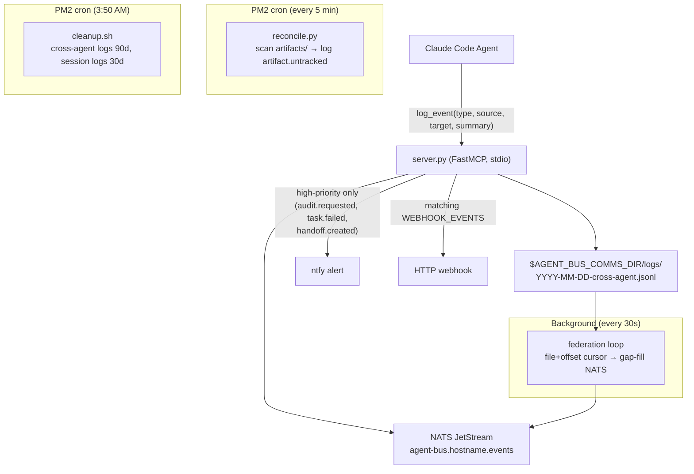
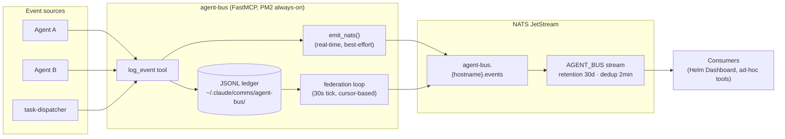

# Agent Bus

The Agent Bus is a FastMCP MCP server that provides a unified inter-agent event log for the claudebox multi-agent setup. Agents call `log_event` when they produce or consume cross-agent work items — task handoffs, audit requests, build completions, diagnose sessions. Events are appended to local JSONL files and federated to NATS JetStream in the background.

**Repo:** `TadMSTR/agent-bus`  
**Deploy path:** `~/repos/personal/agent-bus/`  
**Transport:** stdio (MCP only — no port binding)  
**Storage:** `~/.claude/comms/`

## Why

Before the agent bus, inter-agent events existed only in session notes and memory files — no queryable history, no real-time observability. A security agent completing an audit had no structured way to signal that to the Grafana dashboard or to NATS consumers. The bus adds:

- A common write path (MCP tool + Python client) for all agents
- JSONL event log queryable by type, source, target, or timestamp
- NATS federation for downstream consumers (Grafana, Helm Dashboard, future agents)
- Reconciler coverage for artifacts written without a corresponding log event

## How It Works


```mermaid
graph TD
    Agent["Claude Code Agent"] -->|"log_event(type, source, target, summary)"| Server["server.py (FastMCP, stdio)"]

    Server --> Log["$AGENT_BUS_COMMS_DIR/logs/<br/>YYYY-MM-DD-cross-agent.jsonl"]
    Server --> NATS["NATS JetStream<br/>agent-bus.hostname.events"]
    Server -->|"high-priority only<br/>(audit.requested, task.failed,<br/>handoff.created)"| Ntfy["ntfy alert"]
    Server -->|"matching WEBHOOK_EVENTS"| Webhook["HTTP webhook"]

    subgraph "Background (every 30s)"
        FedLoop["federation loop<br/>file+offset cursor → gap-fill NATS"]
    end
    Log --> FedLoop --> NATS

    subgraph "PM2 cron (every 5 min)"
        Reconcile["reconcile.py<br/>scan artifacts/ → log artifact.untracked"]
    end

    subgraph "PM2 cron (3:50 AM)"
        Cleanup["cleanup.sh<br/>cross-agent logs 90d, session logs 30d"]
    end
```

## Environment Variables

| Variable | Default | Description |
|----------|---------|-------------|
| `AGENT_BUS_COMMS_DIR` | `~/.claude/comms` | Base directory for logs, artifacts, and cursors |
| `NATS_URL` | `nats://localhost:4222` | NATS server URL (optional) |
| `NTFY_URL` | — | ntfy topic URL for push notifications (optional) |
| `AGENT_BUS_CROSS_AGENT_RETENTION_DAYS` | `90` | Days to retain cross-agent log files |
| `AGENT_BUS_SESSION_RETENTION_DAYS` | `30` | Days to retain session log files |
| `AGENT_BUS_WEBHOOK_URL` | — | URL to POST event JSON to (optional) |
| `AGENT_BUS_WEBHOOK_EVENTS` | — | Comma-separated event types to fire on, or `*` for all (optional) |
| `AGENT_BUS_VERIFY_SIGNATURES` | `false` | Enable ed25519 signature verification on `verify_chain` calls (warn mode — mismatches logged, not rejected) |

`NATS_URL`, `NTFY_URL`, and the webhook vars are fully optional — the server operates on local JSONL alone without them.

## Storage Layout

```
$AGENT_BUS_COMMS_DIR/          (default: ~/.claude/comms)
├── logs/
│   ├── YYYY-MM-DD-cross-agent.jsonl   # inter-agent events
│   └── YYYY-MM-DD-session.jsonl       # session-scoped (memory, skills)
├── artifacts/
│   ├── build-plans/                   # plan.md, handoff.md per build
│   ├── audit-requests/                # request.md per audit target
│   ├── audit-reports/                 # report.md + handoff per audit
│   ├── diagnose-sessions/             # session notes from diagnose skill
│   └── handoffs/                      # generic cross-agent handoffs
├── federation-cursor.json             # NATS federation offset tracker
└── .reconcile-cursor                  # reconciler mtime watermark
```

## MCP Tools

### `log_event`

The primary write path. Called by Claude Code agents directly via the `agent-bus` MCP server.

```python
log_event(
    event_type="audit.requested",
    source="claudebox",
    target="security",
    summary="Security audit request: helm-temporal-worker",
    artifact_path="$HOME/.claude/comms/artifacts/audit-requests/helm-temporal-worker/request.md",
)
```

`scope` defaults to `"cross-agent"`. Events in the CROSS_AGENT_EVENTS set always route to the cross-agent log regardless of the scope parameter.

### `query_events`

Query the log with filters. Returns most-recent-first, capped at 500. Useful for the Helm Dashboard's agent monitoring tab and for agents checking recent activity at session start.

```python
# What did the security agent complete in the last 24h?
query_events(source="security", event_type="audit.completed", limit=10)

# All cross-agent events since this morning
query_events(since="2026-03-29T06:00:00Z")
```

### `get_event`

Retrieve a specific event by UUID. Used when `artifact_path` in a log entry points back to a known event.

### `get_status`

Returns current server configuration and health: configured paths, which optional integrations are active (NATS, ntfy, webhook), date range of available logs, and today's event count. Useful for verifying setup after installation or after changing env vars. Integration URLs are returned with query strings stripped (prevents embedded auth tokens from leaking to callers).

### `verify_chain` _(v0.2.0)_

Verifies the SHA-256 hash chain and (optionally) ed25519 signatures across a day's event log:

```python
verify_chain(date="2026-05-26")
# Returns:
# {
#   "total": 142,
#   "verified": 142,
#   "chain_breaks": 0,
#   "sig_failures": 0,
#   "unsigned_events": 12   # events before signing was enabled
# }
```

Each event written since v0.2.0 includes a `prev_hash` field (SHA-256 of the previous event's JSON) and an `ed25519_sig` field. `verify_chain` walks the chain and flags any event where the hash doesn't match its predecessor. Signature failures are counted separately and logged as warnings — they don't block normal operation (`AGENT_BUS_VERIFY_SIGNATURES=true` required for sig verification to run). The `date` parameter is validated against `YYYY-MM-DD` format before use.

## Event Vocabulary

| Event | When | High-priority ntfy |
|-------|------|--------------------|
| `task.dispatched` | Task written to `~/.claude/task-queue/` | |
| `task.approved` | Task auto-approved by dispatcher | |
| `task.completed` | Agent completed a task | |
| `task.failed` | Task exhausted retries or was rejected | ✓ |
| `task.routing-failed` | No manifest match for task_type | ✓ |
| `handoff.created` | Work item handed to another agent | ✓ |
| `handoff.picked-up` | Agent picked up a handoff | |
| `handoff.completed` | Handoff resolved | |
| `audit.requested` | Security audit request written | ✓ |
| `audit.completed` | Audit report written | |
| `build-plan.created` | Build plan added to queue | |
| `diagnose.started` | Diagnose skill session begun | |
| `diagnose.completed` | Diagnose skill concluded | |
| `artifact.untracked` | File in artifacts dir without log entry (reconciler) | |

Session-scoped events (memory flushes, skill executions) use `scope="session"` and go to the session log — not federated to NATS.

## Python Client (`agent_bus_client.py`)

Located at `~/scripts/agent_bus_client.py`. For Python scripts that can't call MCP directly (PM2 cron processes, `task-dispatcher.py`). Writes directly to JSONL with the same schema as the server — no round-trip overhead, no external dependency.

```python
from agent_bus_client import log_event

log_event("task.dispatched", source="task-dispatcher", target="claudebox",
          summary="Build phase 1 dispatched")
```

The client intentionally omits ntfy emission — `task-dispatcher.py` retains its own ntfy calls for high-priority events to avoid double-firing.

## Federation


```mermaid
graph LR
    subgraph Sources["Event sources"]
        A1["Agent A"]
        A2["Agent B"]
        TD["task-dispatcher"]
    end

    subgraph Bus["agent-bus (FastMCP, PM2 always-on)"]
        Log["log_event tool"]
        JSONL[("JSONL ledger<br/>~/.claude/comms/agent-bus/")]
        Inline["emit_nats()<br/>(real-time, best-effort)"]
        Loop["federation loop<br/>(30s tick, cursor-based)"]
    end

    subgraph NATS["NATS JetStream"]
        Subj["agent-bus.{hostname}.events"]
        Stream["AGENT_BUS stream<br/>retention 30d · dedup 2min"]
    end

    Consumers["Consumers<br/>(Helm Dashboard, ad-hoc tools)"]

    A1 --> Log
    A2 --> Log
    TD --> Log
    Log --> JSONL
    Log --> Inline
    JSONL --> Loop
    Inline --> Subj
    Loop --> Subj
    Subj --> Stream
    Stream --> Consumers
```

Events are published to `agent-bus.{hostname}.events` on `nats://localhost:4222`.

**AGENT_BUS JetStream stream** subscribes to `agent-bus.>`:
- Retention: 30 days
- Dedup window: 2 minutes (covers inline + loop double-publish)
- Storage: file

The inline `emit_nats()` call on every `log_event` provides real-time publishing. The background federation loop re-publishes from a file+offset cursor every 30 seconds to fill gaps from NATS downtime. Consumers should treat the stream as **at-least-once**.

`federation-cursor.json` tracks `last_federated_file` + `last_federated_offset` — efficient seek-based replay rather than re-scanning full log history on each tick.

## PM2 Services

| Service | Script | Schedule | Purpose |
|---------|--------|----------|---------|
| `agent-bus` | `server.py` | always-on | FastMCP server + federation loop |
| `agent-bus-reconcile` | `reconcile.py` | `*/5 * * * *` | Scan artifacts for untracked files |
| `agent-bus-cleanup` | `cleanup.sh` | `50 3 * * *` | Prune old log files |

## Skills Wired In

The following skills call `log_event` at defined lifecycle points:

| Skill | Event logged |
|-------|-------------|
| `build-close-out` | `audit.requested`, `handoff.created` |
| `security-audit` | `audit.requested`, `audit.completed` |
| `diagnose` | `diagnose.started`, `diagnose.completed` |
| `memory-flush` | `handoff.completed` (memory checkpoint handoff) |
| `build-plan-review` | `build-plan.created` |

`task-dispatcher.py` logs `task.dispatched`, `task.approved`, `task.completed`, `task.failed`, `task.routing-failed` via the Python client.

## Reconciler Detail

The reconciler (`reconcile.py`) runs every 5 minutes and scans `~/.claude/comms/artifacts/` for files newer than the mtime cursor (`.reconcile-cursor`). Any file that:
1. Has `st_mtime` newer than the cursor, AND
2. Is not already referenced in today's cross-agent log as `artifact_path`

...gets an `artifact.untracked` event logged. This catches artifacts written by agents that haven't fully adopted `log_event` calls, or files written directly to the artifacts directory by tools or scripts.

After scanning, the cursor file is `touch()`ed to the current time. On the next run, only newly-modified files are re-examined.

## Event Integrity (v0.2.0)

Each event appended since v0.2.0 carries two integrity fields:

- **`prev_hash`** — SHA-256 of the preceding event's raw JSON line. Forms a tamper-evident chain: modifying or deleting any event invalidates every subsequent `prev_hash`. The first event in a log file has `prev_hash: null`.
- **`ed25519_sig`** — base64-encoded ed25519 signature over the event JSON (excluding the `ed25519_sig` field itself). Signed using the server's private key.

**Key registry:** Public keys for signature verification live at `~/.claude/comms/agent-keys.json`. The registry maps source agent names to base64-encoded ed25519 public keys. Add a key here to enable verification for events from that agent.

**Verification is warn-mode only.** `verify_chain` reports failures but doesn't reject events. This is intentional — the log is append-only; rejecting a malformed event would lose it. The chain and signatures are audit evidence, not an access gate.

**Thread safety:** the `append_event()` path uses a `threading.Lock` covering both the `_last_line()` read (to obtain `prev_hash`) and the write+fsync, preventing concurrent writes from producing the same `prev_hash`.

## Gotchas and Lessons Learned

**Inline emit + federation loop = at-least-once delivery.** Every event is published twice to NATS: once inline when logged, and again by the federation loop replay. The AGENT_BUS stream's 2-minute dedup window suppresses duplicates for recent events. For events older than 2 minutes (e.g., after NATS downtime), consumers will see duplicates — design them to be idempotent.

**stdio transport only.** `server.py` runs as an MCP stdio server (not HTTP). It cannot be reached by services outside Claude Code sessions. The Python client (`agent_bus_client.py`) exists specifically for this gap — use it from PM2 cron scripts and non-MCP callers.

**Webhook fires are fire-and-forget.** `emit_webhook()` POSTs event JSON to `AGENT_BUS_WEBHOOK_URL` for each event matching `AGENT_BUS_WEBHOOK_EVENTS` (or all events if `*`). There is no retry — if the endpoint is down, the event is still logged locally and federated to NATS normally. Set `AGENT_BUS_WEBHOOK_EVENTS` to a specific list to avoid flooding high-volume webhook receivers.

**Session log is not federated.** Events with `scope="session"` go to `-session.jsonl` and are never published to NATS. They're for local query only (e.g., "what skills ran in today's memory-sync?"). Use `scope="cross-agent"` for anything that needs NATS visibility.

**The reconciler uses mtime, not file content.** If a file is modified after creation, it will be re-scanned and potentially logged again as `artifact.untracked`. The intra-day dedup (checking `artifact_path` in today's log) prevents duplicate events within the same calendar day, but if a file was first seen yesterday and modified today it will appear again. This is acceptable — the event is advisory, not authoritative.

**Deploy path differs from repo name.** The repo is `agent-bus-mcp` on GitHub but deploys to `~/repos/personal/agent-bus/`. The ecosystem config and MCP registration reference the deploy path. Don't clone directly to `agent-bus-mcp` if PM2 is already configured.

---

## Related Docs

- [Agent Orchestration](agent-orchestration.md) — task queue and dispatcher that uses the Python client
- [NATS JetStream](nats-jetstream.md) — the AGENT_BUS stream lives here
- [Task Dispatcher](task-dispatcher.md) — logs task lifecycle events via agent_bus_client.py
- [Helm Dashboard](helm-dashboard.md) — consumes agent-bus events for the monitoring tab
