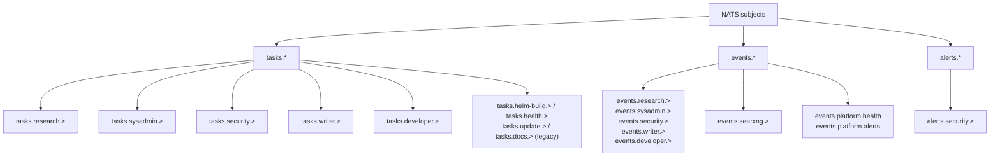
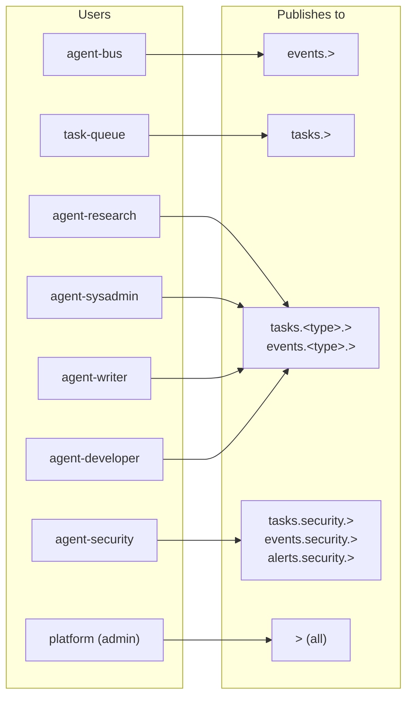

# NATS

NATS on forge is the event transport layer for agent orchestration. It provides per-agent publish/subscribe channels with subject-level ACLs — each agent type gets its own NATS user with credentials scoped to its task and event subjects.

## Configuration

Config file: `/opt/appdata/agent-platform/nats/nats.conf` (600, owned by ted)

```
port: 4222
http_port: 8222

jetstream {
  store_dir: /data
}

authorization {
  users: [ ... ]
}
```

Passwords are stored as bcrypt hashes in the config. The config is mounted read-only into the NATS container; credentials are not visible in process args. JetStream data persists at `/opt/appdata/agent-platform/nats/`.

## Users and Permissions

`_INBOX.>` subscribe access is required for request/reply patterns (NATS uses `_INBOX.*` for reply subjects).

### Agent platform users (current)

| User | Role | Publish | Subscribe |
|------|------|---------|-----------| 
| `platform` | Full admin | `>` | `>` |
| `agent-bus` | Bus — routes all events | `events.>` | `>` |
| `task-queue` | Task queue MCP | `tasks.>` | `tasks.>`, `events.>`, `_INBOX.>` |
| `agent-research` | Research agent | `tasks.research.>`, `events.research.>` | `tasks.research.>`, `_INBOX.>` |
| `agent-sysadmin` | Sysadmin agent | `tasks.sysadmin.>`, `events.sysadmin.>` | `tasks.sysadmin.>`, `_INBOX.>` |
| `agent-security` | Security agent | `tasks.security.>`, `events.security.>`, `alerts.security.>` | `tasks.security.>`, `events.>`, `_INBOX.>` |
| `agent-writer` | Writer agent | `tasks.writer.>`, `events.writer.>` | `tasks.writer.>`, `_INBOX.>` |
| `agent-developer` | Developer agent | `tasks.developer.>`, `events.developer.>` | `tasks.developer.>`, `_INBOX.>` |
| `searxng-mcp` | SearXNG MCP server | `events.searxng.>` | `_INBOX.>` |

### Legacy helm users (retained, not actively rotated)

| User | Role | Publish | Subscribe |
|------|------|---------|-----------| 
| `helm-build` | Build agent | `tasks.helm-build.>`, `events.helm-build.>` | `tasks.helm-build.>`, `_INBOX.>` |
| `temporal-worker` | Temporal bridge | `events.temporal.>` | `_INBOX.>` |
| `helm-health` | Health agent | `events.platform.health`, `events.platform.alerts` | `tasks.health.>`, `_INBOX.>` |
| `helm-security` | Security (helm era) | `events.security.>`, `alerts.security.>` | `>` |
| `helm-update` | Update agent | `events.update.>`, `tasks.update.>` | `tasks.update.>`, `events.platform.>`, `_INBOX.>` |
| `helm-docs` | Docs agent | `events.docs.>` | `events.docs.>`, `events.platform.deployed`, `events.platform.config-changed`, `tasks.docs.>`, `_INBOX.>` |

**Phase 5 note:** `temporal-worker` subscribe permissions were tightened — it no longer subscribes to `tasks.>` broadly (changed from Phase 4).

## Credentials

### Agent platform credentials

Passwords for the `agent-*` users and supporting services (agent-bus, task-queue, searxng-mcp) are stored in `~/.claude-secrets/nats-agent-users.env` (600, owned by ted):

```bash
NATS_AGENT_RESEARCH_PASSWORD=<password>
NATS_AGENT_SYSADMIN_PASSWORD=<password>
NATS_AGENT_SECURITY_PASSWORD=<password>
NATS_AGENT_WRITER_PASSWORD=<password>
NATS_AGENT_DEVELOPER_PASSWORD=<password>
NATS_AGENT_BUS_PASSWORD=<password>
NATS_TASK_QUEUE_PASSWORD=<password>
NATS_SEARXNG_MCP_PASSWORD=<password>
```

### Legacy helm user credentials

Passwords for the `helm-*` unix users are not stored in a shared credentials file. The unix users (`helm-temporal`, `helm-platform`, `helm-health`, `helm-security`, `helm-update`, `helm-docs`) exist on the system but credential files under their home directories are not active.

## Credential Rotation

No automated rotation is currently in place. To rotate credentials manually:

1. Generate new passwords
2. Update `nats.conf` with new bcrypt hashes (`python3 -c "import bcrypt; print(bcrypt.hashpw(b'<pass>', bcrypt.gensalt(11)).decode())"`)
3. Update `~/.claude-secrets/nats-agent-users.env` with the new plaintext passwords
4. Hot-reload: `docker kill --signal=SIGHUP nats`
5. Update any services that read from `nats-agent-users.env` (task-queue-mcp, agent MCP configs)

## NATS CLI

The NATS container uses a distroless image (no shell). The CLI must be installed on the host:

```
/usr/local/bin/nats  (v0.3.2)
```

Common operations:
```bash
# Check server status
nats -s nats://platform:<password>@localhost:4222 server info

# List streams
nats -s nats://platform:<password>@localhost:4222 stream ls

# Test subject ACLs for a user
nats -s nats://helm-build:<password>@localhost:4222 pub tasks.helm-build.test "hello"

# Verify helm-health can publish
nats -s nats://helm-health:<password>@localhost:4222 pub events.platform.health '{"status":"ok"}'
```

## Subject Topology



### User ACL summary



`agent-bus` subscribes to `>` (everything) and re-publishes to `events.>` — it is the
cross-agent event router. `agent-security` is the only agent-type user with an
`alerts.*` publish ACL and broad `events.>` subscribe access.

`platform` has full publish and subscribe access for administrative operations.

## Migration History

- **Phase 4:** Migrated from a single shared `--auth` token (visible in `docker inspect`) to per-user config file with bcrypt hashes. Introduced `temporal-worker` and `helm-build` users.
- **Phase 5:** Added `helm-health` user. Added per-agent credential files in agent home directories. Added automated credential rotation via `rotate-nats-creds.sh` (PM2 cron, 3 AM daily). Tightened `temporal-worker` subscribe permissions.
- **forge-q2-sync-deploy (2026-05-28):** NATS container hardened — added `user: "1000:1000"`, `cap_drop: [ALL]`, `security_opt: [no-new-privileges: "true"]`; data dir ownership corrected to match. Port 4222 rebound from `0.0.0.0` to `127.0.0.1` (Docker's iptables DNAT bypasses UFW — localhost-only binding was the reliable fix). Claudebox accesses NATS via a persistent SSH tunnel (`ssh -L 4222:localhost:4222 forge`). Removed overly-broad `events.platform.>` from the `agent-research` publish ACL (only `tasks.research.*` and `events.research.*` needed).

## Related Docs

- helm-launch — how NATS credentials are injected at agent launch
- agent-isolation — Unix agent users and file permissions
- platform-health — helm-health agent and what it publishes
- [phase-4-agent-framework.md](../../phases/phase-4-agent-framework.md) — Phase 4 context
- [phase-5-agent-isolation.md](../../phases/phase-5-agent-isolation.md) — Phase 5 context
