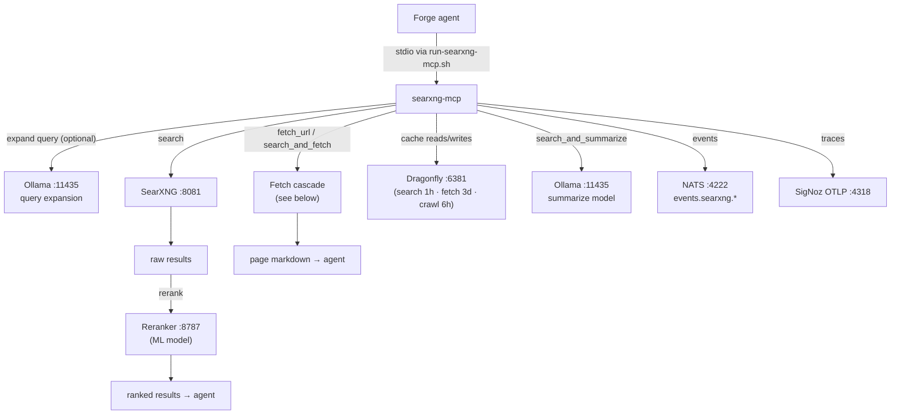
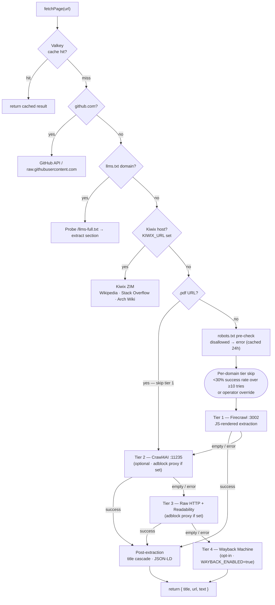

# searxng-mcp

searxng-mcp is a FastMCP MCP server (Node.js/TypeScript) that wraps SearXNG with
intelligent web fetching, ML-based result reranking, and multi-tier content extraction.
It provides forge agents with local web search and page retrieval without sending queries
to third-party search APIs.

- **Package:** `@tadmstr/searxng-mcp` v3.12.0 (TadMSTR/searxng-mcp)
- **Repo:** `/home/ted/repos/personal/searxng-mcp/`
- **Transport:** stdio — spawned per agent session via `/home/ted/scripts/run-searxng-mcp.sh`
- **Runtime:** Node.js 20+

## Architecture

## Tools (6)

| Tool | Description |
|------|-------------|
| `search` | Query SearXNG with local reranking; returns top N results (1–20) |
| `search_and_fetch` | Search, rerank, fetch full content (1–3 results) via fetch cascade |
| `search_and_summarize` | Search, fetch, synthesize summary with Ollama (1–5 results) |
| `fetch_url` | Extract readable markdown from any URL via tiered fetch cascade |
| `crawl_site` | Crawl entire site; returns URL/title/snippet manifest (Firecrawl → sitemap → optional BFS) |
| `clear_cache` | Purge search/fetch/crawl/all caches in Dragonfly |

## Fetch Cascade

`fetch_url` uses a multi-tier strategy with per-domain success tracking. Tiers are tried in
order; each failure falls through to the next. Per-domain success rates are tracked in
Dragonfly — if a domain's success rate drops below 30% over 10+ tries, that tier is skipped.

Robots.txt compliance is enforced on tiers 1–3. Adblock filtering is available via
`ADBLOCK_PROXY_URL` (applied to tiers 2 and 3).

### Adblock proxy container

`ADBLOCK_PROXY_URL` points at `crawler-adblock-proxy-1` — a standalone HTTP proxy (built
from `searxng-mcp/docker/adblock-proxy`, `@ghostery/adblocker` filter lists) deployed in its
own `~/docker/crawler/docker-compose.yml` stack (compose project `crawler`, network
`fetch-net`), not part of the Firecrawl or Crawl4AI stacks it fronts. It listens on
`127.0.0.1:8118` (host-bound, since searxng-mcp runs as a host stdio process, not a
container) and blocks plain-HTTP ad/tracker requests with an empty `200` response;
HTTPS `CONNECT` is tunneled without MITM. Filter lists (EasyList + EasyPrivacy) refresh
every 168 hours (`ADBLOCK_REFRESH_HOURS`).

## Environment Variables

| Variable | Required | Purpose |
|----------|----------|---------|
| `SEARXNG_URL` | Yes | SearXNG instance (default: `http://localhost:8081`) |
| `FIRECRAWL_URL` | Yes | Firecrawl extraction endpoint (port 3002) |
| `CRAWL4AI_URL` | No | Crawl4AI fallback (port 11235) |
| `RERANKER_URL` | Yes | ML reranker endpoint (port 8787) |
| `VALKEY_URL` | Yes | Dragonfly/Valkey cache (port 6381, db1; 3-day fetch TTL) |
| `OLLAMA_URL` | No | Ollama for search_and_summarize (port 11435) |
| `KIWIX_URL` | No | Kiwix offline fast path |
| `HISTER_URL` | No | Hister browser-history fast path |
| `HISTER_TOKEN` | No | Bearer token for Hister |
| `ADBLOCK_PROXY_URL` | No | HTTP proxy for ad filtering on tiers 2+3 |
| `NATS_URL` | No | NATS for event publishing (`events.searxng.*`) |
| `OTEL_EXPORTER_OTLP_ENDPOINT` | No | SigNoz distributed tracing |
| `EXPAND_QUERIES` | No | Enable Ollama query expansion (default: false) |
| `CRAWL_BFS_ENABLED` | No | Enable BFS crawl fallback (default: false) |
| `CRAWL_MAX_PAGES_DEFAULT` | No | Max pages per crawl (default: 20) |
| `CRAWL_MANIFEST_TTL_SECONDS` | No | Crawl manifest cache TTL (default: 21600) |

## Dependencies

| Service | Required | Port |
|---------|----------|------|
| SearXNG | Yes | 8081 |
| Firecrawl | Yes | 3002 |
| Reranker | Yes | 8787 |
| Dragonfly (searxng-dragonfly) | Yes | 6381 |
| Crawl4AI | No | 11235 |
| Ollama | No | 11435 |
| Kiwix | No | 8292 |
| NATS | No | 4222 |

## scoped-mcp Wiring

Registered in all five agent manifests under `~/.claude/manifests/`:

| Manifest | Access |
|----------|--------|
| `sysadmin-agent.yml` | All tools except `clear_cache` |
| `developer-agent.yml` | All tools except `clear_cache` |
| `research-agent.yml` | All tools except `clear_cache` |
| `security-agent.yml` | All tools except `clear_cache` |
| `writer-agent.yml` | All tools except `clear_cache` |

`clear_cache` is denied on all agents — shared Valkey cache, no individual agent should
purge globally. `search_and_summarize` rate-limited to 10/min (LLM-intensive).

## Observability

Events published to NATS subjects `events.searxng.*` when configured. OpenTelemetry
traces sent to SigNoz via `OTEL_EXPORTER_OTLP_ENDPOINT`. Grafana dashboard
"SearXNG-MCP Operations" tracks search/fetch/cache metrics.

## Security Notes

- Runs as stdio subprocess — no network listener, no authentication surface
- Robots.txt compliance enforced on all fetch tiers
- Per-domain success tracking stored in Dragonfly for intelligent tier selection
- Cache keys scoped by URL; no cross-agent data leakage
