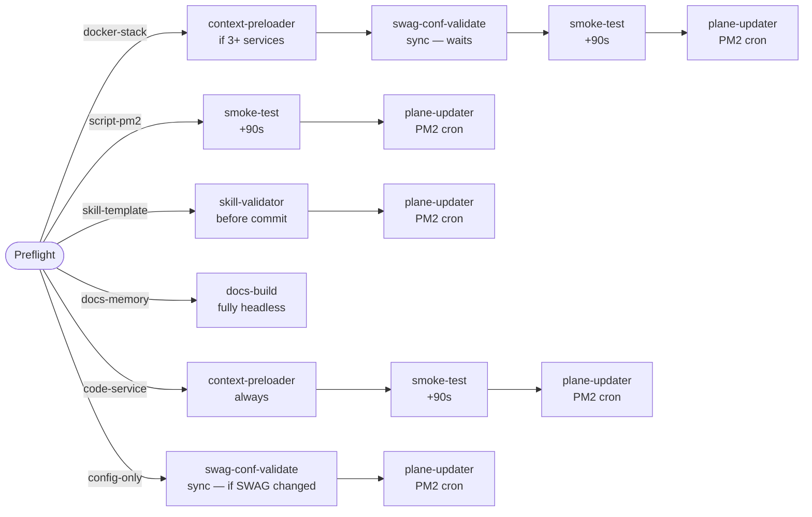
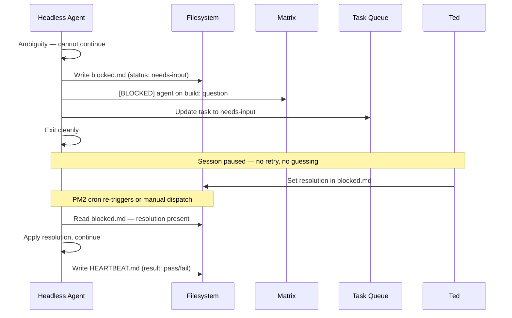

# Build Pipeline Agents

The build pipeline automation layer offloads mechanical steps from interactive build sessions into purpose-built headless `claude -p` projects. Each agent handles one well-defined task — SWAG conf validation, smoke testing, skill schema checking, Plane work item updates, or context pre-loading. The build agent and Ted engage only when judgment is needed.

## Why Headless Agents

The interactive build session is the most expensive resource in the pipeline: it holds Ted's attention, consumes tokens for mechanical checks that don't need reasoning, and serializes work that can run in parallel. Before this automation layer, the same session that was solving a hard dependency graph question was also re-running nginx config tests and updating Jira tickets.

The automation layer decouples those concerns. Build agent → judgment calls. Headless agents → mechanical tasks. The build agent dispatches headless work via the task queue and continues. Headless agents run, write their output, and post to Matrix when done or blocked.

## Build Type Taxonomy

Every build is classified by type at preflight. The type determines which headless agents fire and when. The `build-preflight` skill infers the type from the files-changed table; if ambiguous, it asks Ted before writing the handoff.

| Type | When to use |
|------|-------------|
| `docker-stack` | New service with compose file + SWAG proxy conf |
| `script-pm2` | Shell scripts, Python scripts, PM2 entries — no Docker |
| `skill-template` | New or updated SKILL.md files, template files |
| `docs-memory` | Memory notes, docs, prime-directive edits only — no code |
| `code-service` | MCP servers, Python packages, web apps |
| `config-only` | SWAG confs, Authelia config, PM2 entries only — no new service |

## Invocation Map

The build agent calls each headless agent at the trigger point listed for its build type. All agents communicate via the task queue — the build agent submits a task, the dispatcher launches the headless session, the session updates the task on completion.

| Build type | Agent | Trigger point |
|------------|-------|---------------|
| docker-stack | context-preloader | Before starting (if 3+ services in scope) |
| docker-stack | swag-conf-validate | After writing proxy conf, before reload |
| docker-stack | smoke-test | After build-finalize (auto, 90s delay) |
| docker-stack | plane-updater | After build-finalize (triggered by PM2 cron) |
| script-pm2 | smoke-test | After build-finalize (auto, 90s delay) |
| script-pm2 | plane-updater | After build-finalize (triggered by PM2 cron) |
| skill-template | skill-validator | After SKILL.md written, before prime-directive commit |
| skill-template | plane-updater | After build-finalize (triggered by PM2 cron) |
| docs-memory | docs-build | Fully headless — no interactive session (see below) |
| code-service | context-preloader | Before starting (always) |
| code-service | smoke-test | After build-finalize (auto, 90s delay) |
| code-service | plane-updater | After build-finalize (triggered by PM2 cron) |
| config-only | swag-conf-validate | After writing conf, before reload (if SWAG conf changed) |
| config-only | plane-updater | After build-finalize (triggered by PM2 cron) |



## The Five Headless Agents

### swag-conf-validate

**Project:** shell script at `~/scripts/swag-conf-validate.sh` (not a `claude -p` project)  
**Trigger:** build agent calls directly — `~/scripts/swag-conf-validate.sh <build-name> <conf-file-path>`  
**Purpose:** run `nginx -t` inside the SWAG container against the new proxy conf before reloading

The script runs the nginx config test, exits 0 on pass, and exits 1 on failure with a blocked.md written to `~/.claude/comms/artifacts/build-plans/<build_name>/blocked.md` and a Matrix notification fired. The build agent checks the exit code and does not proceed to build-finalize until the conf passes.

This is the only pipeline agent that runs synchronously — the build agent waits for it before continuing. All others are fire-and-forget.

### smoke-test

**Project:** `~/.claude/projects/smoke-test/`  
**Trigger:** task dispatcher after build-finalize (90-second delay in payload)  
**Purpose:** post-deploy health checks — HTTP reachability, container status, log error scan

Checks vary by build type:

- `docker-stack` / `code-service`: HTTP GET to service URL, `docker ps` status, recent error log scan
- `script-pm2`: PM2 service status, log error scan

Results are appended to the build close-out note under `## Smoke test`. On pass: one Matrix line to `#claudebox`. On fail: blocked.md written, Matrix alert with check details.

### skill-validator

**Project:** `~/.claude/projects/skill-validator/`  
**Trigger:** build agent calls it after writing SKILL.md, before prime-directive commit  
**Purpose:** structural checks on new or updated skill files

Checks include: `## Inputs` and `## Step N` sections present, no unfilled `<PLACEHOLDER>` strings, all referenced file paths exist, skill title matches filename, no copy-paste from another skill with only the name changed. Results written to `~/.claude/comms/artifacts/skill-validations/<skill-name>/findings.md`.

The build agent reads the exit code: clean exit means commit can proceed; non-zero means fix the findings first.

### plane-updater

**Project:** `~/.claude/projects/plane-updater/`  
**Trigger:** PM2 cron (`plane-updater`, every 5 min) watches for `plane-update: pending` in close-out notes  
**Purpose:** close Plane work items and add completion comments after a build

See [plane-updater.md](plane-updater.md) for the full doc.

### docs-build

**Project:** `~/.claude/projects/docs-build/`  
**Trigger:** task dispatcher, dispatched by research agent with `build-type: docs-memory`  
**Purpose:** execute documentation-only builds without an interactive session

For `docs-memory` builds (memory notes, prime-directive edits, doc updates with no code changes), no interactive session is needed. The research agent writes a handoff with `build-type: docs-memory`, submits a task, and the docs-build headless session handles it end-to-end: reads the handoff, makes the changes, commits to the appropriate repo, writes a close-out note with `plane-update: pending`, posts a Matrix summary, and exits.

### context-preloader

**Project:** `~/.claude/projects/context-preloader/`  
**Trigger:** build agent calls it at session start for `docker-stack` (3+ services) and all `code-service` builds  
**Purpose:** extract and summarize relevant config files before the build agent starts reading them

Reads compose files, SWAG confs, PM2 entries, and source files from the handoff scope-contract; writes a compact context snapshot to `~/.claude/comms/artifacts/build-plans/<build_name>/context-snapshot.md`. The build agent reads this at session start instead of opening 15 files individually.

## The blocked.md Protocol

Every headless agent shares the same pause protocol. When a session hits an unexpected state requiring a decision:

1. Write `~/.claude/comms/artifacts/<type>/<build-name>/blocked.md` using the blocked template
2. Post to `#claudebox`: `[BLOCKED] <agent-name> on <build-name>: <one-line question>`
3. Update task status to `needs-input`
4. Exit cleanly — do not guess, do not continue past the ambiguity

On next invocation, the agent checks for `blocked.md` with a `resolution:` field set. If resolution is present, it applies it and continues. If not, it re-posts and exits.

The blocked.md format is defined in `~/.claude/templates/reports/blocked.template.md`:

```yaml
---
build: <BUILD_NAME>
agent: <headless-agent-name>
blocked-at: <YYYY-MM-DD HH:MM>
status: needs-input
resolution: ~   # Ted sets this to unblock
---
```

Ted fills in `resolution:` with the appropriate option (or `custom: <value>`) and saves. The next PM2-triggered invocation or manual re-dispatch picks it up.



## HEARTBEAT.md Liveness Protocol

Every headless agent writes a HEARTBEAT.md as its final step on every run — pass, fail, or blocked.

**Location:** `~/.claude/projects/<agent-name>/HEARTBEAT.md` (overwritten each run)

```yaml
---
agent: <headless-agent-name>
build: <BUILD_NAME>
run-at: <YYYY-MM-DD HH:MM>
result: pass | fail | blocked
---

<One sentence: what was done and the outcome.>
```

To check all headless agent status at once:

```bash
grep -h "run-at\|result\|agent" ~/.claude/projects/*/HEARTBEAT.md
```

This is a single-file liveness check per agent with no Matrix noise for routine outcomes.

## Scoped-MCP Manifest Framework

Each headless project runs with tool access scoped to exactly what it needs. The `~/.claude/projects/<name>/settings.json` points to a filled-in manifest in `~/.claude/manifests/`; the project session inherits only those tools, with no global bleed-through from `~/.claude/settings.json`.

Template manifests for all six agent types live in `homelab-agent/manifests/` with `<FILL_AT_DEPLOY>` placeholders. See [manifests/README.md](../../manifests/README.md) for the deployment guide.

| Project | Manifest |
|---------|----------|
| `smoke-test` | `headless-smoke-test.yml` |
| `skill-validator` | `headless-skill-validator.yml` |
| `plane-updater` | `headless-plane-updater.yml` |
| `docs-build` | `headless-plane-updater.yml` (same surface) |
| `context-preloader` | `headless-context-preloader.yml` |
| `security-kb-precheck` | `headless-security-precheck.yml` |
| `security` (headless mode) | `headless-security-audit.yml` |

## New Agent-Bus Event Types

| Event type | Source | When |
|------------|--------|------|
| `smoke-test.pass` | smoke-test | All health checks passed |
| `smoke-test.fail` | smoke-test | One or more checks failed |
| `plane.updated` | plane-updater | Work items closed |
| `build.blocked` | any headless agent | blocked.md written, needs-input |
| `validation.pass` | skill-validator / swag-conf-validate | Clean validation |
| `validation.fail` | skill-validator / swag-conf-validate | Validation failed |

## Related Docs

- [Plane Updater](plane-updater.md) — full doc for the PM2 cron + headless Plane updater
- [Security KB Precheck](security-kb-precheck.md) — headless pre-audit scanner
- [Task Dispatcher](task-dispatcher.md) — headless session dispatch mechanics
- [scoped-mcp](scoped-mcp.md) — manifest schema, module types, tool allowlists
- [Agent Orchestration](agent-orchestration.md) — task queue, agent manifests, risk-based approval
