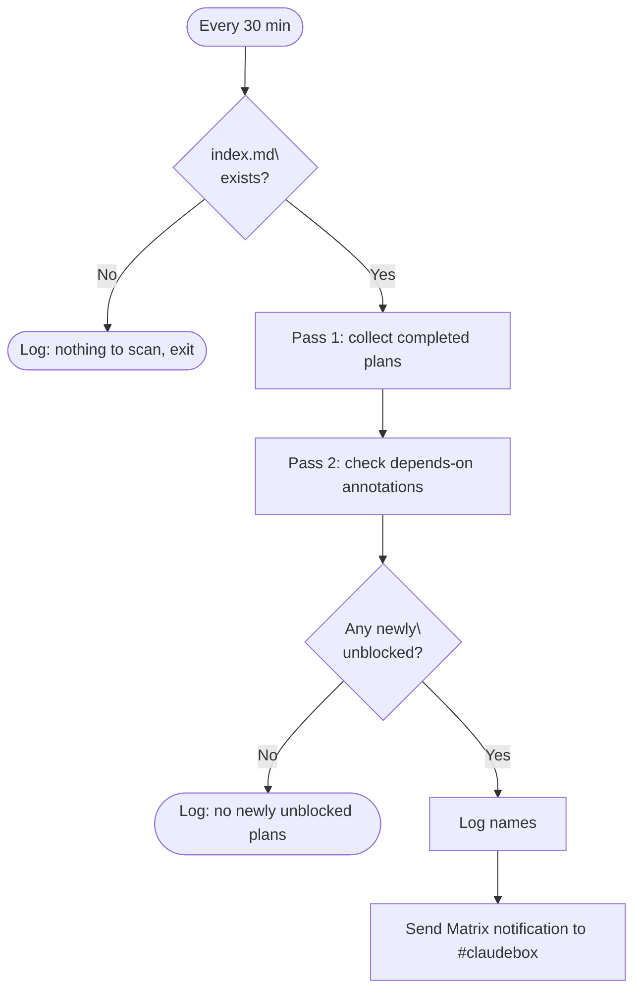

# Build Unblock Scan

The build unblock scan is a PM2 cron job that runs every 30 minutes and checks the build plan index for plans whose blocking dependency has been completed. When a newly-unblocked plan is found, it sends a Matrix notification to `#claudebox`.

**Script:** `~/scripts/build-unblock-scan.sh`  
**PM2 service:** `build-unblock-scan` (cron: `*/30 * * * *`)  
**Log:** `/var/log/claudebox/build-unblock-scan.log`

## What It Does

Each run parses `~/.claude/comms/artifacts/build-plans/index.md` — the build plan registry. Plans in the index are markdown sections (`## <plan-name>`) annotated with inline metadata fields (`status:`, `depends-on:`).

The script performs a two-pass scan:

1. **Pass 1** — collect all plans with `status: complete`
2. **Pass 2** — for each plan with a `depends-on:` annotation, check whether the dependency appears in the completed set. If it does (and the plan itself is not already complete), the plan is newly unblocked.

When newly unblocked plans are found, it sends a Matrix notification:

```
**[UNBLOCKED]** Build plans ready: <plan1>, <plan2>. Check ~/.claude/comms/artifacts/build-plans/index.md
```



## Index Format

The script reads a specific annotation convention from `index.md`:

```markdown
## some-build-plan
status: complete
...

## another-build-plan
status: pending
depends-on: some-build-plan
...
```

The `depends-on:` value is matched loosely (substring match in both directions) to handle naming variations. For deterministic matching, keep plan names consistent between the section header and `depends-on:` references.

## Log Output

All output is timestamped and appended to `/var/log/claudebox/build-unblock-scan.log`:

```
[2026-05-02 14:00:01] Build unblock scan starting
[2026-05-02 14:00:01] No newly unblocked plans
[2026-05-02 14:00:01] Scan complete
```

When plans are unblocked:

```
[2026-05-02 14:00:01] Build unblock scan starting
[2026-05-02 14:00:01] Newly unblocked: helm-platform-phase2, grafana-build
[2026-05-02 14:00:01] Scan complete
```

## PM2 Configuration

```js
{
  name: "build-unblock-scan",
  script: "/home/ted/scripts/build-unblock-scan.sh",
  cron_restart: "*/30 * * * *",
  autorestart: false,
  out_file: "/var/log/claudebox/build-unblock-scan.log",
  error_file: "/var/log/claudebox/build-unblock-scan.log",
  merge_logs: true,
  time: true,
  env: { LOG_PATH: "/var/log/claudebox/build-unblock-scan.log" }
}
```

`autorestart: false` is intentional — cron job, not a daemon.

## Relationship to the build-unblock Skill

The `build-unblock` skill was previously invoked manually during build close-out sessions. The PM2 cron replaces that: unblock scanning now runs independently of any active session, every 30 minutes. The skill itself is no longer called from `build-finalize`.

The cron approach means you get unblock notifications even on days when no build sessions are active — useful when a blocking build completes on a weekday and the dependent build is queued for a weekend sprint.

## Related Docs

- [Agent Orchestration](agent-orchestration.md) — build plan index format, plan lifecycle
- [drift-detector-scan](drift-detector-scan.md) — companion PM2 cron for post-build artifact checking
- [Inter-Agent Communication](inter-agent-communication.md) — handoff and artifact directory conventions
