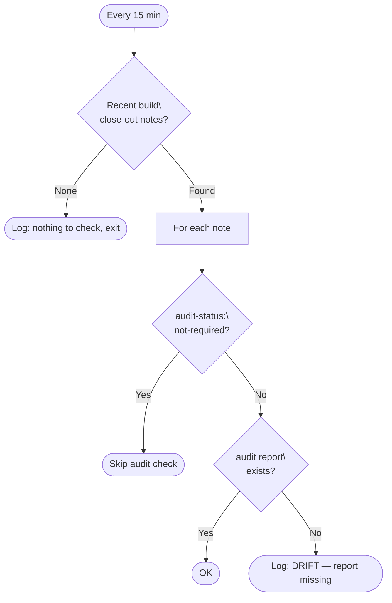

# Drift Detector Scan

The drift detector scan is a PM2 cron job that runs every 15 minutes and checks whether recent builds left expected artifacts in place. It detects a specific class of post-deployment drift: builds that closed out without a corresponding audit report.

**Script:** `~/scripts/drift-detector-scan.sh`  
**PM2 service:** `drift-detector-scan` (cron: `*/15 * * * *`)  
**Log:** `/var/log/claudebox/drift-detector-scan.log`

## What It Does

Each run scans `~/.claude/memory/shared/` for build close-out memory notes written in the last 15 minutes. These are notes tagged with `[build` in their YAML frontmatter — written by the `build-close-out` skill at the end of every completed build.

For each recent build note found, the script checks:

- **Audit report presence** — if the build's `audit-status` is not `not-required`, confirms that `~/.claude/comms/artifacts/audit-reports/<build_name>/handoff.md` exists. If missing, logs `DRIFT: <build_name> — audit report missing at <path>`.

This is a lightweight structural check. It doesn't inspect file contents or validate correctness — just confirms declared artifacts exist at their expected paths.



## When It Fires

The 15-minute cron window matches the close-out memory note search window. A build that completes and closes out will produce a note within seconds; the next cron tick will find it and check. This makes the check near-real-time relative to build completion rather than waiting for a daily or weekly scan.

If no close-out notes are found, the script exits cleanly with a single log line. On a quiet day this is the common case.

## Log Output

All output is timestamped and appended to `/var/log/claudebox/drift-detector-scan.log`:

```
[2026-05-02 14:30:01] Drift detector scan starting
[2026-05-02 14:30:01] No recent build close-out notes — nothing to check
[2026-05-02 14:30:01] Drift scan complete
```

When drift is detected:

```
[2026-05-02 14:30:01] Recent build notes found: 1
[2026-05-02 14:30:01] Checking drift for build: headless-agent-automation
[2026-05-02 14:30:01] DRIFT: headless-agent-automation — audit report missing at /home/ted/.claude/comms/artifacts/audit-reports/headless-agent-automation/handoff.md
[2026-05-02 14:30:01] Drift scan complete
```

Drift log lines are written to the log only — there is no Matrix alert for this check. The log is monitored by PM2 logrotate (daily rotation, 7-day retention).

## PM2 Configuration

```js
{
  name: "drift-detector-scan",
  script: "/home/ted/scripts/drift-detector-scan.sh",
  cron_restart: "*/15 * * * *",
  autorestart: false,
  out_file: "/var/log/claudebox/drift-detector-scan.log",
  error_file: "/var/log/claudebox/drift-detector-scan.log",
  merge_logs: true,
  time: true
}
```

`autorestart: false` is intentional — this is a cron job, not a long-running daemon. PM2 starts it on schedule and it exits when done.

## Scope and Limitations

The script only checks builds completed in the last 15 minutes. It won't catch drift from older builds that were never audited — that's covered by the security agent's session-start scan (see [Security Agent](security-agent.md)).

The check is also narrow by design: it confirms one thing (audit report present) rather than doing a deep structural audit. For broader drift detection across design documents and memory, see the `drift-detector` skill invoked during build close-out.

## Related Docs

- [Security Agent](security-agent.md) — audit report format and the broader audit workflow
- [Inter-Agent Communication](inter-agent-communication.md) — audit-reports directory layout
- [build-unblock-scan](build-unblock-scan.md) — companion PM2 cron for build plan queue management
