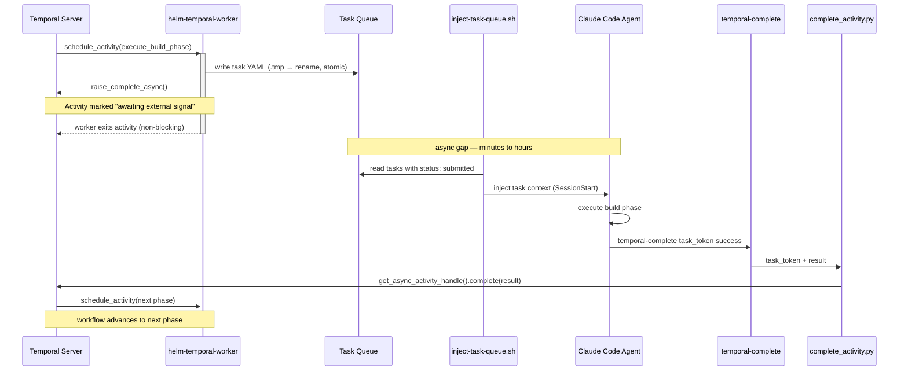

# Helm Temporal Worker

The Helm Temporal Worker is a Python PM2 service that bridges the Temporal durable execution stack to Claude Code agent sessions. It connects to the Temporal server, polls the `helm-build` task queue, and dispatches each workflow phase to the appropriate Claude Code agent by writing a task queue YAML file. The activity completes asynchronously — the worker exits immediately and waits for an external signal from the agent after it finishes the phase.

This enables multi-phase Helm build automation with durable state tracking: if a phase fails or the worker restarts, Temporal retries from the last incomplete phase rather than from scratch.

## Architecture

The async activity completion pattern is the key design choice. A standard Temporal activity runs to completion inside the worker process — impossible for Claude Code sessions, which are interactive and may take hours. The async pattern decouples execution:

```
Temporal Server
    │
    │  (schedule activity)
    ▼
helm-temporal-worker (PM2)
    │
    │  1. Write task YAML to ~/.claude/task-queue/
    │  2. raise_complete_async()  ← tells Temporal "I'm done, signal me later"
    │  3. Worker exits activity (does NOT block)
    │
    ▼
inject-task-queue.sh hook (SessionStart)
    │
    │  Picks up task YAML, agent sees it at session start
    ▼
Claude Code Agent
    │
    │  Executes phase, runs build-close-out skill
    │
    │  ~/scripts/temporal-complete <task_token> success "Phase done"
    │
    ▼
complete_activity.py
    │
    │  Signals Temporal via get_async_activity_handle()
    ▼
Temporal Server
    │
    │  (activity complete → schedule next phase)
    ▼
    ...repeat for each phase
```



Each phase of the build plan becomes one Temporal activity. `BuildPlanWorkflow` iterates through all phases sequentially — the next phase only starts after the previous activity is signaled complete.

## Components

### worker.py

The PM2 entry point. Connects to Temporal at `localhost:7233`, registers `BuildPlanWorkflow` and the `execute_build_phase` activity on the `helm-build` task queue, and runs until SIGTERM/SIGINT.

```python
TEMPORAL_ADDRESS = "localhost:7233"
TEMPORAL_NAMESPACE = "default"
TASK_QUEUE = "helm-build"
```

Signal handling uses `asyncio` event loop signal handlers rather than blocking — the worker shuts down cleanly on PM2 stop.

### activities/build_phase.py — `execute_build_phase`

The activity that runs for each phase. Receives a `BuildPhaseInput` and:

1. Generates a task UUID and timestamp
2. Base64-encodes the Temporal task token from `activity.info().task_token`
3. Writes a task YAML file to `~/.claude/task-queue/` (atomic: write `.tmp`, then rename)
4. Calls `activity.raise_complete_async()` — registers the activity as externally-completable and exits

The task YAML includes the encoded task token in `payload.task_token`. The agent uses this token to signal back to Temporal after phase completion.

### workflows/build_plan.py — `BuildPlanWorkflow`

The workflow definition. Takes a `BuildPlanInput` with a plan name and list of `PhaseSpec` objects. Executes each phase sequentially via `workflow.execute_activity()`:

- **Timeout:** 24 hours per activity (`start_to_close_timeout`)
- **Retry policy:** maximum 2 attempts; `PhaseFailedError` is non-retryable (agent explicitly failed the phase)
- If any phase returns `status != "success"`, the workflow raises `PhaseFailedError` and stops

### complete_activity.py

CLI tool invoked by Claude Code agents (via the `~/scripts/temporal-complete` wrapper) to signal phase completion back to Temporal:

```bash
temporal-complete <task_token_b64> success "Phase 2 done — stack deployed"
temporal-complete <task_token_b64> failed  "Docker healthcheck timed out"
```

Uses `client.get_async_activity_handle(task_token=...)` to retrieve the activity handle, then calls `handle.complete()` or `handle.fail()` with a `BuildPhaseResult`.

### models.py

Dataclasses shared between workflow, activities, and complete_activity:

| Class | Fields |
|-------|--------|
| `BuildPlanInput` | `plan_name`, `phases: List[PhaseSpec]` |
| `PhaseSpec` | `number`, `agent_type`, `description`, `context_refs` |
| `BuildPhaseInput` | `plan_name`, `phase_number`, `agent_type`, `description`, `context_refs`, `workflow_id` |
| `BuildPhaseResult` | `status` (`"success"` or `"failed"`), `output` |
| `BuildPlanResult` | `status`, `phases_run` |

### ~/scripts/temporal-complete

Shell wrapper around `complete_activity.py`. Not a symlink — system Python lacks `temporalio`. The wrapper calls the venv interpreter explicitly:

```bash
#!/bin/bash
cd /home/ted/repos/personal/helm-temporal-worker
venv/bin/python3 complete_activity.py "$@"
```

## Configuration

**PM2:** `~/repos/personal/helm-temporal-worker/ecosystem.config.js`

| Setting | Value |
|---------|-------|
| `interpreter` | `/home/ted/repos/personal/helm-temporal-worker/venv/bin/python3` |
| `cwd` | `/home/ted/repos/personal/helm-temporal-worker` |
| `autorestart` | `true` |
| `max_restarts` | 10 |
| `exp_backoff_restart_delay_ms` | 5000 |
| `PYTHONUNBUFFERED` | `1` |

**Python dependencies:** `requirements.txt` — `temporalio`, `pyyaml`, `dataclasses-json`. Installed in `venv/` within the repo directory. Re-install with `pip install -r requirements.txt` if the venv is lost.

**Network:** Worker connects outbound to `localhost:7233` — no inbound ports, no proxy, no auth layer.

## Triggering a Build Plan

To start a multi-phase build via Temporal, submit a `BuildPlanWorkflow` using the Temporal CLI or a client script:

```bash
# Via Docker (Temporal CLI on temporal-network)
docker run --rm --network temporal-network \
  temporalio/admin-tools:1.30.2 \
  temporal workflow start \
    --workflow-type BuildPlanWorkflow \
    --task-queue helm-build \
    --namespace default \
    --workflow-id "helm-build-$(date +%Y%m%d-%H%M%S)" \
    --input '{"plan_name": "my-build", "phases": [{"number": 1, "agent_type": "claudebox", "description": "Deploy base stack", "context_refs": []}]}'
```

Once started, the worker picks up the workflow, dispatches Phase 1 as a task queue YAML, and suspends. The agent completes the phase and runs `temporal-complete`. The workflow proceeds to Phase 2, and so on.

## Integration Points

**Temporal Server:** Worker connects to `localhost:7233` on startup. If Temporal is not running, PM2 will restart the worker up to 10 times with exponential backoff before giving up. Check `docker ps` for the `temporal` container if the worker won't stay up.

**Task queue (`~/.claude/task-queue/`):** The worker writes phase tasks here using the same atomic write pattern as all other task producers (`.tmp` → rename). Task files include the encoded task token in `payload.task_token` — this is the only coupling between the task queue system and Temporal.

**inject-task-queue.sh (SessionStart hook):** Picks up tasks with `status: submitted` at session start and surfaces them to agents as `additionalContext`. The worker doesn't need to know which agent picks up the task — the hook routes it based on `target_agent`.

**build-close-out skill:** Step 5b of the build-close-out skill invokes `temporal-complete` after closing out a phase. The skill reads `payload.task_token` from the task YAML and passes it to the wrapper. This is the only required change agents need to make — everything else in build-close-out is unchanged.

**Plane:** Build plan phases map to Plane work items. There's no direct integration yet — the workflow input describes phases textually and agents update Plane manually via the MCP. Future: workflow input could include Plane issue IDs for automatic status updates.

## Gotchas and Lessons Learned

**`raise_complete_async()` raises an exception — this is expected.** The Temporalio SDK raises `CompleteAsyncError` internally after `raise_complete_async()` is called. This is how Temporal knows to mark the activity as "waiting for external completion." Do not wrap it in a try/except. PM2 logs will not show an error for this.

**Task tokens are base64-encoded and may fold at 80 chars.** If reading the token from a task YAML file manually (e.g., in a shell script), use the YAML parser — `grep` or `awk` will truncate the token at line breaks. The `temporal-complete` wrapper already handles this via Python's yaml loader, but raw shell extraction will silently produce an invalid token.

**`get_async_activity_handle()` — not `complete_async_activity_by_token()`** — the build plan was written against an older SDK spec. The correct API in temporalio 1.24.0 is `client.get_async_activity_handle(task_token=decoded_bytes)`, then `handle.complete(result)`. The method `complete_async_activity_by_token()` does not exist.

**Worker must be on the same network as Temporal.** The `temporal` container binds gRPC on `127.0.0.1:7233` (host port) — this means the worker must run on the host (not in a container) to reach it. Workers in Docker containers on `claudebox-net` cannot connect because `temporal-network` is isolated. Current setup runs the worker via PM2 on the host, which is correct.

**Activity timeout is 24 hours.** If an agent session takes longer than 24 hours to complete a phase (unlikely but possible for complex multi-step phases), Temporal will time out and retry the activity. The retry will re-dispatch the phase to the task queue — the agent will see it again. Design phases to complete well within this window.

**venv must survive a claudebox rebuild.** `deploy-claudebox.sh` recreates the venv from `requirements.txt` as part of the helm-temporal-worker deploy section. If you add a dependency, update `requirements.txt` and the deploy script.

## Further Reading

- [Temporal async activity completion](https://docs.temporal.io/dev-guide/python/features#async-activity-completion)
- [Temporal Python SDK](https://docs.temporal.io/develop/python)
- [temporalio Python package](https://github.com/temporalio/sdk-python)

---

## Related Docs

- [Temporal](temporal.md) — the Temporal server stack this worker connects to
- [Agent Orchestration](agent-orchestration.md) — the task queue and PM2 dispatcher
- [Plane](plane.md) — project tracking for Helm platform build phases
- [build-close-out skill](../../README.md) — Step 5b triggers `temporal-complete`
