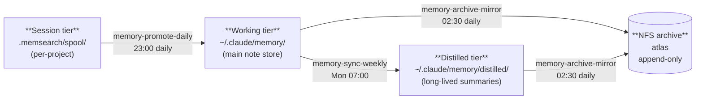
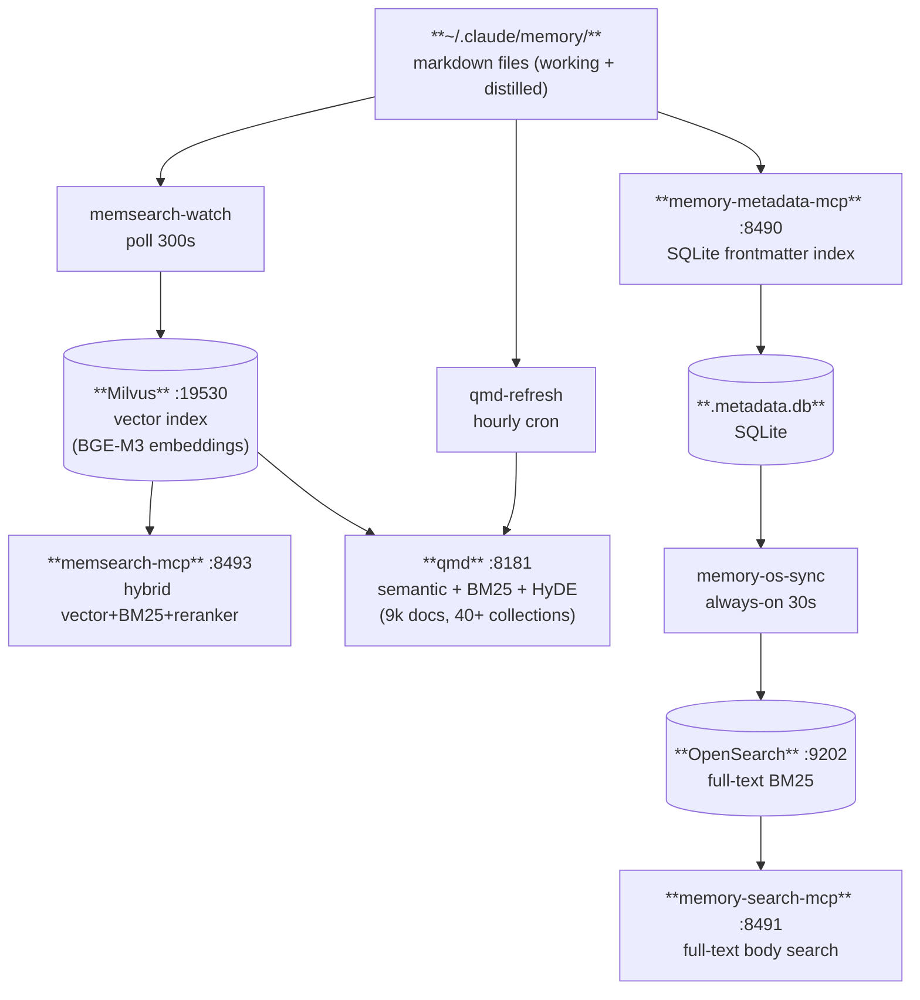
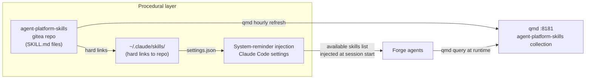
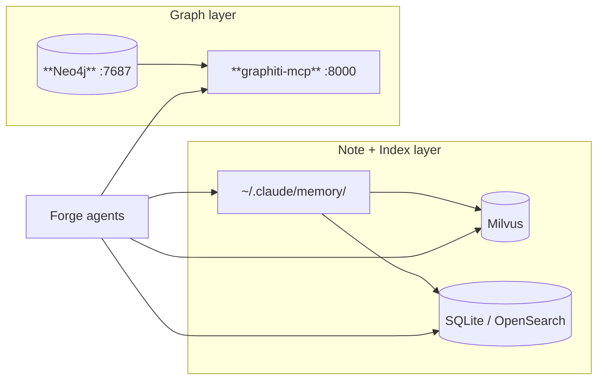
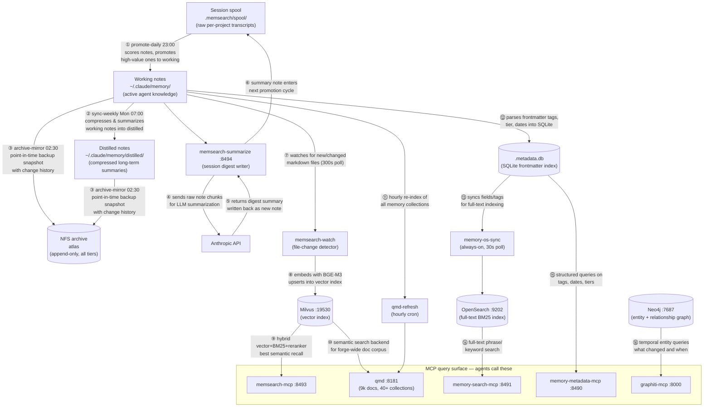

# Memory Architecture

Forge's agent memory system has two parallel layers: **flat notes** (the canonical source of truth,
organised into three promotion tiers) and **indices** (derived from the notes, enabling different
query styles). Graphiti is a third, complementary layer for relational and temporal knowledge that
doesn't map well to flat text.

---

## The Three-Tier Note Store

All agent memory begins as markdown files. Files move forward through tiers as they are promoted;
nothing is deleted outright — older tiers are archived to NFS.

| Tier | Location | What lives here | Written by |
|------|----------|----------------|-----------|
| Session | `~/.claude/projects/*/.memsearch/spool/` | Raw session transcripts (per-project) | memsearch plugin, memsearch-summarize |
| Working | `~/.claude/memory/` | Active notes, decisions, agent memories | Agents, memory-promote-daily |
| Distilled | `~/.claude/memory/distilled/` | Compressed long-term summaries | memory-sync-weekly |
| Archive | NFS (atlas) | All tiers, append-only with change history | memory-archive-mirror |

---

## The Index Layer

The note files are the source of truth. The indices are derived and can be rebuilt. Four indices
serve different query needs:

### Choosing a query path

| Need | Use | Why |
|------|-----|-----|
| Semantic / fuzzy recall across memory notes | `memsearch-mcp` | Hybrid vector+BM25 with local reranker — best recall |
| Semantic search across all forge docs (not just notes) | `qmd` | Covers 9k docs across 40+ collections |
| Filter notes by tag, date, tier, or category | `memory-metadata-mcp` | Structured frontmatter queries without reading bodies |
| Find notes containing a specific phrase or term | `memory-search-mcp` | Full-text BM25 over note bodies |

---

## Procedural Layer

The skills system is the procedural memory tier — reusable agent behaviors stored as SKILL.md files.
Unlike the note store (observations, decisions) or Graphiti (entity relationships), skills encode
*how to do things*: multi-step procedures, tool sequencing, and domain-specific workflows.

| Access path | When to use |
|-------------|-------------|
| System-reminder injection | Immediate: skills available without a query |
| qmd (`agent-platform-skills` collection) | Retrieval: search for a skill by task description |

Skills are not promoted through the session/working/distilled pipeline — they are versioned in Git
and indexed by qmd independently. The authoritative source is the Gitea repo; the hard links at
`~/.claude/skills/` keep deployed copies in sync automatically.

---

## Graphiti — Relational Layer

Graphiti is a parallel system, not part of the note or index layer. It stores **entities and
relationships** (not document chunks) in Neo4j with temporal metadata — when facts were true and
when they changed.

Use Graphiti for:
- "What services does SWAG depend on?"
- "When did this architectural decision change?"
- "Which agents have access to which tools?"

Use the note/index layer for:
- Free-text observations, session notes, decisions
- Anything an agent wrote down mid-session

Graphiti is populated by `add_memory` calls from agents at infrastructure change events (deploys,
topology changes, service additions). It is not fed by the promotion pipeline.

See [graphiti.md](graphiti.md) for configuration, stack details, and operations.

---

## Full System Map

### Hop-by-hop reference

| # | From → To | What it does |
|---|-----------|-------------|
| ① | spool → working | `memory-promote-daily` scores session notes nightly and moves high-value ones into the main working store |
| ② | working → distilled | `memory-sync-weekly` reads working notes and compresses them into concise long-lived summaries |
| ③ | working/distilled → NFS | `memory-archive-mirror` takes a daily snapshot of all tiers to atlas — append-only, retains change history |
| ④–⑤ | working ↔ Anthropic | `memsearch-summarize` chunks a project's spool, calls Claude to write a digest, and saves the result |
| ⑥ | summarize → spool | The new summary re-enters the spool so it gets scored and promoted by the next ① cycle |
| ⑦–⑧ | working → Milvus | `memsearch-watch` polls for changed files, embeds them with BGE-M3, and upserts vectors into Milvus |
| ⑨ | Milvus → memsearch-mcp | Agents query via hybrid vector + BM25 + cross-encoder reranker — highest-recall recall path |
| ⑩–⑪ | working/Milvus → qmd | `qmd-refresh` re-indexes all memory collections hourly; qmd also uses Milvus as its vector backend |
| ⑫ | working → .metadata.db | `memory-metadata-mcp` parses frontmatter (tier, tags, dates) into a local SQLite file on each write |
| ⑬ | .metadata.db → OpenSearch | `memory-os-sync` watches the SQLite file and pushes changes to OpenSearch for full-text indexing |
| ⑭ | OpenSearch → memory-search-mcp | Agents search note *bodies* by phrase or keyword via BM25 |
| ⑮ | .metadata.db → memory-metadata-mcp | Agents filter notes by structured fields (tag, date range, tier) without reading file bodies |
| ⑯ | Neo4j → graphiti-mcp | Agents query entities, relationships, and when facts changed — the relational/temporal layer |

---

## Related Docs

- [memory-stack.md](memory-stack.md) — Milvus + OpenSearch Docker stack
- [memory-services.md](memory-services.md) — PM2 indexing services and promotion pipeline
- [memsearch.md](memsearch.md) — memsearch library, reranker, configuration
- [memsearch-mcp.md](memsearch-mcp.md) — MCP server wrapping memsearch
- [memsearch-summarize.md](memsearch-summarize.md) — session transcript summarizer
- [graphiti.md](graphiti.md) — Neo4j knowledge graph (relational layer)
