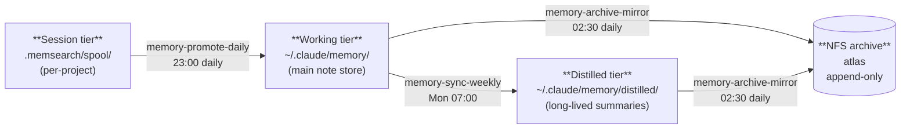
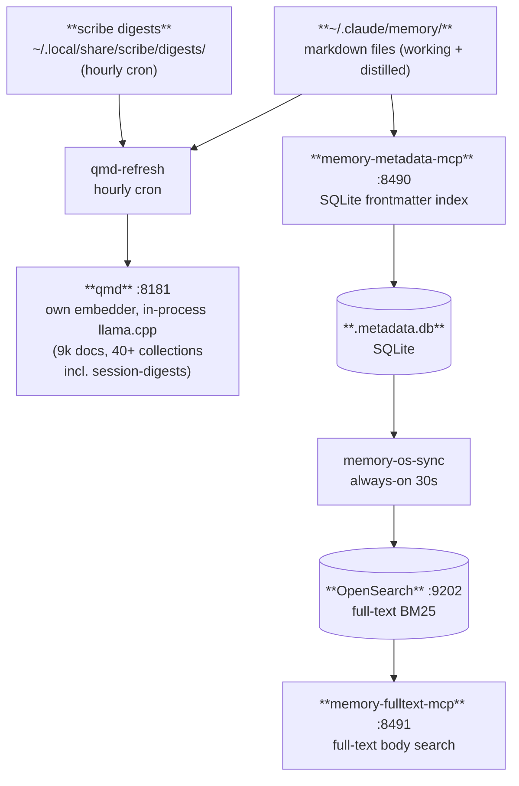
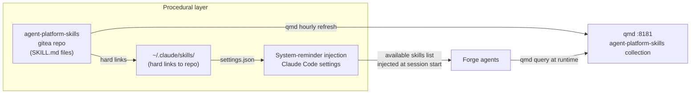
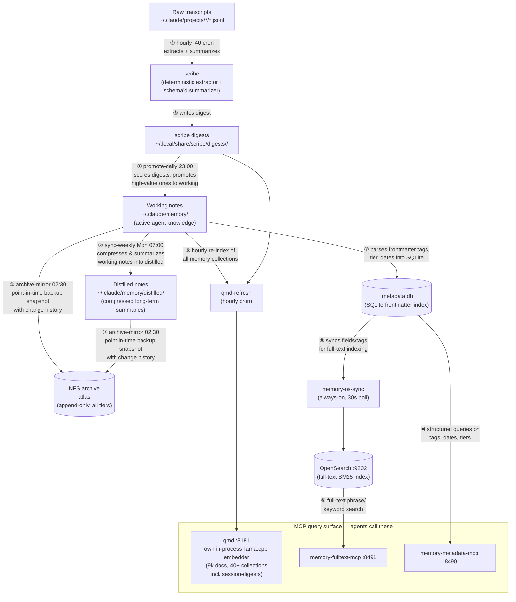

# Memory Architecture

Forge's agent memory system has two parallel layers: **flat notes** (the canonical source of truth,
organised into three promotion tiers) and **indices** (derived from the notes, enabling different
query styles). A third layer, Graphiti (a Neo4j-backed relational/temporal knowledge graph), was
retired 2026-08-05 — see [graphiti.md](graphiti.md). There is no relational layer today; agents
use flat notes for the queries Graphiti used to answer.

**memsearch (Milvus-backed hybrid vector+BM25 search) was retired 2026-09-17** — see
[memsearch.md](memsearch.md#retirement). qmd now backs semantic recall across every tier,
including session history via its `session-digests` collection, which [scribe](scribe.md)
writes on an hourly cron. The diagrams and tables below reflect the post-retirement state.

---

## The Three-Tier Note Store

All agent memory begins as markdown files. Files move forward through tiers as they are promoted;
nothing is deleted outright — older tiers are archived to NFS.

| Tier | Location | What lives here | Written by |
|------|----------|----------------|-----------|
| Session | `~/.claude/projects/*/*.jsonl` (raw transcripts), `~/.local/share/scribe/digests/<agent>/` (digests) | Raw session transcripts and scribe's hourly digests | Claude Code, [scribe](scribe.md) |
| Working | `~/.claude/memory/` | Active notes, decisions, agent memories | Agents, memory-promote-daily |
| Distilled | `~/.claude/memory/distilled/` | Compressed long-term summaries | memory-sync-weekly |
| Archive | NFS (atlas) | All tiers, append-only with change history | memory-archive-mirror |

---

## The Index Layer

The note files are the source of truth. The indices are derived and can be rebuilt. Four indices
serve different query needs:

### Choosing a query path

| Need | Use | Why |
|------|-----|-----|
| Semantic / fuzzy recall across memory notes and session digests | `qmd` | Own in-process llama.cpp embedder, 9k docs across 40+ collections including `session-digests`. Replaced `memsearch-mcp` 2026-09-17 — see [memsearch.md](memsearch.md#retirement) |
| Filter notes by tag, date, tier, or category | `memory-metadata-mcp` | Structured frontmatter queries without reading bodies |
| Find notes containing a specific phrase or term | `memory-fulltext-mcp` | Full-text BM25 over note bodies |

---

## Procedural Layer

The skills system is the procedural memory tier — reusable agent behaviors stored as SKILL.md files.
Unlike the note store (observations, decisions), skills encode *how to do things*: multi-step
procedures, tool sequencing, and domain-specific workflows.

| Access path | When to use |
|-------------|-------------|
| System-reminder injection | Immediate: skills available without a query |
| qmd (`agent-platform-skills` collection) | Retrieval: search for a skill by task description |

Skills are not promoted through the session/working/distilled pipeline — they are versioned in Git
and indexed by qmd independently. The authoritative source is the Gitea repo; the hard links at
`~/.claude/skills/` keep deployed copies in sync automatically.

---

## Graphiti (retired)

Forge previously ran a relational/temporal knowledge graph layer (Neo4j + graphiti-mcp)
alongside the note/index layers above. It was retired 2026-08-05 — see
[graphiti.md](graphiti.md) for what it was and why it was shut down. Queries it used to answer
("what depends on what," "when did this change") now fall back to flat notes; there is no
direct replacement.

---

## Full System Map

### Hop-by-hop reference

| # | From → To | What it does |
|---|-----------|-------------|
| ① | digests → working | `memory-promote-daily` scores scribe digests nightly and moves high-value ones into the main working store. Re-pointed from `.memsearch/memory/` journals to `~/.local/share/scribe/digests/<agent>/` during the 2026-09-17 memsearch cutover |
| ② | working → distilled | `memory-sync-weekly` reads working notes and compresses them into concise long-lived summaries |
| ③ | working/distilled → NFS | `memory-archive-mirror` takes a daily snapshot of all tiers to atlas — append-only, retains change history. Scribe digests are **not** mirrored under this layout — a known gap, see [scribe.md](scribe.md) |
| ④–⑤ | transcripts → scribe → digests | `scribe` extracts an hourly cron over raw session transcripts into a structured event log, then a schema'd summarizer writes a digest. Replaced `memsearch-summarize` 2026-09-17 — see [scribe.md](scribe.md) for the extraction fix and provider detail (do not trust a provider name in this doc; it has been wrong twice before) |
| ⑥ | working/digests → qmd | `qmd-refresh` re-indexes all memory collections hourly, including scribe's `session-digests` collection. qmd links `llama.cpp` in-process and loads its own GGUF embedding models from `~/.cache/qmd/models/` — no dependency on Milvus. The real GPU coupling: qmd's in-process `llama.cpp` and Ollama's `llama.cpp`-backed inference share one 16 GB GPU, the root of the recurring "Failed to create any embedding context" errors, not a data dependency |
| ⑦ | working → .metadata.db | `memory-metadata-mcp` parses frontmatter (tier, tags, dates) into a local SQLite file on each write |
| ⑧ | .metadata.db → OpenSearch | `memory-os-sync` watches the SQLite file and pushes changes to OpenSearch for full-text indexing |
| ⑨ | OpenSearch → memory-fulltext-mcp | Agents search note *bodies* by phrase or keyword via BM25 |
| ⑩ | .metadata.db → memory-metadata-mcp | Agents filter notes by structured fields (tag, date range, tier) without reading file bodies |

**Retired 2026-09-17:** `memsearch-watch-fast`/`memsearch-watch-templates` (polled/watched
files, embedded with BGE-M3, upserted into Milvus) and `memsearch-mcp` (hybrid
vector+BM25+reranker query surface). See [memsearch.md](memsearch.md#retirement).

---

## Related Docs

- [memory-stack.md](memory-stack.md) — Milvus (stopped, data preserved) + OpenSearch (still live)
- [memory-services.md](memory-services.md) — PM2 indexing services and promotion pipeline
- [scribe.md](scribe.md) — transcript extraction + session digest writer, replaced memsearch-summarize
- [memsearch.md](memsearch.md) — hybrid vector+BM25 search library, retired 2026-09-17
- [memsearch-mcp.md](memsearch-mcp.md) — MCP server wrapping memsearch, retired 2026-09-17
- [memsearch-summarize.md](memsearch-summarize.md) — session transcript summarizer, retired 2026-09-17
- [llm-providers.md](../ai-search/llm-providers.md) — which LLM provider each memory consumer
  actually uses, kept current in one place rather than four
- [graphiti.md](graphiti.md) — Neo4j knowledge graph, retired 2026-08-05
