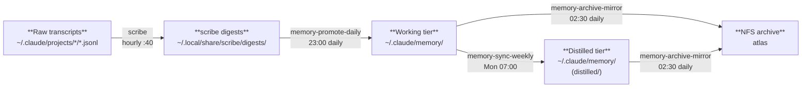
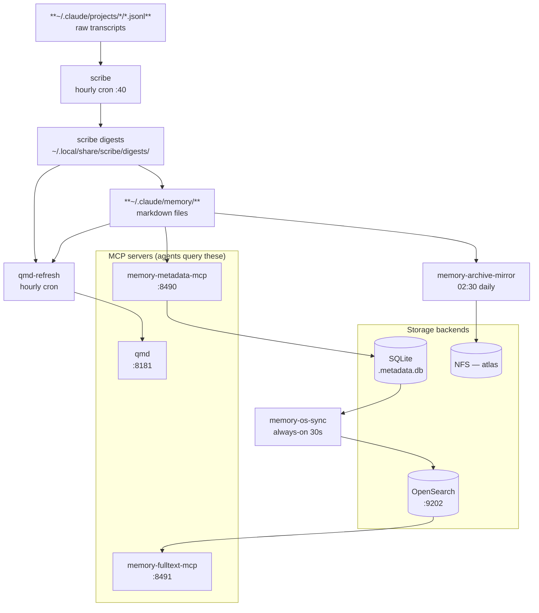

# Memory Services

PM2-managed services that form the agent memory layer. Two groups: **indexing and search**
(always-on) and **promotion pipeline** (scheduled).

> **memsearch retired 2026-09-17.** `memsearch-watch-fast`, `memsearch-watch-templates`,
> `memsearch-mcp`, and `memsearch-summarize` were stopped and deleted from PM2 the same day,
> along with the Milvus backend they indexed into — see
> [memsearch.md](memsearch.md#retirement) for the full cutover record. This page now lists only
> the services still running.

## qmd

Semantic + keyword search MCP server over ~9,000 markdown documents across 40+ collections
(docs cache, component docs, build reports, agent memory, session digests, etc.). Supports
BM25 (lexical), vector (semantic), and HyDE (hypothetical document) sub-queries. Replaced
memsearch-mcp as the primary semantic recall path for agent memory on 2026-09-17.

```bash
qmd mcp --http --port 8181 --host 127.0.0.1
```

- **Endpoint:** `http://127.0.0.1:8181`
- **Collections:** see `qmd status` for the full list and per-collection doc counts —
  including `session-digests`, fed by [scribe](scribe.md)'s hourly cron

## qmd-webhook

Small always-on HTTP listener that reacts to [agent-bus](../agent/agent-bus.md) events by
triggering targeted `qmd embed` reindexing — an event-driven complement to the hourly
`qmd-refresh` cron, so newly created build artifacts become searchable within seconds
instead of waiting for the next hourly pass.

```bash
python3 ~/scripts/qmd-webhook.py
```

- **Endpoint:** `http://127.0.0.1:8499` (HTTP POST, no auth — localhost-only)
- **Transport:** plain `http.server`, not MCP — receives agent-bus webhook POSTs, not agent tool calls

Maps event types to qmd collections and reindexes only the affected collection:

| Event | Collection reindexed |
|-------|----------------------|
| `build-plan.created` | `comms-artifacts` |
| `handoff.created` | `comms-artifacts` |
| `audit.requested` | `comms-artifacts` |
| `artifact.untracked` | `comms-artifacts` |

Unrecognized event types are logged and ignored. Reindex calls are fire-and-forget
(`subprocess.Popen`, not awaited) so a slow `qmd embed` never blocks the next webhook POST.

## memory-metadata-mcp

Read-only MCP server exposing a SQLite metadata index over `~/.claude/memory/` notes.
Provides `list_notes`, `get_note_metadata`, and `count_by` tools for structured queries
by category, tier, tag, or date — without reading note bodies.

```bash
/home/ted/repos/personal/memory-metadata-mcp/server.py
```

- **Endpoint:** `http://127.0.0.1:8490`
- **Transport:** streamable-http

## memory-fulltext-mcp

Full-text search MCP over memory notes via OpenSearch. Returns body excerpts alongside
metadata, enabling queries that require matching note content rather than just frontmatter.
Scope: personal-agent use only (not in the global scoped-mcp manifest).

> **Renamed 2026-07-23** (commit `0e649ad`, agent-platform-agents) from `memory-search-mcp`
> to `memory-fulltext-mcp` — the old name was easily confused with the (now retired)
> `memsearch-mcp`. Same service, same port, same PM2 process name under the hood; only the
> name changed.

```bash
/home/ted/repos/personal/memory-fulltext-mcp/server.py
```

- **Endpoint:** `http://127.0.0.1:8491`
- **Backend:** OpenSearch at `127.0.0.1:9202`
- **Transport:** streamable-http

## scribe

Deterministic transcript extractor and session digest writer, replaced memsearch-summarize
2026-09-17. Runs as an hourly cron (`40 * * * *`), not a PM2 daemon. See
[scribe.md](scribe.md) for the full page.

## Promotion Pipeline (scheduled)

Cron jobs that drive the memory tier lifecycle on forge. Scripts live in
`host-forge-scripts/scripts/`, symlinked to `~/scripts/`.



| PM2 name | Type | Schedule | Purpose |
|----------|------|----------|---------|
| `memory-os-sync` | always-on | — | Syncs `.metadata.db` → OpenSearch every 30s |
| `memory-promote-daily` | cron | `0 23 * * *` | Steps 1–3, 8 of memory-sync: session scan, promote to working, LibreChat import |
| `memory-sync-weekly` | cron | `0 7 * * 1` | Steps 4–8: working → distilled, expiry, dedup, metrics |
| `memory-pipeline` | cron | `0 4 * * *` | qmd-refresh (Step 1 is nominally memsearch-compact — see caveat below) |
| `memory-archive-mirror` | cron | `30 2 * * *` | rsync durable notes to NFS (atlas) with versioned change backups |
| `qmd-refresh` | cron | `0 * * * *` | `qmd update` + `qmd embed` — keeps agent-memory collection current hourly |

**Known gap (vikunja#885, open as of 2026-09-21):** the memsearch cutover updated the
services above but not two live cron scripts. `memory-promote-daily.sh`'s Step 1 still
instructs the launcher to scan `.memsearch/memory/` journals rather than scribe's digest
directory — those journals froze at cutover, so the daily promote step risks going silently
no-op. `memory-pipeline.sh` still gates its qmd-reindex step on `memsearch-compact.sh`, a
script for a library that no longer runs. Neither has broken output yet as of this writing;
treat both scripts' actual content, not this table, as ground truth until #885 closes.

The promotion jobs drive headless Claude Code sessions via `~/.claude/projects/memory-sync/CLAUDE.md`.
Matrix notifications go to `#sysadmin` on forge's Synapse homeserver.

`memory-archive-mirror` logs to `~/.claude/logs/memory-archive-mirror.log`. NFS target:
`<nas-ip>:/mnt/storage/forge` (atlas). Append-only: source-side deletions are preserved in the
archive under `changes/YYYY-MM-DD/`. Scribe digests are not currently mirrored under this
layout — see [scribe.md](scribe.md).

---

## Dependency Chain



All always-on OpenSearch-backed services depend on the [memory-stack](memory-stack.md)
OpenSearch container being healthy — Milvus, the other memory-stack container, is stopped
(memsearch retirement) and nothing here depends on it anymore.

**Note:** `memory-metadata-mcp` (SQLite, `:8490`) has zero overlap with `memory-fulltext-mcp`
(OpenSearch, `:8491`) — the metadata server queries structured note frontmatter (tier,
tags, dates), the fulltext server queries note bodies.

## Related Docs

- [memory-architecture.md](memory-architecture.md) — full system map: tiers and indices
- [memory-stack.md](memory-stack.md) — Milvus (stopped) + OpenSearch (still live) storage backends
- [scribe.md](scribe.md) — transcript extraction + session digest writer
- [memsearch.md](memsearch.md) — hybrid vector+BM25 search library, retired 2026-09-17
- [graphiti.md](graphiti.md) — knowledge graph, retired 2026-08-05
