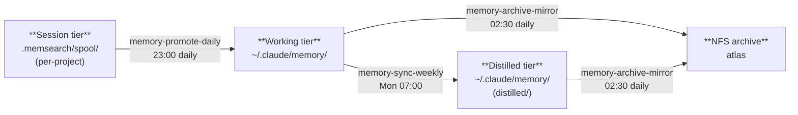
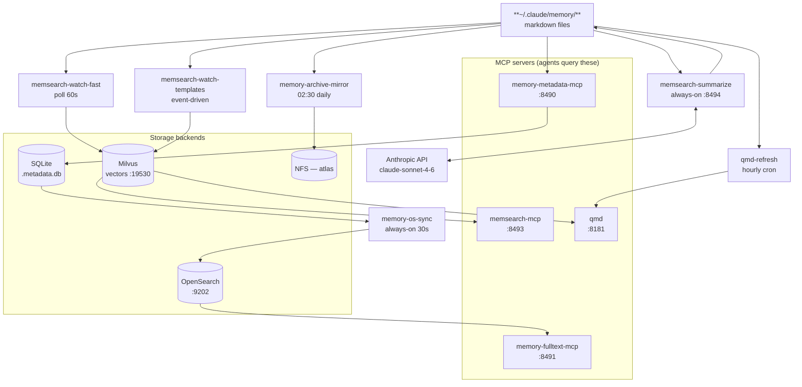

# Memory Services

PM2-managed services that form the agent memory layer on top of the
[memory-stack](memory-stack.md) Docker containers (Milvus + OpenSearch). Two groups:
**indexing and search** (always-on) and **promotion pipeline** (scheduled).

## memsearch-watch-fast

Polls the working and session memory directories every 60 seconds and re-indexes changed
files into Milvus. Fast tier — these directories change constantly during active sessions.

**Script:** `~/scripts/memsearch-watch-fast.sh`

Directories indexed:

| Directory | Tier |
|-----------|------|
| `~/.claude/memory/` | working |
| `~/.claude/projects/*/.memsearch/memory/` | session (per-project) |

Logs to `~/logs/memsearch/watch-fast-<timestamp>.log` (30-day retention).

## memsearch-watch-templates

Event-driven watcher (`inotifywait`) for `~/.claude/templates/`. Indexes only when files
actually change, debounced 30 seconds to absorb bulk writes. Always runs one index pass on
startup to catch anything missed while the process was down.

**Script:** `~/scripts/memsearch-watch-templates.sh`

Directories indexed:

| Directory | Tier |
|-----------|------|
| `~/.claude/templates/` | templates |

Logs to `~/logs/memsearch/watch-templates-<timestamp>.log` (30-day retention).

Note: an earlier version used a single polling `memsearch-watch` service across all three
directories (itself a replacement for an inotify-based version with a threading bug — concurrent
file changes caused silent indexing failures). Split into two PM2 services in July 2026: a 60s
poller for the working/session tiers, which change constantly during active sessions, and an
event-driven `inotifywait` watcher for templates, which change rarely and don't need polling.
See [memsearch.md](memsearch.md) for full details.

## memsearch-mcp

FastMCP server exposing hybrid vector+BM25+reranker memory search to forge agents over
streamable-http MCP transport.

```bash
/opt/venvs/memsearch/bin/python3 ~/repos/personal/memsearch-mcp/server.py
```

- **Endpoint:** `http://127.0.0.1:8493/mcp`
- **Transport:** streamable-http

See [memsearch-mcp.md](memsearch-mcp.md) for tool surface, agent access matrix, and operations.

## qmd

Semantic + keyword search MCP server over ~9 000 markdown documents across 40+
collections (docs cache, component docs, build reports, agent memory, etc.). Supports
BM25 (lexical), vector (semantic), and HyDE (hypothetical document) sub-queries.

```bash
qmd mcp --http --port 8181 --host 127.0.0.1
```

- **Endpoint:** `http://127.0.0.1:8181`
- **Collections:** see `qmd status` for the full list and per-collection doc counts

## qmd-webhook

Small always-on HTTP listener that reacts to [agent-bus](../agent/agent-bus.md) events by
triggering targeted `qmd embed` reindexing — an event-driven complement to the hourly
`qmd-refresh` cron, so newly created build artifacts become searchable within seconds
instead of waiting for the next hourly pass.

```bash
python3 ~/scripts/qmd-webhook.py
```

- **Endpoint:** `http://127.0.0.1:8499` (HTTP POST, no auth — localhost-only)
- **Transport:** plain `http.server`, not MCP — receives agent-bus webhook POSTs, not agent tool calls

Maps event types to qmd collections and reindexes only the affected collection:

| Event | Collection reindexed |
|-------|----------------------|
| `build-plan.created` | `comms-artifacts` |
| `handoff.created` | `comms-artifacts` |
| `audit.requested` | `comms-artifacts` |
| `artifact.untracked` | `comms-artifacts` |

Unrecognized event types are logged and ignored. Reindex calls are fire-and-forget
(`subprocess.Popen`, not awaited) so a slow `qmd embed` never blocks the next webhook POST.

## memory-metadata-mcp

Read-only MCP server exposing a SQLite metadata index over `~/.claude/memory/` notes.
Provides `list_notes`, `get_note_metadata`, and `count_by` tools for structured queries
by category, tier, tag, or date — without reading note bodies.

```bash
/home/ted/repos/personal/memory-metadata-mcp/server.py
```

- **Endpoint:** `http://127.0.0.1:8490`
- **Transport:** streamable-http

## memory-fulltext-mcp

Full-text search MCP over memory notes via OpenSearch. Returns body excerpts alongside
metadata, enabling queries that require matching note content rather than just frontmatter.
Scope: personal-agent use only (not in the global scoped-mcp manifest).

> **Renamed 2026-07-23** (commit `0e649ad`, agent-platform-agents) from `memory-search-mcp`
> to `memory-fulltext-mcp` — the old name was easily confused with `memsearch-mcp`
> (a different, vector+BM25 service). Same service, same port, same PM2 process name
> under the hood; only the name changed.

```bash
/home/ted/repos/personal/memory-fulltext-mcp/server.py
```

- **Endpoint:** `http://127.0.0.1:8491`
- **Backend:** OpenSearch at `127.0.0.1:9202`
- **Transport:** streamable-http

## memsearch-summarize

FastMCP server and background daemon that summarizes raw session transcripts in memsearch
spool directories via the Anthropic API. Replaces verbose logs with 3–6 bullet summaries.

```bash
/opt/venvs/memsearch/bin/python3 ~/repos/gitea/host-forge-scripts/scripts/memsearch-summarize.py
```

- **Endpoint:** `http://127.0.0.1:8494/mcp`
- **Transport:** streamable-http
- **Poll interval:** 10 seconds

See [memsearch-summarize.md](memsearch-summarize.md) for tools, configuration, and operations.

## Promotion Pipeline (scheduled)

Five cron jobs + two always-on daemons drive the memory tier lifecycle on forge.
Scripts live in `host-forge-scripts/scripts/`, symlinked to `~/scripts/`.



| PM2 name | Type | Schedule | Purpose |
|----------|------|----------|---------|
| `memory-os-sync` | always-on | — | Syncs `.metadata.db` → OpenSearch every 30s |
| `memory-promote-daily` | cron | `0 23 * * *` | Steps 1–3, 8 of memory-sync: session scan, promote to working, LibreChat import |
| `memory-sync-weekly` | cron | `0 7 * * 1` | Steps 4–8: working → distilled, expiry, dedup, metrics |
| `memory-pipeline` | cron | `0 4 * * *` | memsearch-compact + qmd-refresh |
| `memory-archive-mirror` | cron | `30 2 * * *` | rsync durable notes to NFS (atlas) with versioned change backups |
| `qmd-refresh` | cron | `0 * * * *` | `qmd update` + `qmd embed` — keeps agent-memory collection current hourly |

The promotion jobs drive headless Claude Code sessions via `~/.claude/projects/memory-sync/CLAUDE.md`.
Matrix notifications go to `#sysadmin` on forge's Synapse homeserver.

`memory-archive-mirror` logs to `~/.claude/logs/memory-archive-mirror.log`. NFS target:
`<nas-ip>:/mnt/storage/forge` (atlas). Append-only: source-side deletions are preserved in the
archive under `changes/YYYY-MM-DD/`.

---

## Dependency Chain



All always-on services depend on the [memory-stack](memory-stack.md) containers being healthy.
If Milvus or OpenSearch is down, the respective MCP server will fail silently on search
but will not crash.

**Note:** `memory-metadata-mcp` (SQLite, `:8490`) has zero overlap with `memory-fulltext-mcp`
(OpenSearch, `:8491`) — the metadata server queries structured note frontmatter (tier,
tags, dates), the fulltext server queries note bodies.

## Related Docs

- [memory-architecture.md](memory-architecture.md) — full system map: tiers, indices, and Graphiti
- [memory-stack.md](memory-stack.md) — Milvus + OpenSearch storage backends
- [memsearch.md](memsearch.md) — memsearch library, polling watch daemon, reranker
- [memsearch-mcp.md](memsearch-mcp.md) — MCP server wrapping memsearch
- [memsearch-summarize.md](memsearch-summarize.md) — session transcript summarizer
- [graphiti.md](graphiti.md) — knowledge graph (relational, temporal — separate from flat memory)
