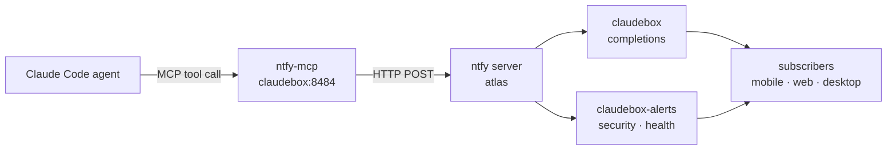

# ntfy-mcp

ntfy-mcp is a Docker-hosted MCP server that gives Claude Code sessions a native tool call for sending push notifications via [ntfy](https://ntfy.sh). It's a thin HTTP proxy between an agent and an ntfy instance — stateless, no database, one tool.

Every automated workflow on claudebox already uses ntfy: memory pipeline completions, backup results, resource alerts, build completions. Before ntfy-mcp, agents had to send notifications either through homelab-ops-mcp's `run_command` (raw curl) or by writing shell commands inline. ntfy-mcp replaces both with a typed, auditable `send_notification` tool call.

It sits in [Layer 1](../../README.md#layer-1--host--core-tooling) alongside the other MCP servers that extend agent capability.

- **Source:** `~/repos/personal/ntfy-mcp/`
- **Transport:** streamable-http (Docker container, `claudebox-net`)
- **Port:** 8484
- **Container:** `ntfy-mcp`

## Tool

### `send_notification`

```
send_notification(
    message,
    topic?,
    title?,
    priority?,
    tags?,
    markdown?,
    click?,
    icon?
)
```

| Parameter | Type | Default | Description |
|-----------|------|---------|-------------|
| `message` | string | required | Notification body. Supports Markdown if `markdown=true`. |
| `topic` | string | `NTFY_DEFAULT_TOPIC` | ntfy topic to publish to. |
| `title` | string | — | Bold title shown above the message. |
| `priority` | string | `default` | `min` \| `low` \| `default` \| `high` \| `urgent` |
| `tags` | list[str] | — | Emoji short codes, e.g. `["white_check_mark", "claudebox"]` |
| `markdown` | bool | `false` | Enable Markdown rendering in the notification body. |
| `click` | string | — | URL to open when the notification is tapped. |
| `icon` | string | — | URL of an icon image to display. |

Returns `{"ok": true, "topic": "...", "status": 200}` on success, or `{"ok": false, "error": "..."}` on failure.

## Configuration

Docker Compose at `~/docker/ntfy-mcp/docker-compose.yml`:

```yaml
services:
  ntfy-mcp:
    build:
      context: /path/to/ntfy-mcp
      dockerfile: Dockerfile
    container_name: ntfy-mcp
    ports:
      - "8484:8484"
    environment:
      - NTFY_URL=https://ntfy.yourdomain.com
      - NTFY_DEFAULT_TOPIC=claudebox
      - NTFY_TOKEN=          # leave empty for open instances
      - MCP_PORT=8484
    networks:
      - claudebox-net
    restart: unless-stopped

networks:
  claudebox-net:
    external: true
```

**Environment variables:**

| Variable | Description |
|----------|-------------|
| `NTFY_URL` | Base URL of your ntfy instance |
| `NTFY_DEFAULT_TOPIC` | Topic used when `topic` is omitted in the tool call |
| `NTFY_TOKEN` | Bearer token for authenticated ntfy instances; leave empty for open instances |
| `MCP_PORT` | Port the MCP server listens on inside the container (default: 8484) |

Claude Code CLI registration in `~/.claude.json`:

```json
{
  "mcpServers": {
    "ntfy": {
      "type": "http",
      "url": "http://localhost:8484/mcp"
    }
  }
}
```

Note: use `"type": "http"` not `"type": "streamable-http"` in `~/.claude.json`. The container binds on `claudebox-net`, reachable from the host at `localhost:8484`.

## Runtime

- **Image:** built locally from `~/repos/personal/ntfy-mcp/` (Python 3.12, FastMCP)
- **Entrypoint:** `python -m src.server`
- **Network:** `claudebox-net` (shared Docker network)
- **Restart policy:** `unless-stopped`

The container is **not** registered with LibreChat — it's Claude Code only. LibreChat agents use the ntfy MCP server on atlas (separate instance, different topic namespace).

## Integration Points

**Claude Code sessions.** Every writer, build, and homelab agent has `ntfy` in its MCP server list. Agents use it to signal completions, request operator input, and report errors — see the escalation protocol in each project's CLAUDE.md.



**ntfy on atlas.** The ntfy server itself runs on atlas (not claudebox). ntfy-mcp is purely a client — it forwards `send_notification` calls as HTTP POST requests to the atlas instance. There is no local ntfy server on claudebox.

**Topic routing.** Default topic is `claudebox`. Agents can override with the `topic` parameter — some use project-specific topics for filtering (e.g., `claudebox-alerts` for security and health events vs. `claudebox` for general completions).

## CI

GitHub Actions workflow (`.github/workflows/ci.yml`) runs on every push and pull request:

- **Test matrix:** Python 3.11, 3.12, 3.13
- **Dependency scan:** `pip-audit` on each Python version — catches CVEs in transitive dependencies

## Security Considerations

Port 8484 is bound on all interfaces on the host, but the container is only reachable from `claudebox-net` Docker services and the host itself. No external exposure through SWAG.

`NTFY_TOKEN` is stored in the stack `.env` file, not in the Compose file. If your ntfy instance requires authentication, populate the token there — the container passes it as a Bearer header on all requests.

The server has no authentication of its own. Any process on claudebox that can reach port 8484 can send notifications. This is acceptable because claudebox is a single-user machine and the ntfy topics involved are alerting channels, not sensitive data conduits.

**Header injection protection.** All user-supplied header values (`title`, `tags`, `click`, `icon`) pass through a `_clean()` helper that strips `\r` and `\n` before writing to HTTP headers.

**Topic allowlist.** Topics are validated against `^[a-zA-Z0-9_-]{1,64}$`. The previous path-separator check (`/` or `..`) was bypassable via URL-encoded equivalents (`%2F`, `%2E%2E`) that reverse proxies may decode before forwarding — the allowlist closes that class entirely. Invalid topics return `{"ok": false, "error": "Invalid topic: ..."}`.

**Non-root container.** The Dockerfile runs as `appuser` (uid 1001) — no process in the container runs as root.

## Gotchas and Lessons Learned

**Topic character restrictions.** Topics must match `^[a-zA-Z0-9_-]{1,64}$`. Dots, slashes, spaces, and any URL-encoded variants are rejected. This is stricter than ntfy's own naming guidance — it's intentional to prevent path traversal bypasses via reverse-proxy URL decoding.

**Rebuilding after source changes.** ntfy-mcp is built from local source — `docker compose up -d` won't pull a new image, it uses the existing build. After editing the server source, rebuild explicitly: `docker compose up -d --build`.

**`NTFY_TOKEN` left empty.** The default `.env` ships with `NTFY_TOKEN=` (empty string). The server passes this as `Authorization: Bearer ` — some ntfy instances reject empty bearer tokens. If you hit 401s on an authenticated ntfy server, confirm the token is actually populated in the `.env`, not just the Compose file.

**Topic not found vs. server unreachable.** ntfy creates topics on first publish — a 404 on a valid ntfy server usually means the URL is wrong, not the topic. If `send_notification` returns `{"ok": false}`, check `NTFY_URL` first.

## Related Docs

- [homelab-ops-mcp](homelab-ops-mcp.md) — shell access alternative for sending notifications via raw curl
- [inter-agent-communication](inter-agent-communication.md) — how agents signal each other, including ntfy as a push channel
- [nats-jetstream](nats-jetstream.md) — the other notification/messaging layer (async, queue-based vs. ntfy's push)
