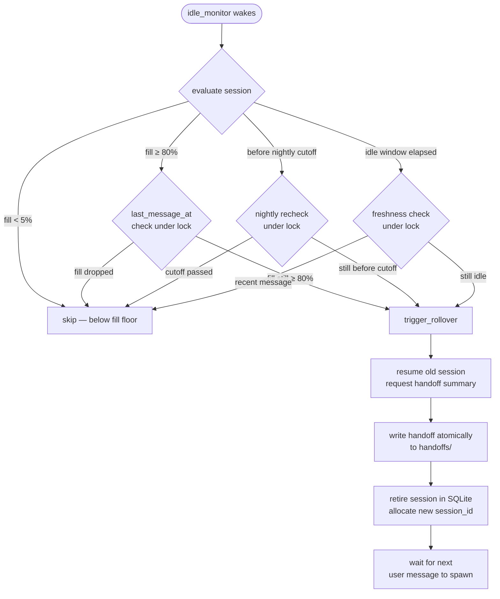

# personal-agent

Matrix-native personal agent on claudebox. Polls `#personal:yourdomain.me`, manages stateful `claude -p` sessions per thread with transparent rollover, and relays responses back via the [scoped-mcp](scoped-mcp.md) proxy layer.

This is the proving ground for the resident-agent pattern before it generalises to Helm.

## Overview

`manager.py` runs as a PM2 service, polls the `#personal` Matrix room for `@ted` messages, and routes each thread to an independent `claude -p` session tracked in SQLite. One thread = one session. Sessions persist across manager restarts and roll over automatically when fill, age, or idle thresholds are exceeded — the rollover is transparent: the next message after a rollover opens a fresh session pre-loaded with a handoff summary and the last 10 transcript turns.

```
Ted → #personal (Matrix)
        ↓
manager.py (PM2 · claudebox)
  ├── poll #personal for @ted messages
  ├── check session state in SQLite
  └── prepend handoff + last-10 if post-rollover
        ↓
  claude -p --session-id <uuid>   (new thread)
  claude -p --resume <uuid>       (existing thread)
        ↓ stdout
manager.py → post response to #personal
```

All tool access goes through [scoped-mcp](scoped-mcp.md) at `~/.claude/manifests/personal-agent.yml`. The manifest is the single source of truth for what the agent can reach — argument filters enforce credential and path-scope constraints on every tool call.

## Session Lifecycle

Each Matrix thread gets its own session UUID. The manager stores thread → session mappings in `~/.claude/data/personal-agent/sessions.db`.

| Event | Action |
|-------|--------|
| New thread | Allocate UUID, run `claude -p --session-id <uuid>` |
| Existing thread, active session | Run `claude -p --resume <uuid>` |
| Post-rollover first message | Spawn new UUID with `--append-system-prompt <handoff>` containing handoff text + last 10 turns |
| `handoff_injected` flag | Set on first post-rollover message; prevents double-injection if manager restarts between rollover and next message |

The SQLite schema tracks `thread_root_id`, `session_id`, `status`, `last_message_at`, `created_at`, `token_fill_pct`, `previous_session_id`, and `handoff_injected`. Schema migrations run automatically on startup.

## Rollover Triggers

The idle monitor wakes every 60 seconds and evaluates three OR'd conditions per active session. The first trigger that fires initiates rollover.

| Trigger | Condition | When it fires |
|---------|-----------|---------------|
| `idle` | No message for `idle_threshold` seconds | Threshold shrinks as context fill rises (see table below) |
| `token_budget` | Context fill ≥ 80% | Computed from latest transcript entry summing `input_tokens + cache_creation_input_tokens + cache_read_input_tokens` |
| `nightly_cutoff` | Session created before the last `nightly_rollover_hour` boundary (default 4 AM) | Aligns rollovers with Ted's wake cycle so each day starts with a fresh session |

**Idle threshold scaling** — the idle window shortens as context fills, so near-full sessions roll over sooner:

| Fill range | Idle threshold |
|------------|----------------|
| < 40% | Idle trigger disabled (fill floor) |
| 40–60% | 1800s (30 min) |
| 60–80% | 1200s (20 min) |
| ≥ 80% | 360s (6 min) |



**Rollover commit** (v0.2 validation): `rollover_start → rollover_complete` in ~26s; `handoff_bytes=5758`. The old session is resumed briefly, generates a ~400-word summary, then the new session_id is allocated. No new `claude -p` process is spawned until Ted sends the next message.

## Tool Surface

All 11 modules route through scoped-mcp. Two argument filters apply to every tool call: `no-credentials` (blocks credential-shaped strings) and `personal-agent-path-scope` (restricts filesystem reads to the agent's own directories).

| Module | Type | Purpose |
|--------|------|---------|
| `matrix` | built-in | Room-scoped Matrix send — `#personal` only |
| `task-queue` | mcp_proxy | Delegate work to claudebox / homelab-ops / dev / research agents (v0.5+) |
| `agent-bus` | mcp_proxy | Subscribe to task completion events |
| `memory-search` | mcp_proxy | Full-text search across session and working memory |
| `memory-metadata` | mcp_proxy | Structured memory queries (by category, tag, date) |
| `matrix-mcp` | mcp_proxy | Read Matrix history, list rooms |
| `searxng` | mcp_proxy | Web search — `search` and `search_and_summarize` only |
| `plane` | mcp_proxy | Query and update Plane work items |
| `pm2` | mcp_proxy | Read PM2 service status |
| `backrest` | mcp_proxy | Check backup status |
| `homelab-ops` | mcp_proxy | Read files scoped to agent directories |

`fetch_url` and `search_and_fetch` are not in the searxng allowlist — see Security Model.

## Security Model

**Single-operator gate** — `@ted:yourdomain.me` verification runs in Python (`manager.py`) before any session interaction. Unauthenticated Matrix senders are dropped silently. The gate is not in CLAUDE.md (which could be overridden by prompt injection).

**Path scope** — homelab-ops reads restricted to:
- `~/.claude/projects/personal-agent/`
- `~/.claude/memory/feedback_*`
- `~/.claude/comms/`

Broader `~/.claude/memory/` access is excluded — security agent notes, build plans, and shared handoffs are not reachable from this agent.

**SSRF prevention** — `fetch_url` and `search_and_fetch` removed from the searxng manifest allowlist. Arbitrary outbound HTTP is blocked; internal loopback services (task-queue :8485, homelab-ops :8282, agent-bus) have no auth and were the primary SSRF target.

**Runtime hardening:**

| Control | Detail |
|---------|--------|
| Resume rate limiter | 3s minimum between resumes; warning logged at handler queue depth > 3 |
| Session retention cleanup | `cleanup_old_sessions()` called hourly; cascades to `event_aliases` via FK |
| Message size cap | Input > 32KB rejected before subprocess; handoff text capped at 16KB |
| stderr sanitization | Internal paths and tool fragments routed to PM2 log, not posted to `#personal` |
| Handoff write | Atomic — written to a `.tmp` file (`O_CREAT|O_EXCL`, mode 0o600) and renamed |
| Rollover lock | `_rollover_lock` prevents concurrent rollovers; trigger conditions re-validated under lock |

## Configuration

`~/.claude/projects/personal-agent/config.yml` (gitignored; template: `config.example.yml`). Credentials in `~/.claude-secrets/matrix-personal.env`.

| Key | Default | Description |
|-----|---------|-------------|
| `session_retention_days` | 30 | Sessions older than this are cleaned up hourly |
| `token_budget_fill_threshold` | 0.80 | Fill fraction that triggers `token_budget` rollover |
| `nightly_rollover_hour` | 4 | Local-time hour for `nightly_cutoff` boundary (aligns with wake cycle) |
| `context_window_tokens` | 200000 | Model context window size used for fill-pct calculation |

## Operations

```bash
# Status and logs
pm2 status personal-agent
pm2 logs personal-agent --lines 50

# Restart after config change
pm2 restart personal-agent && pm2 save

# Inspect sessions
sqlite3 ~/.claude/data/personal-agent/sessions.db \
  "SELECT thread_root_id, status, last_message_at, token_fill_pct FROM sessions ORDER BY last_message_at DESC LIMIT 20"

# List handoffs
ls -lt ~/.claude/projects/personal-agent/handoffs/
```

## Build Status

v0.1–v0.3 complete and in production. See the [personal-agent README](https://github.com/TadMSTR/personal-agent) for the full build phase table.

| Phase | Adds |
|-------|------|
| v0.1 | Matrix poll loop, per-thread sessions, scoped-mcp surface (11 modules), structured logging, security hardening |
| v0.2 | Idle-based rollover (1800s threshold), handoff generation, continuity injection on post-rollover spawn |
| v0.3 | Dynamic rollover triggers: `token_budget` (fill ≥ 80%), `nightly_cutoff` (4 AM boundary), idle threshold scaling with 40% fill floor |
| v0.4 | Typing indicators, cold-start memory injection, persona refinement _(planned)_ |
| v0.5 | task-queue-mcp delegation + agent-bus result synthesis _(planned)_ |
| v0.6 | Gitea-backed self-modification with locked-section validation _(planned)_ |
