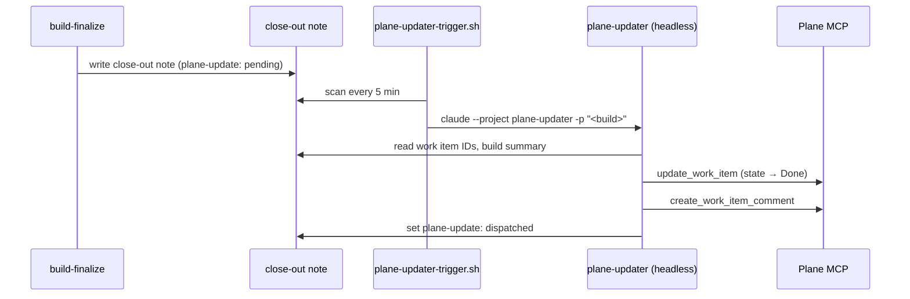

# Plane Updater

The plane updater is a two-part automation: a PM2 cron job that watches for completed builds and dispatches work item updates, and a headless `claude -p` project that uses the Plane MCP to close work items and add completion comments.

**Trigger script:** `~/scripts/plane-updater-trigger.sh`  
**PM2 service:** `plane-updater` (cron: `*/5 * * * *`)  
**Headless project:** `~/.claude/projects/plane-updater/`  
**Log:** `/var/log/claudebox/plane-updater.log`

## What It Does

After `build-finalize` writes a close-out note, it marks the note's frontmatter with `plane-update: pending`. The PM2 trigger script scans `~/.claude/memory/shared/` every 5 minutes for notes with that marker. When it finds one, it launches the headless `plane-updater` project, which:

1. Reads the close-out note to extract the build name, Plane work item IDs, and audit summary
2. Moves each item to "Done" state via the Plane MCP
3. Adds a completion comment: `Build complete: <build-name> (<date>). <summary>. Audit: <clean | N findings>.`
4. If no IDs appear in the close-out note, searches Plane for work items matching the build name
5. Posts one line to `#claudebox` if items were updated: `[PLANE] N items closed for <build-name>`
6. Updates the close-out note marker from `plane-update: pending` to `plane-update: dispatched`
7. Writes a HEARTBEAT.md to `~/.claude/projects/plane-updater/HEARTBEAT.md`



## PM2 Configuration

```js
{
  name: "plane-updater",
  script: "/home/ted/scripts/plane-updater-trigger.sh",
  cron_restart: "*/5 * * * *",
  autorestart: false,
  out_file: "/var/log/claudebox/plane-updater.log",
  error_file: "/var/log/claudebox/plane-updater.log",
  merge_logs: true,
  time: true
}
```

`autorestart: false` — cron job, not a daemon. The trigger script exits immediately after dispatching headless sessions.

## Scoped-MCP Wiring

The headless project uses scoped-mcp with `headless-plane-updater.yml`, which limits the session to:

- `homelab-ops` — read_file, write_file, edit_file (close-out note + HEARTBEAT.md writes)
- `plane` — update_work_item, create_work_item_comment, retrieve_work_item, search_work_items, list_work_items, list_states, retrieve_state
- `matrix` — send_matrix_message
- `task-queue` — update_task, get_task
- `agent-bus` — log_event

The Plane tools are explicitly allowlisted to prevent accidental bulk operations — delete, create project, and archive tools are not in the manifest.

## Close-Out Note Integration

`build-finalize` adds one frontmatter field to the close-out note it writes:

```yaml
plane-update: pending
```

The trigger script matches on this field. After dispatching, the headless session changes it to `dispatched`. This field is the only coordination mechanism — no queue file, no database.

## When Blocked

If the Plane MCP returns an error or no items can be found after a name-based search, the headless session writes `~/.claude/comms/artifacts/build-plans/<build_name>/blocked.md` with the query attempted and the error, posts to `#claudebox`, and exits. It does not retry. The `plane-update: pending` marker remains in the close-out note so the trigger fires again on the next 5-minute tick — a natural retry without a polling loop.

## Liveness Check

```bash
cat ~/.claude/projects/plane-updater/HEARTBEAT.md
# shows: agent, last build name, run-at timestamp, result (pass/fail/blocked)
```

The HEARTBEAT.md is overwritten on every run. If the timestamp is more than an hour old and builds have been completing, the trigger script or headless session may need attention.

## Related Docs

- [Plane](plane.md) — Plane self-hosted instance, MCP integration, work item structure
- [Build Pipeline Agents](build-pipeline-agents.md) — full build automation pipeline overview
- [Inter-Agent Communication](inter-agent-communication.md) — handoff format and close-out note schema
