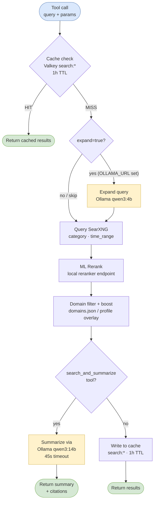

# searxng-mcp

MCP server providing web search via a self-hosted SearXNG instance, with ML reranking, Valkey result caching, and domain filtering. Agents use this instead of the built-in `WebSearch` tool — private, no per-query API costs, and results are shaped by configurable domain boost/block lists.

**Version:** 3.0.0

## Tools

| Tool | Description |
|------|-------------|
| `search` | Search via SearXNG + rerank. Optional query expansion via Ollama. Returns top N results. Cached 1 hour. |
| `search_and_fetch` | Search, rerank, then fetch full content of top 1–3 results. Fetch cascade: Firecrawl → Crawl4AI → raw HTTP. Optional query expansion. |
| `search_and_summarize` | Search, fetch top results, then summarize via Ollama qwen3:14b. Returns structured summary with citations. |
| `fetch_url` | Fetch and extract readable content from a URL. Cached 24 hours. |
| `clear_cache` | Purge search cache, fetch cache, or both. |

All tools accept an optional `domain_profile` parameter.

### search

```
search(query, num_results=5, category="general", time_range?, domain_profile?, expand?)
```

- `category`: `general` | `news` | `it` | `science`
- `time_range`: `day` | `week` | `month` | `year` (omit for all time)
- `num_results`: 1–20 (default 5)
- `expand`: if `true`, rewrites the query via Ollama qwen3:4b before sending to SearXNG. Requires `OLLAMA_URL` to be set. Ignored silently if `OLLAMA_URL` is empty.

### search_and_fetch

```
search_and_fetch(query, category="general", time_range?, fetch_count=1, domain_profile?, expand?)
```

Fetches up to 3 pages. Content budget is 8000 characters split evenly across fetched pages. GitHub URLs use the GitHub API; all others use the fetch cascade: Firecrawl → Crawl4AI → raw HTTP.

### search_and_summarize

```
search_and_summarize(query, category="general", time_range?, domain_profile?, expand?)
```

Performs a search, fetches top results, then passes content to Ollama qwen3:14b for structured summarization. Returns a formatted markdown response with a summary paragraph and a citations list.

**Response shape:**
```json
{
  "summary": "...",
  "citations": [
    { "url": "...", "title": "...", "key_facts": ["...", "..."] }
  ]
}
```

- 45-second summarization timeout; falls back to raw fetch output if Ollama is unavailable or times out
- Requires `OLLAMA_URL` to be set — returns an error if empty
- Results are **not** cached (summary is generated fresh each call)

### fetch_url

```
fetch_url(url, domain_profile?)
```

Blocked domains return an error. Content truncated to 8000 characters. Uses the same fetch cascade as `search_and_fetch`: Firecrawl → Crawl4AI → raw HTTP.

### clear_cache

```
clear_cache(target="all")  # "search" | "fetch" | "all"
```

Use when researching fast-moving topics where hour-old cached results are stale.

## Caching

Results are cached in Valkey (Redis-compatible, local container). Cache keys are namespaced:

| Namespace | TTL | Content |
|-----------|-----|---------|
| `search:*` | 1 hour | SearXNG result sets |
| `fetch:*` | 24 hours | Firecrawl/GitHub page content |



The Valkey container (`searxng-mcp-cache`) runs separately from the SearXNG container:

```
searxng-mcp-cache  (valkey/valkey:8-alpine, port 127.0.0.1:6381)
```

`VALKEY_URL` is injected via the MCP server config in `~/.claude/settings.json`.

## Domain Filtering

`domains.json` at the repo root configures boost and block lists. The file is hot-reloaded every 5 seconds — no server restart needed.

**Schema:**
```json
{
  "boost": ["domain.com", "other.com/path/prefix"],
  "block": ["spam.com"],
  "profiles": {
    "homelab": {
      "boost": ["docs.docker.com", "wiki.archlinux.org"],
      "block": []
    },
    "dev": {
      "boost": ["stackoverflow.com", "developer.mozilla.org"],
      "block": []
    }
  }
}
```

- **boost**: Matching results float to the top of rankings (stable sort — relative order within groups is preserved)
- **block**: Matching results are removed from output entirely
- **profiles**: Named overlays that extend the base lists — pass `domain_profile="homelab"` or `domain_profile="dev"` on any tool call

Domain patterns can be bare hostnames (`stackoverflow.com`) or include a path prefix (`reddit.com/r/homelab`). `www.` is stripped before matching.

## MCP Configuration

Registered in `~/.claude/settings.json` under `mcpServers`:

```json
{
  "mcpServers": {
    "searxng": {
      "command": "node",
      "args": ["/path/to/searxng-mcp/dist/index.js"],
      "env": {
        "SEARXNG_URL": "http://localhost:8081",
        "VALKEY_URL": "redis://localhost:6381",
        "CACHE_TTL_SECONDS": "3600",
        "FETCH_CACHE_TTL_SECONDS": "86400"
      }
    }
  }
}
```

## Environment Variables

| Variable | Default | Description |
|----------|---------|-------------|
| `SEARXNG_URL` | `http://localhost:8081` | SearXNG instance URL |
| `FIRECRAWL_URL` | `http://localhost:3002` | Firecrawl URL for page fetching (tier 1 of fetch cascade) |
| `CRAWL4AI_URL` | `` (empty) | Crawl4AI URL for second-tier fetch fallback. If empty, Crawl4AI is skipped and raw HTTP is used directly. |
| `CRAWL4AI_API_TOKEN` | `` (empty) | Optional Bearer token for Crawl4AI API authentication. Sent as `Authorization: Bearer` header when set. |
| `RERANKER_URL` | `http://localhost:8787` | Local ML reranker endpoint |
| `VALKEY_URL` | `redis://localhost:6381` | Valkey connection URL |
| `CACHE_TTL_SECONDS` | `3600` | Search result cache TTL |
| `FETCH_CACHE_TTL_SECONDS` | `86400` | Fetched page cache TTL |
| `OLLAMA_URL` | `` (empty) | Ollama API base URL — required for `expand` and `search_and_summarize`. If empty, those features are disabled. |
| `EXPAND_QUERIES` | `false` | Set to `true` to expand all queries by default (without passing `expand=true` per-call). |
| `GITHUB_TOKEN` | — | Optional — increases GitHub API rate limit |

## Changelog

**Unreleased (after v3.0.2)**

- Refactored from single 973-line `index.ts` to 9 focused modules — no behavior or tool changes
- SSRF fix: `assertPublicUrl()` now correctly blocks IPv6 private addresses (`::1`, `fc00::/7`, `fe80::/10`); prior versions only validated IPv4
- Vitest test scaffold added: 37 tests covering domain filtering, cache, SSRF validation, URL normalization, and parameter coercion

- Crawl4AI fetch adapter as second-tier fallback (`CRAWL4AI_URL` env var); uses `markdown.raw_markdown` for clean extraction on JS-heavy or Firecrawl-failing pages
- `CRAWL4AI_API_TOKEN` env var — optional Bearer token for Crawl4AI instances with API protection
- Raw HTTP fetch as third-tier fallback — ensures fetch never fails silently
- `expand` parameter coercion fixed to `z.coerce.boolean()` — prevents MCP serialization errors when `true` is passed as `"true"`
- Fetch cascade falls through to Crawl4AI on empty Firecrawl response (bot-blocked pages return `success: true` with empty content; empty-content check now triggers cascade, not only exceptions)

**v3.0.2 (2026-04-04)**

- `search_and_summarize`: added regex extraction of the JSON object before parsing — qwen3:14b occasionally appends trailing text after the JSON block

**v3.0.1 (2026-04-04)**

- `search_and_summarize`: increased summarization timeout from 15s to 45s — qwen3:14b over HTTPS requires 17–35s; 15s was reliably too short
- `search_and_summarize`: removed `format: "json"` from the Ollama chat request — grammar-constrained generation caused requests to hang; the model follows JSON instructions from the prompt

**v3.0.0 (2026-04-04)**

Phase 2 — Query expansion
- `expandQuery()` via Ollama qwen3:4b — rewrites the query for broader coverage before sending to SearXNG
- `expand` parameter on `search` and `search_and_fetch`
- `EXPAND_QUERIES` env var to enable expansion globally
- `OLLAMA_URL` env var (defaults to empty string — features are call-gated if unset)
- Security: hardcoded personal `OLLAMA_URL` removed from public repo; call gating ensures safe behavior with empty default

Phase 4 — Search summarization
- `search_and_summarize` tool: searches, fetches top results, summarizes via qwen3:14b
- Returns structured summary with citations as formatted markdown
- 45-second summarization timeout with graceful fallback to raw fetch output

**v2.1.0 (2026-04-04)**

Phase 1 — Valkey caching
- Added `iovalkey` client, connecting to a dedicated Valkey container
- `search:*` and `fetch:*` namespaced cache keys
- `clear_cache` tool for manual cache invalidation

Phase 5 — Domain filtering
- `domains.json` with global boost/block lists and named profiles
- Hot-reload via `fs.watchFile` (5s poll) — no restart needed
- `domain_profile` parameter added to all tools
- Two built-in profiles: `homelab`, `dev`

## Architecture

The server is organized as 9 focused modules (refactored from a single 973-line `index.ts`):

| Module | Responsibility |
|--------|---------------|
| `index.ts` | MCP server entry point and tool registration |
| `search.ts` | SearXNG query execution and result parsing |
| `rerank.ts` | ML reranking via local reranker endpoint |
| `domain-filter.ts` | Domain boost/block logic and `domains.json` hot-reload |
| `cache.ts` | Valkey read/write with namespaced TTLs |
| `fetch.ts` | Fetch cascade (Firecrawl → Crawl4AI → raw HTTP) |
| `expand.ts` | Query expansion via Ollama qwen3:4b |
| `summarize.ts` | Search summarization via Ollama qwen3:14b |
| `security.ts` | URL validation including SSRF protection |

## Security

### SSRF Protection

All user-supplied URLs pass through `assertPublicUrl()` before any outbound request. This function blocks requests to:

- RFC 1918 private IPv4 ranges (`10.x`, `172.16–31.x`, `192.168.x`)
- IPv6 private/loopback addresses (`::1`, `fc00::/7`, `fe80::/10`)
- Link-local and loopback ranges

The IPv6 blocking was a pre-existing gap (prior versions only validated IPv4 private ranges). Fixed in the 2026-04-07 refactor.

## Testing

A Vitest test scaffold was added in the 2026-04-07 refactor — 37 tests covering the core modules. Run with:

```bash
pnpm test
```

Tests live in `src/__tests__/`. Coverage includes: domain filtering, cache key generation, SSRF validation (IPv4 and IPv6), URL normalization, and `expand` parameter coercion.

## Related Docs

- [searxng.md](searxng.md) — SearXNG self-hosted search backend
