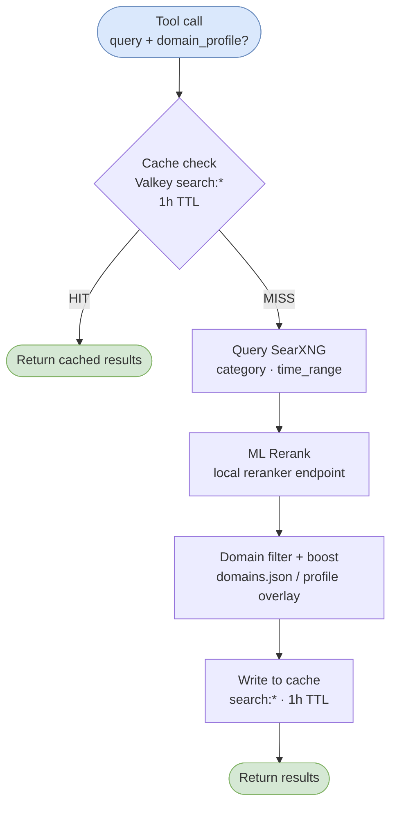

# searxng-mcp

MCP server providing web search via a self-hosted SearXNG instance, with ML reranking, Valkey result caching, and domain filtering. Agents use this instead of the built-in `WebSearch` tool — private, no per-query API costs, and results are shaped by configurable domain boost/block lists.

**Version:** 2.1.0

## Tools

| Tool | Description |
|------|-------------|
| `search` | Search via SearXNG + rerank. Returns top N results. Cached 1 hour. |
| `search_and_fetch` | Search, rerank, then fetch full content of top 1–3 results via Firecrawl or GitHub API. |
| `fetch_url` | Fetch and extract readable content from a URL. Cached 24 hours. |
| `clear_cache` | Purge search cache, fetch cache, or both. |

All tools accept an optional `domain_profile` parameter.

### search

```
search(query, num_results=5, category="general", time_range?, domain_profile?)
```

- `category`: `general` | `news` | `it` | `science`
- `time_range`: `day` | `week` | `month` | `year` (omit for all time)
- `num_results`: 1–20 (default 5)

### search_and_fetch

```
search_and_fetch(query, category="general", time_range?, fetch_count=1, domain_profile?)
```

Fetches up to 3 pages. Content budget is 8000 characters split evenly across fetched pages. GitHub URLs use the GitHub API; all others use Firecrawl.

### fetch_url

```
fetch_url(url, domain_profile?)
```

Blocked domains return an error. Content truncated to 8000 characters.

### clear_cache

```
clear_cache(target="all")  # "search" | "fetch" | "all"
```

Use when researching fast-moving topics where hour-old cached results are stale.

## Caching

Results are cached in Valkey (Redis-compatible, local container). Cache keys are namespaced:

| Namespace | TTL | Content |
|-----------|-----|---------|
| `search:*` | 1 hour | SearXNG result sets |
| `fetch:*` | 24 hours | Firecrawl/GitHub page content |



The Valkey container (`searxng-mcp-cache`) runs separately from the SearXNG container:

```
searxng-mcp-cache  (valkey/valkey:8-alpine, port 127.0.0.1:6381)
```

`VALKEY_URL` is injected via the MCP server config in `~/.claude/settings.json`.

## Domain Filtering

`domains.json` at the repo root configures boost and block lists. The file is hot-reloaded every 5 seconds — no server restart needed.

**Schema:**
```json
{
  "boost": ["domain.com", "other.com/path/prefix"],
  "block": ["spam.com"],
  "profiles": {
    "homelab": {
      "boost": ["docs.docker.com", "wiki.archlinux.org"],
      "block": []
    },
    "dev": {
      "boost": ["stackoverflow.com", "developer.mozilla.org"],
      "block": []
    }
  }
}
```

- **boost**: Matching results float to the top of rankings (stable sort — relative order within groups is preserved)
- **block**: Matching results are removed from output entirely
- **profiles**: Named overlays that extend the base lists — pass `domain_profile="homelab"` or `domain_profile="dev"` on any tool call

Domain patterns can be bare hostnames (`stackoverflow.com`) or include a path prefix (`reddit.com/r/homelab`). `www.` is stripped before matching.

## MCP Configuration

Registered in `~/.claude/settings.json` under `mcpServers`:

```json
{
  "mcpServers": {
    "searxng": {
      "command": "node",
      "args": ["/path/to/searxng-mcp/dist/index.js"],
      "env": {
        "SEARXNG_URL": "http://localhost:8081",
        "VALKEY_URL": "redis://localhost:6381",
        "CACHE_TTL_SECONDS": "3600",
        "FETCH_CACHE_TTL_SECONDS": "86400"
      }
    }
  }
}
```

## Environment Variables

| Variable | Default | Description |
|----------|---------|-------------|
| `SEARXNG_URL` | `http://localhost:8081` | SearXNG instance URL |
| `FIRECRAWL_URL` | `http://localhost:3002` | Firecrawl URL for page fetching |
| `RERANKER_URL` | `http://localhost:8787` | Local ML reranker endpoint |
| `VALKEY_URL` | `redis://localhost:6381` | Valkey connection URL |
| `CACHE_TTL_SECONDS` | `3600` | Search result cache TTL |
| `FETCH_CACHE_TTL_SECONDS` | `86400` | Fetched page cache TTL |
| `GITHUB_TOKEN` | — | Optional — increases GitHub API rate limit |

## What Changed in v2.1.0

**Phase 1 — Valkey caching**
- Added `iovalkey` client, connecting to a dedicated Valkey container
- `search:*` and `fetch:*` namespaced cache keys
- `clear_cache` tool for manual cache invalidation

**Phase 5 — Domain filtering**
- `domains.json` with global boost/block lists and named profiles
- Hot-reload via `fs.watchFile` (5s poll) — no restart needed
- `domain_profile` parameter added to all tools
- Two built-in profiles: `homelab`, `dev`

## Related Docs

- [searxng.md](searxng.md) — SearXNG self-hosted search backend
