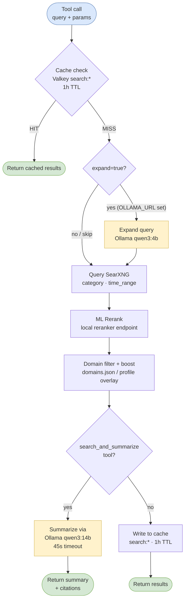

# searxng-mcp

MCP server providing web search via a self-hosted SearXNG instance, with ML reranking, Valkey result caching, and domain filtering. Agents use this instead of the built-in `WebSearch` tool — private, no per-query API costs, and results are shaped by configurable domain boost/block lists.

**Version:** 3.7.0

## Tools

| Tool | Description |
|------|-------------|
| `search` | Search via SearXNG + rerank. Optional query expansion via Ollama. Returns top N results. Cached 1 hour. |
| `search_and_fetch` | Search, rerank, then fetch full content of top 1–3 results. Fetch cascade: Firecrawl → Crawl4AI → raw HTTP. Optional query expansion. |
| `search_and_summarize` | Search, fetch top results, then summarize via Ollama (`OLLAMA_SUMMARIZE_MODEL`). Returns structured summary with citations. |
| `fetch_url` | Fetch and extract readable content from a URL. Cached 24 hours. |
| `clear_cache` | Purge search cache, fetch cache, or both. |

All tools accept an optional `domain_profile` parameter.

### search

```
search(query, num_results=5, category="general", time_range?, domain_profile?, expand?)
```

- `category`: `general` | `news` | `it` | `science`
- `time_range`: `day` | `week` | `month` | `year` (omit for all time)
- `num_results`: 1–20 (default 5)
- `expand`: if `true`, rewrites the query via Ollama (`OLLAMA_EXPAND_MODEL`, default `qwen3:4b`) before sending to SearXNG. Requires `OLLAMA_URL` to be set. Ignored silently if `OLLAMA_URL` is empty.

### search_and_fetch

```
search_and_fetch(query, category="general", time_range?, fetch_count=1, domain_profile?, expand?)
```

Fetches up to 3 pages. Content budget is 8000 characters split evenly across fetched pages. GitHub URLs use the GitHub API; all others use the fetch cascade: Firecrawl → Crawl4AI → raw HTTP.

### search_and_summarize

```
search_and_summarize(query, category="general", time_range?, domain_profile?, expand?)
```

Performs a search, fetches top results, then passes content to Ollama (`OLLAMA_SUMMARIZE_MODEL`, default `qwen3:14b`) for structured summarization. Returns a formatted markdown response with a summary paragraph and a citations list.

On the Crawl4AI fetch path, `fit_markdown` is used for noise-filtered content. Other tools (`search_and_fetch`, `fetch_url`) use `raw_markdown`.

**Response shape:**
```json
{
  "summary": "...",
  "citations": [
    { "url": "...", "title": "...", "key_facts": ["...", "..."] }
  ]
}
```

- 45-second summarization timeout; falls back to raw fetch output if Ollama is unavailable or times out
- Requires `OLLAMA_URL` to be set — returns an error if empty
- Results are **not** cached (summary is generated fresh each call)

### fetch_url

```
fetch_url(url, domain_profile?)
```

Blocked domains return an error. Content truncated to 8000 characters. Uses the same fetch cascade as `search_and_fetch`: Firecrawl → Crawl4AI → raw HTTP.

### clear_cache

```
clear_cache(target="all")  # "search" | "fetch" | "all"
```

Use when researching fast-moving topics where hour-old cached results are stale.

## Caching

Results are cached in Valkey (Redis-compatible, local container). Cache keys are namespaced:

| Namespace | TTL | Content |
|-----------|-----|---------|
| `search:*` | 1 hour | SearXNG result sets |
| `fetch:*` | 24 hours | Firecrawl/GitHub page content |


```mermaid
flowchart TD
    A(["Tool call\nquery + params"]) --> B{"Cache check\nValkey search:*\n1h TTL"}
    B -- "HIT" --> HIT(["Return cached results"])
    B -- "MISS" --> EX{"expand=true?"}
    EX -- "yes (OLLAMA_URL set)" --> EXP["Expand query\nOllama qwen3:4b"]
    EX -- "no / skip" --> C
    EXP --> C["Query SearXNG\ncategory · time_range"]
    C --> D["ML Rerank\nlocal reranker endpoint"]
    D --> E["Domain filter + boost\ndomains.json / profile overlay"]
    E --> SUM{"search_and_summarize\ntool?"}
    SUM -- "yes" --> SUMM["Summarize via\nOllama qwen3:14b\n45s timeout"]
    SUM -- "no" --> F["Write to cache\nsearch:* · 1h TTL"]
    SUMM --> SDONE(["Return summary\n+ citations"])
    F --> DONE(["Return results"])

    style HIT fill:#d5e8d4,stroke:#82b366
    style DONE fill:#d5e8d4,stroke:#82b366
    style SDONE fill:#d5e8d4,stroke:#82b366
    style A fill:#dae8fc,stroke:#6c8ebf
    style EXP fill:#fff2cc,stroke:#d6b656
    style SUMM fill:#fff2cc,stroke:#d6b656
```

The Valkey container (`searxng-mcp-cache`) runs separately from the SearXNG container:

```
searxng-mcp-cache  (valkey/valkey:8-alpine, port 127.0.0.1:6381)
```

`VALKEY_URL` is injected via the MCP server config in `~/.claude/settings.json`.

## Reranking

Results from SearXNG are reranked by a local cross-encoder model before being returned. As of v3.2.0, the reranker blends two signals:

- **Cross-encoder score** — relevance of the result to the query
- **Recency decay** — exponential decay based on `publishedDate`: `exp(-ageDays / 90)`, so a 90-day-old result has ~37% of a same-day result's recency weight

The blend is: `finalScore = crossEncoderScore * (1 - weight) + recencyScore * weight`, where `weight` defaults to `0.15` (`RERANK_RECENCY_WEIGHT`).

Recency weighting is **skipped** when `time_range` is set — if the agent has already filtered by date, adding decay is redundant.

If the reranker is unavailable, results fall back to raw SearXNG ordering (no decay applied).

## Domain Filtering

`domains.json` at the repo root configures boost and block lists. The file is hot-reloaded every 5 seconds — no server restart needed.

**Schema:**
```json
{
  "boost": ["domain.com", "other.com/path/prefix"],
  "block": ["spam.com"],
  "profiles": {
    "homelab": {
      "boost": ["docs.docker.com", "wiki.archlinux.org"],
      "block": []
    },
    "dev": {
      "boost": ["stackoverflow.com", "developer.mozilla.org"],
      "block": []
    }
  }
}
```

- **boost**: Matching results float to the top of rankings (stable sort — relative order within groups is preserved)
- **block**: Matching results are removed from output entirely
- **profiles**: Named overlays that extend the base lists — pass `domain_profile="homelab"` or `domain_profile="dev"` on any tool call

Domain patterns can be bare hostnames (`stackoverflow.com`) or include a path prefix (`reddit.com/r/homelab`). `www.` is stripped before matching.

## MCP Configuration

Registered in `~/.claude/settings.json` under `mcpServers`:

```json
{
  "mcpServers": {
    "searxng": {
      "command": "node",
      "args": ["/path/to/searxng-mcp/dist/index.js"],
      "env": {
        "SEARXNG_URL": "http://localhost:8081",
        "VALKEY_URL": "redis://localhost:6381",
        "CACHE_TTL_SECONDS": "3600",
        "FETCH_CACHE_TTL_SECONDS": "86400"
      }
    }
  }
}
```

## Environment Variables

| Variable | Default | Description |
|----------|---------|-------------|
| `SEARXNG_URL` | `http://localhost:8081` | SearXNG instance URL |
| `FIRECRAWL_URL` | `http://localhost:3002` | Firecrawl URL for page fetching (tier 1 of fetch cascade) |
| `CRAWL4AI_URL` | `` (empty) | Crawl4AI URL for second-tier fetch fallback. If empty, Crawl4AI is skipped and raw HTTP is used directly. |
| `CRAWL4AI_API_TOKEN` | `` (empty) | Optional Bearer token for Crawl4AI API authentication. Sent as `Authorization: Bearer` header when set. |
| `RERANKER_URL` | `http://localhost:8787` | Local ML reranker endpoint |
| `RERANK_RECENCY_WEIGHT` | `0.15` | Blend weight for recency decay (0–1). Set to `0` to disable. Ignored when `time_range` is set. |
| `VALKEY_URL` | `redis://localhost:6381` | Valkey connection URL |
| `CACHE_TTL_SECONDS` | `3600` | Search result cache TTL |
| `FETCH_CACHE_TTL_SECONDS` | `86400` | Fetched page cache TTL |
| `OLLAMA_URL` | `` (empty) | Ollama API base URL — required for `expand` and `search_and_summarize`. If empty, those features are disabled. |
| `OLLAMA_API_KEY` | `` (empty) | Optional Bearer token for authenticated Ollama proxies — adds `Authorization: Bearer` header when set. |
| `OLLAMA_EXPAND_MODEL` | `qwen3:4b` | Model used by query expansion. Override without rebuilding. |
| `OLLAMA_SUMMARIZE_MODEL` | `qwen3:14b` | Model used by `search_and_summarize`. Override without rebuilding. |
| `EXPAND_QUERIES` | `false` | Set to `true` to expand all queries by default (without passing `expand=true` per-call). |
| `OTEL_EXPORTER_OTLP_ENDPOINT` | `` (empty) | Optional — enables OpenTelemetry traces and metrics export. All OTel packages lazy-loaded; zero cost when unset. |
| `NATS_URL` | `` (empty) | Optional — enables fire-and-forget core-NATS event publishing on `searxng.*` subjects. |
| `NATS_SUBJECT_PREFIX` | `searxng` | NATS subject prefix when `NATS_URL` is set. |
| `NATS_CREDS` | `` (empty) | Optional path to NATS credentials file — used via `credsAuthenticator` when set. |
| `GITHUB_TOKEN` | — | Optional — increases GitHub API rate limit |

## Changelog

**v3.7.0 (2026-05-18)**

- `language` parameter on `search`, `search_and_fetch`, `search_and_summarize` — BCP-47 language code (e.g. `en`, `de`) or `all`; omitting preserves SearXNG instance default.
- PDF routing: `.pdf` URLs bypass Firecrawl and route directly to Crawl4AI (tier 2); `rawFetch` throws a descriptive error on `application/pdf` content instead of returning binary noise.
- Wayback Machine tier-4 (opt-in, `WAYBACK_ENABLED=true`): pages that fail all three tiers look up the most recent CDX snapshot. Results get an `[Archived]` title prefix. Off by default.
- Adblock double-load guard in `puppeteer-adblock/init-adblock.js` — eliminates ~1.5s duplicate filter-list fetch on container start. **Requires container rebuild**: `docker compose up -d --build firecrawl-puppeteer`.
- Test coverage: 57% → 80%+ by line; 211 tests across tier-specific test files.
- Security: CDX response byte-capped via `readBoundedText` (L1); `redirect:manual` added to `fetchRawHtmlForMetadata` (L2).

**v3.6.0 (2026-05-18)**

- NATS client migrated from `nats` v2 (deprecated) to `@nats-io/nats-core` + `@nats-io/transport-node` v3. No behavior change; lazy-import discipline preserved.
- `tier_stats_30d` now implements a real 30-day rolling window via `window_start_ms` reset strategy. Schema bumped to v2; v1 records are discarded on read and rebuild from new fetches. `pnpm dump-domain` now shows per-tier success rate and days until window reset.
- `src/fetch.ts` refactored from 601 to 296 lines — tier handlers extracted into `src/tiers/{firecrawl,crawl4ai,raw,github}.ts`, shared primitives into `src/fetch-utils.ts`. No behavior change.
- Security: `fetchRawHtmlForMetadata` now calls `assertPublicUrl()` before fetching — parity with the existing SSRF guard on `rawFetch`.

**v3.5.0 (2026-05-17)**

- **llms.txt fast path** — `fetch_url` and `search_and_fetch` on whitelisted docs domains (`docs.anthropic.com`, `docs.openai.com`, `docs.stripe.com`, `docs.crawl4ai.com`, `docs.firecrawl.dev`, `docs.cursor.com`) probe `<origin>/llms-full.txt` first and return the matching page section before running puppeteer. Configurable via `llms_txt` array in `domains.json`.
- **Per-domain capability DB** — Valkey-backed (`domain:<hostname>`, 90-day TTL) records tier success counts, robots.txt status, llms-full.txt presence, JSON-LD/og:title sampling. New `pnpm dump-domain <hostname>` operator CLI for inspection.
- **Data-driven tier routing** — skips any tier with <30% success over ≥10 attempts; operator override via `tier_skip` key in `domains.json` (e.g. `{"unihertz.com": ["tier1"]}`).
- **Adblock sidecar** — custom `puppeteer-adblock` Docker image layers EasyList + EasyPrivacy on the firecrawl-puppeteer service. Configurable via `ADBLOCK_DISABLE`, `ADBLOCK_FILTERS_URL`, `ADBLOCK_REFRESH_HOURS`.
- **Observability (opt-in)** — `OTEL_EXPORTER_OTLP_ENDPOINT` enables OpenTelemetry traces/metrics across tool, tier, and stage spans. `NATS_URL` enables fire-and-forget publishes on `searxng.search.*`, `searxng.fetch.*`, `searxng.cache.*`, `searxng.error` subjects with `request_id` and (when OTel is active) `trace_id` correlation.
- **Request context** — AsyncLocalStorage-backed `request_id` propagation; all fetches, cache lookups, and events from one tool call share an id.
- **Post-extraction pipeline** — JSON-LD `Article`/`NewsArticle`/`BlogPosting`/`TechArticle` extraction (`headline` + `articleBody` preferred over chrome text), title cascade (`og:title` → `twitter:title` → `<title>` → first `<h1>`), tier-2 Readability comparison over Crawl4AI's `result.html`.
- **robots.txt compliance** — pre-fetch `robots-parser` check, per-origin cached 24 h; disallowed fetches throw `RobotsDisallowedError`.
- **Honest User-Agent** — `searxng-mcp/3.5.0 (+https://github.com/TadMSTR/searxng-mcp; personal research)` on tier-3 and GitHub raw fetches.
- Audit fixes: `rawFetch` enforces `assertPublicUrl()` internally; redirect-error message no longer echoes `Location` header; 2 MB streaming cap on raw HTML reads; `NATS_CREDS` now actually authenticates via `credsAuthenticator`.

**v3.4.0 (2026-05-17)**

- `OLLAMA_EXPAND_MODEL` (default `qwen3:4b`) and `OLLAMA_SUMMARIZE_MODEL` (default `qwen3:14b`) env vars — override models without rebuilding
- `OLLAMA_API_KEY` env var — Bearer token support for authenticated Ollama proxies
- `@mozilla/readability` extraction in tier-3 raw fetch — clean article markdown instead of raw HTML slice; non-article pages fall back to raw HTML as before
- Crawl4AI `fit_markdown` on `search_and_summarize` path — noise-filtered content for summarization; other callers continue to use `raw_markdown`
- Tier-success logging to stderr — `tier1 miss`, `tier2 hit/miss`, `tier3 fallback` per `fetchPage` call
- Fetch cache truncation fix: pages cached at 8000 chars, `maxChars` slice applied on read — prevents truncated cache hits
- `cacheClear` uses `SCAN` instead of `KEYS` for non-blocking pattern invalidation

**v3.3.0 (2026-04-19)**

- npm publishing: `@tadmstr/searxng-mcp` (installable via `npx @tadmstr/searxng-mcp`)

**v3.2.0 (2026-04-07)**

- Recency weighting in reranker: exponential decay `exp(-ageDays/90)` blended with cross-encoder score at weight `0.15` (`RERANK_RECENCY_WEIGHT`)
- Skipped when `time_range` is set — date-filtered queries don't benefit from additional decay

**v3.1.0 (2026-04-07)**

- Crawl4AI fetch adapter as second-tier fallback (`CRAWL4AI_URL` env var); uses `raw_markdown` for general fetch calls, `fit_markdown` on `search_and_summarize` path (added v3.4.0)
- `CRAWL4AI_API_TOKEN` env var — optional Bearer token for Crawl4AI instances with API protection
- Raw HTTP fetch as third-tier fallback — ensures fetch never fails silently
- `expand` parameter coercion fixed to `z.coerce.boolean()` — prevents MCP serialization errors when `true` is passed as `"true"`
- Fetch cascade falls through to Crawl4AI on empty Firecrawl response
- SSRF fix: `assertPublicUrl()` now correctly blocks IPv6 private addresses (`::1`, `fc00::/7`, `fe80::/10`)

**v3.2.1 (2026-04-19)**

- CI/CD: GitHub Actions workflows added — Node.js 20/22 matrix CI and automated release workflow with SHA-pinned actions at current major versions, scoped permissions, and `--verify-tag` enforcement on release
- Biome linter adopted — style-only fixes applied across all source modules (no behavior changes)
- `_BOOST_FACTOR` dead constant removed from `src/domains.ts`
- Refactored from single 973-line `index.ts` to 9 focused modules — no behavior or tool changes
- Vitest test scaffold: 37 tests covering domain filtering, cache, SSRF validation, URL normalization, and parameter coercion

**v3.0.2 (2026-04-04)**

- `search_and_summarize`: added regex extraction of the JSON object before parsing — qwen3:14b occasionally appends trailing text after the JSON block

**v3.0.1 (2026-04-04)**

- `search_and_summarize`: increased summarization timeout from 15s to 45s — qwen3:14b over HTTPS requires 17–35s; 15s was reliably too short
- `search_and_summarize`: removed `format: "json"` from the Ollama chat request — grammar-constrained generation caused requests to hang; the model follows JSON instructions from the prompt

**v3.0.0 (2026-04-04)**

Phase 2 — Query expansion
- `expandQuery()` via Ollama qwen3:4b — rewrites the query for broader coverage before sending to SearXNG
- `expand` parameter on `search` and `search_and_fetch`
- `EXPAND_QUERIES` env var to enable expansion globally
- `OLLAMA_URL` env var (defaults to empty string — features are call-gated if unset)
- Security: hardcoded personal `OLLAMA_URL` removed from public repo; call gating ensures safe behavior with empty default

Phase 4 — Search summarization
- `search_and_summarize` tool: searches, fetches top results, summarizes via qwen3:14b
- Returns structured summary with citations as formatted markdown
- 45-second summarization timeout with graceful fallback to raw fetch output

**v2.1.0 (2026-04-04)**

Phase 1 — Valkey caching
- Added `iovalkey` client, connecting to a dedicated Valkey container
- `search:*` and `fetch:*` namespaced cache keys
- `clear_cache` tool for manual cache invalidation

Phase 5 — Domain filtering
- `domains.json` with global boost/block lists and named profiles
- Hot-reload via `fs.watchFile` (5s poll) — no restart needed
- `domain_profile` parameter added to all tools
- Two built-in profiles: `homelab`, `dev`

## Architecture

The server is organized as focused modules:

| Module | Responsibility |
|--------|---------------|
| `index.ts` | MCP server entry point and tool registration |
| `search.ts` | SearXNG query execution and result parsing |
| `rerank.ts` | ML reranking with recency decay blending via local reranker endpoint |
| `domain-filter.ts` | Domain boost/block logic and `domains.json` hot-reload |
| `cache.ts` | Valkey read/write with namespaced TTLs |
| `fetch.ts` | Fetch cascade orchestration — dispatches to tier handlers |
| `fetch-utils.ts` | Shared fetch primitives used by tier handlers |
| `src/tiers/firecrawl.ts` | Tier-1 fetch via Firecrawl |
| `src/tiers/crawl4ai.ts` | Tier-2 fetch via Crawl4AI |
| `src/tiers/raw.ts` | Tier-3 raw HTTP fetch with Readability extraction |
| `src/tiers/github.ts` | GitHub API / raw.githubusercontent fast path |
| `expand.ts` | Query expansion via Ollama (`OLLAMA_EXPAND_MODEL`) |
| `summarize.ts` | Search summarization via Ollama (`OLLAMA_SUMMARIZE_MODEL`) |
| `security.ts` | URL validation including SSRF protection |

## Security

### SSRF Protection

All user-supplied URLs pass through `assertPublicUrl()` before any outbound request. This function blocks requests to:

- RFC 1918 private IPv4 ranges (`10.x`, `172.16–31.x`, `192.168.x`)
- IPv6 private/loopback addresses (`::1`, `fc00::/7`, `fe80::/10`)
- Link-local and loopback ranges

The IPv6 blocking was a pre-existing gap (prior versions only validated IPv4 private ranges). Fixed in the 2026-04-07 refactor.

## Testing

Vitest test suite — 149 tests across 16 files. Run with:

```bash
pnpm test
```

Tests live in `src/__tests__/`. Coverage includes: domain filtering, cache key generation, SSRF validation (IPv4 and IPv6), URL normalization, `expand` parameter coercion, and tier handler behaviour.

## Related Docs

- [searxng.md](searxng.md) — SearXNG self-hosted search backend
