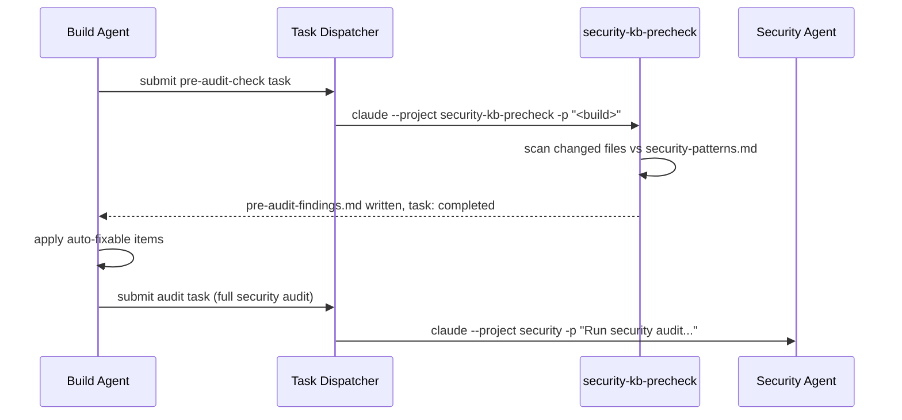

# Security KB Precheck

The security KB precheck is a headless `claude -p` project that runs a fast, automated scan before the full security audit. It reads the shared security patterns knowledge base, checks the build's changed files against known-bad patterns, and writes a structured findings file. The build agent applies auto-fixable items before dispatching the full audit, so the security agent focuses on judgment calls rather than mechanical checks.

**Project directory:** `~/.claude/projects/security-kb-precheck/`  
**Dispatch:** task dispatcher (`task_type: pre-audit-check`, `target_agent: security-kb-precheck`)  
**Write scope:** `~/.claude/comms/artifacts/audit-requests/<build_name>/pre-audit-findings.md` only  
**Findings format:** `~/.claude/templates/reports/pre-audit-findings.template.md`

## Purpose

The KB precheck fills the gap between "build agent finishes a phase" and "full security audit runs." It's fast and mechanical — pattern matching against `~/.claude/memory/shared/security-patterns.md`, not judgment. For anything that requires judgment (novel auth patterns, ambiguous exposure scope, tradeoff decisions), it flags the item and moves on. The security agent handles judgment.

This saves the security agent from spending audit time on issues the build agent could have caught and fixed already. It also narrows the audit scope: the audit request's `## Pre-audit findings` section references the findings file, and the security agent skips checks that already passed.

## How It's Invoked

The build agent submits a task after completing a phase:

```yaml
task_type: pre-audit-check
target_agent: security-kb-precheck
risk_level: low
payload:
  build_name: <string>
  changed_files:
    - path/to/file.py
    - path/to/config.yml
  build_type: docker-stack | code | config | mcp-server
```

The task dispatcher auto-approves and launches:

```bash
claude --project security-kb-precheck -p "<build_name>"
```

The session is headless — one pass, then done.

## What the Session Does

1. Read `~/.claude/memory/shared/security-patterns.md` — the shared KB of known-bad patterns (hardcoded secrets, exposed ports, missing auth, unsafe defaults)
2. Invoke the `security-baseline` skill scoped to the declared `build_type`
3. For each changed file in the payload: check against applicable patterns
4. Write findings to `~/.claude/comms/artifacts/audit-requests/<build_name>/pre-audit-findings.md` using the template format
5. Update the task status to `completed`
6. Exit — no interactive loop

On ambiguity (a pattern that might apply but context is unclear), the session notes the ambiguity under "Requires judgment" and continues. It does not pause or ask for clarification.

## Findings File Format

```markdown
---
build: <BUILD_NAME>
date: <YYYY-MM-DD>
checks-run: <N>
auto-fixable: <N>
requires-judgment: <N>
---

## Auto-fixable (build agent applies without asking)
- [ ] <check-id>: <file>:<line> — <what to change>

## Requires judgment (surface to Ted before fixing)
- <check-id>: <issue> — <why judgment is needed>

## Passed
- <check-id>: <description> — OK
```

The build agent reads `## Auto-fixable` and applies those items. It surfaces `## Requires judgment` items to the operator before the full audit runs. The security agent reads the full findings file as context when it starts the audit.

## Dispatch Flow



## Constraints

- **Cannot commit.** The session has no git access and cannot modify files in the build's working tree.
- **Writes one file only.** The only permitted write target is `pre-audit-findings.md` at the expected path. All other write attempts are rejected by the project's `settings.json` tool constraints.
- **One pass per invocation.** The session is not restarted if it exits cleanly. If the task dispatcher re-runs it (e.g., due to a crash), it overwrites the findings file.
- **Fail-closed.** If the findings file cannot be written (path doesn't exist, permissions issue), the task is marked `failed` and a Matrix notification fires to `#claudebox`.

## Standalone Value

The KB precheck is useful even without the full audit pipeline in place. If you just want automated pattern checking against a known-bad list before reviewing a build, you can submit a pre-audit-check task directly and read the findings file — no security agent session required.

## Related Docs

- [Security Agent](security-agent.md) — full audit workflow, triage categories, report format
- [Task Dispatcher](task-dispatcher.md) — headless dispatch mechanics, payload schema
- [Inter-Agent Communication](inter-agent-communication.md) — audit-requests directory layout
