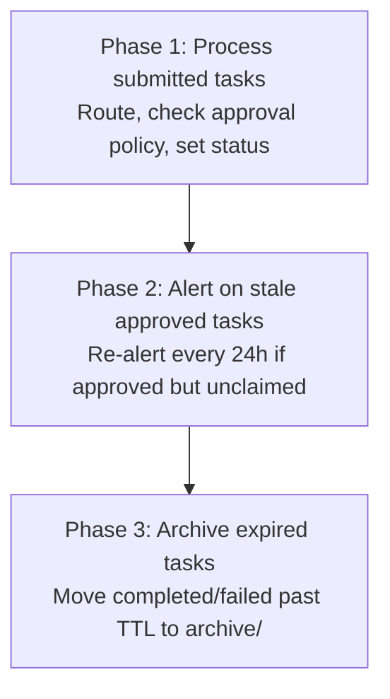
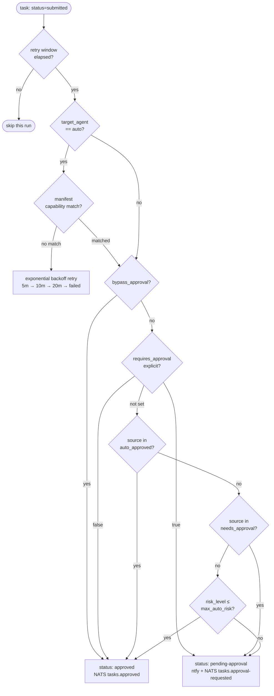

# Task Dispatcher

The task dispatcher is a Python script that runs every 2 minutes via PM2 cron. It manages the agent orchestration task queue: routing submitted tasks to agents, gating high-risk tasks on operator approval, alerting on stale work, and archiving completed tasks past their TTL.

**Script:** `~/scripts/task-dispatcher.py`  
**PM2 service:** `task-dispatcher` (cron: `*/2 * * * *`)  
**Task queue:** `~/.claude/task-queue/` (YAML files, one per task)

## How It Works

Each run executes three phases sequentially:



**Phase 1 approval routing:**



### Phase 1: Process Submitted Tasks

For each task with `status: submitted`:

1. **Retry eligibility check** — if `retry_policy.next_retry_at` is set and hasn't elapsed, skip this run. Tasks in exponential backoff stay at `submitted` but are invisible to the dispatcher until their window opens.

2. **Auto-routing** — if `target_agent` is `"auto"`, match `task_type` against agent manifest capabilities. Prefer claudebox-scoped agents; fall back to any capable agent. If no match, trigger routing failure handling (see below).

3. **Approval policy** — determined in priority order:
   - `bypass_approval: true` → auto-approve (system override; used by rogue-agent lockdown tasks)
   - `requires_approval: true/false` → explicit override
   - Source agent in target manifest's `interaction_permissions.auto_approved` → auto-approve
   - Source agent in target manifest's `interaction_permissions.needs_approval` → gate
   - Fallback: compare `risk_level` against manifest's `max_auto_risk`

4. **Status transition:**
   - Auto-approved → `status: approved`, NATS `tasks.approved` published, n8n approved webhook posted (`post_n8n_approved_webhook()` — triggers the n8n → trigger-proxy → RemoteTrigger session chain; fire-and-forget, no-op if `N8N_WEBHOOK_URL` unset)
   - Needs approval → `status: pending-approval`, ntfy notification sent, NATS `tasks.approval-requested` published
   - n8n submission webhook posted for every submitted task regardless of approval outcome (fire-and-forget, no-op if `N8N_WEBHOOK_URL` unset)

### Routing Failure: Exponential Backoff Retry

When routing fails (no manifest match, unknown agent, etc.), the dispatcher retries up to 3 times with exponential backoff before moving the task to the dead-letter queue:

| Attempt | Backoff |
|---------|---------|
| 1st retry | 5 minutes |
| 2nd retry | 10 minutes |
| 3rd retry | 20 minutes |
| Exhausted | moved to `dead-letters/`, ntfy high-priority alert |

The retry state is stored on the task YAML itself:

```yaml
retry_policy:
  retry_count: 1
  max_retries: 3
  next_retry_at: "2026-03-29T14:35:00+00:00"
  last_failure_reason: "No agent found for task_type=build_phase"
```

This means retries survive dispatcher restarts — the task file carries its own retry schedule. On failure exhaustion, `move_to_dead_letter()` is called, NATS `tasks.failed` is published, and a high-priority ntfy notification fires.

### Dead-Letter Queue

When a task exhausts all retry attempts, it is moved to `~/.claude/task-queue/dead-letters/` rather than left in the main queue or deleted. The move is atomic (`Path.rename()`). Dead-lettered tasks are retained indefinitely for audit purposes.

A high-priority ntfy notification fires on dead-letter with the task summary and last failure reason. To recover a dead-lettered task, move the YAML file back to `~/.claude/task-queue/`, reset `status` to `submitted`, and clear the `retry_policy` block — the dispatcher will pick it up on the next run.

### Phase 2: Alert Deduplication

When an approved task sits unclaimed for more than 24 hours, the dispatcher sends a stale alert. Prior to the fault-tolerance build, it re-alerted on every run after the threshold was crossed — producing a notification storm every 2 minutes.

**Alert dedup** limits re-alerts to once every 24 hours using an `alert_state` block on the task YAML:

```yaml
alert_state:
  first_alerted_at: "2026-03-29T10:00:00+00:00"
  last_alerted_at:  "2026-03-29T10:00:00+00:00"
  alert_count: 1
```

The dispatcher checks `last_alerted_at` before firing. If less than 24 hours have elapsed since the last alert, the notification is suppressed and logged as `"stale alert suppressed"`. `alert_count` increments on each actual notification — useful for knowing how long a task has been sitting unclaimed.

### Phase 3: Archive Expired Tasks

Terminal tasks (`completed` or `failed`) past their `ttl_days` (default 30) are moved to `~/.claude/task-queue/archive/`. The move is atomic (`Path.rename()`). Archived tasks are retained indefinitely for audit purposes.

## Task YAML Schema

```yaml
id: <uuid>
created: <ISO timestamp>
source_agent: <name>
target_agent: <name or "auto">
task_type: <string>
risk_level: low | medium | high
requires_approval: true | false  # optional explicit override
bypass_approval: true            # optional system override
status: submitted | pending-approval | approved | working | completed | failed
summary: <one-line description>
ttl_days: 30
payload:
  <task-type-specific fields>
result:
  output: null
  completed_by: null
  completed_at: null

# Set by dispatcher on routing failure:
retry_policy:
  retry_count: 0
  max_retries: 3
  next_retry_at: <ISO timestamp>
  last_failure_reason: <string>

# Set by dispatcher on stale approved alert:
alert_state:
  first_alerted_at: <ISO timestamp>
  last_alerted_at: <ISO timestamp>
  alert_count: 1

history:
  - timestamp: <ISO>
    status: <status>
    actor: <dispatcher | ted | <agent>>
    note: <string>
```

## task-approve CLI

`~/bin/task-approve` is a symlink to `~/scripts/task-approve.py`. Available subcommands:

```bash
task-approve list                        # show pending-approval tasks
task-approve status                      # show all tasks with colored status
task-approve <task-id>                   # approve a task
task-approve <task-id> --reject "reason" # reject, sets status: failed
task-approve clear-alerts <task-id>      # reset alert_state (stops re-alert storm)
```

**`clear-alerts`** was added in the fault-tolerance build. If a task has been alerting for hours and you want to silence re-alerts without approving or rejecting it, `clear-alerts` wipes the `alert_state` block entirely. The next alert will fire again after 24 hours when the threshold is crossed again. Useful when you've acknowledged the alert and want a clean quiet period.

Task IDs can be specified as full UUID or a prefix (8 chars is usually enough).

## Agent Manifest Fields

The dispatcher reads two fields from agent manifests:

**`max_auto_risk`** — highest risk level the dispatcher will auto-approve for this agent (fallback when source agent not listed in interaction_permissions).

**`interaction_permissions`** — per-source-agent approval policy:
```yaml
interaction_permissions:
  auto_approved:
    - temporal-worker   # these sources bypass approval for this agent
  needs_approval:
    - external-source   # these sources always require approval
```

If the source agent isn't in either list, `max_auto_risk` applies.

## Integration Points

**NATS JetStream:** The dispatcher publishes to these subjects on every transition:
- `tasks.submitted` — task picked up for routing
- `tasks.approved` — auto-approved
- `tasks.approval-requested` — gated on operator
- `tasks.failed` — routing exhausted or rejected
- `tasks.working` — published by `inject-task-queue.sh` when an agent picks up a task

All NATS publishes are fire-and-forget (`timeout=5`). If NATS is down, the dispatcher continues normally.

**n8n:** Posts task metadata to `N8N_WEBHOOK_URL` at two points in the lifecycle: on submission (routing and risk-based logic in the n8n task dispatcher workflow) and on approval (`post_n8n_approved_webhook()` — drives the n8n → trigger-proxy → RemoteTrigger agent session chain). Both are fire-and-forget. If `N8N_WEBHOOK_URL` is not set, both no-op silently.

**ntfy:** Sends notifications to `https://ntfy.example.com/your-channel` for:
- Pending-approval tasks (default priority)
- Stale approved tasks >24h unclaimed (default priority, deduplicated)
- Routing exhausted / task failed (high priority)

**inject-task-queue.sh (SessionStart hook):** Reads tasks with `status: approved` or `status: input-required` at Claude Code session start, injects summaries as `additionalContext`. The dispatcher sets status; the hook delivers tasks to agents.

## Gotchas and Lessons Learned

**Notification storm before alert dedup.** Prior to the `alert_state` implementation, a single stale task would fire a ntfy notification every 2 minutes indefinitely. On a 24h-unclaimed task, that's 720 notifications. The `alert_state` block on the task YAML is the fix — check `last_alerted_at` before alerting.

**Retry state survives restarts.** Because `retry_policy` is stored on the task file (not in memory), the backoff schedule persists across PM2 restarts, system reboots, and dispatcher crashes. A task will not be re-routed until `next_retry_at` has elapsed regardless of how many times the dispatcher has restarted.

**`bypass_approval` is a system-only field.** It's intended for rogue-agent lockdown tasks injected directly by system components. Tasks submitted by agents or humans should never set this field — they'd bypass all approval gating including `requires_approval: true`.

**Auto-routing (`target_agent: auto`) scans all manifests.** If two agents have overlapping capabilities and both are claudebox-scoped, the first match wins (dict iteration order). For deterministic routing, set `target_agent` explicitly on the task.

**task-approve partial ID matching.** The tool matches on full UUID, UUID prefix, or filename stem. If two tasks have IDs with the same 8-char prefix (extremely unlikely with UUID4), `find_task` returns the first file found by glob sort. Use the full UUID if ambiguity is a concern.

**Atomic writes everywhere.** Both `task-dispatcher.py` and `task-approve.py` use the `.tmp → rename` pattern for all writes. This prevents a half-written task file from being read mid-write by another tool or hook. If a write fails, the `.tmp` file is cleaned up and the original is untouched. New task files are created via `os.open(..., 0o600)` — they are only readable by the owning user. The `~/.claude/task-queue/` directory itself is `0700`. This prevents other local processes (e.g., Docker containers with a bind-mounted home directory) from reading task contents.

## Further Reading

- [NATS JetStream](nats-jetstream.md) — event bus for task lifecycle events
- [n8n](n8n.md) — webhook workflow engine that receives task submissions
- [Agent Orchestration](agent-orchestration.md) — task queue overview, lifecycle, agent manifest schema
- [Agent Workspace Check](agent-workspace-check.md) — pre-edit workspace resolver used by agents before picking up tasks

---

## Related Docs

- [Agent Orchestration](agent-orchestration.md) — higher-level overview of the queue and agent manifests
- [NATS JetStream](nats-jetstream.md) — event streaming for task transitions
- [n8n](n8n.md) — webhook routing layer on top of the dispatcher
- [Helm Temporal Worker](helm-temporal-worker.md) — Temporal worker that produces tasks via `raise_complete_async`
