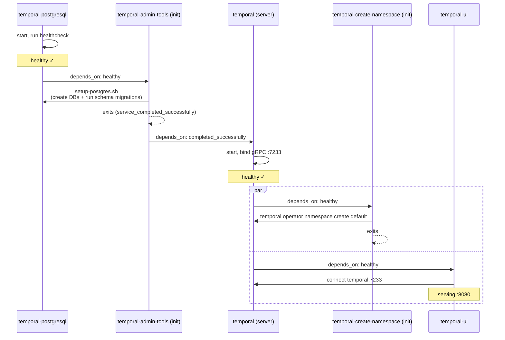

# Temporal

Temporal is a durable execution platform for reliable, long-running workflows. In this stack it provides the workflow engine for multi-phase build automation on the Helm platform — replacing ad-hoc script chains with structured workflows that survive failures, retries, and restarts. It runs as a 5-container Docker stack on a dedicated `temporal-network`, with the UI proxied at `temporal.yourdomain` behind Authelia.

The immediate use case is automating Helm platform build phases: each phase becomes a Temporal workflow, with activities for Docker stack deployment, health checks, SWAG configuration, and post-deploy verification. If a step fails, Temporal retries according to the workflow's retry policy rather than requiring manual re-entry.

## Why Temporal

Multi-phase infrastructure builds are inherently stateful and failure-prone. A deploy script that runs 12 steps sequentially is fragile — if step 7 fails, you need to know what ran, what didn't, and pick up from the right place. Temporal makes this explicit: workflows track state durably in Postgres, activities can retry independently, and the UI shows exactly where execution paused.

Temporal was chosen over:
- **Airflow** — designed for data pipelines; heavier, Python-centric, DAG-focused rather than workflow-focused
- **Prefect** — similar data-pipeline orientation; Temporal's workflow model is a better fit for infrastructure operations
- **Custom state machine in Python** — possible, but Temporal provides retry policies, timeout handling, visibility, and query APIs out of the box
- **n8n** — good for webhook-triggered routing (and already used for that); not designed for stateful multi-step workflows with durable retry semantics

Temporal's gRPC API is the key integration point — any worker (Python, Go, TypeScript) can register activities and workflows, making it agent-friendly for future automation.

## How It Works

The stack runs 5 containers on a dedicated `temporal-network`. The temporal-ui container also attaches to `claudebox-net` for SWAG proxy access. Two of the five containers are init containers that run once and exit.

### Containers

| Container | Image | Role |
|-----------|-------|------|
| temporal-postgresql | postgres:16 | Dedicated PostgreSQL for Temporal state |
| temporal-admin-tools | temporalio/admin-tools:1.30.2 | Init: schema creation and migration (exits) |
| temporal | temporalio/server:1.30.2 | gRPC workflow engine |
| temporal-create-namespace | temporalio/admin-tools:1.30.2 | Init: creates `default` namespace (exits) |
| temporal-ui | temporalio/ui:2.48.1 | Web UI |

### Startup Sequence

The init containers enforce a strict boot order:



`setup-postgres.sh` creates two databases (`temporal` and `temporal_visibility`) and runs the versioned schema migrations for both. The `|| true` on `create-database` makes restart-safe — if the databases already exist, the migration continues rather than aborting.

### Ports

- `127.0.0.1:7233` — Temporal gRPC API (localhost-only; worker and client connections)
- `temporal-ui:8080` — Web UI (internal only, proxied by SWAG at `temporal.yourdomain`)

### Storage

| Host Path | Purpose |
|-----------|---------|
| `/opt/appdata/temporal/postgres` | PostgreSQL data directory |
| `~/docker/temporal/dynamicconfig/` | Server dynamic config overrides (read-only mount) |
| `~/docker/temporal/scripts/` | Init container scripts (read-only mount) |

### Dynamic Config

The server loads `~/docker/temporal/dynamicconfig/development-sql.yaml` at runtime. Currently contains one override:

```yaml
system.forceSearchAttributesCacheRefreshOnRead:
  - value: true
    constraints: {}
```

This forces search attribute cache refresh on every read — useful during initial setup and namespace changes where stale caches can cause confusing query behavior.

## Configuration

**Docker Compose:** `~/docker/temporal/docker-compose.yml`

**Environment (`.env`):**

| Variable | Purpose |
|----------|---------|
| `POSTGRESQL_VERSION` | Postgres image tag (currently `16`) |
| `TEMPORAL_VERSION` | Server and admin-tools image tag (currently `1.30.2`) |
| `TEMPORAL_UI_VERSION` | UI image tag (currently `2.48.1`) |
| `POSTGRES_PASSWORD` | PostgreSQL password for the `temporal` user |

**SWAG proxy:** `temporal.subdomain.conf` — proxies port 8080 (temporal-ui) with SSL termination and Authelia authentication.

**Network:**
- `temporal-network` — isolated bridge network; all Temporal containers connect here
- `claudebox-net` — temporal-ui also attaches here for SWAG discovery

## Integration Points

**Helm platform build automation:** The primary integration target. Helm build workflows will register as Temporal workers, with each build phase (Docker stack deploy, SWAG config, health check, post-deploy verification) implemented as a Temporal activity. This replaces phase-by-phase manual execution with durable automated pipelines.

**Plane:** Plane tracks Helm build tasks. Temporal executes them. The intended flow: Plane work item status update triggers a Temporal workflow start (via an n8n webhook or direct API call); workflow activities update Plane status as build steps complete.

**n8n:** Complementary — n8n handles webhook-triggered routing (e.g., task submissions, notifications); Temporal handles stateful multi-step workflow execution. They may work together: n8n receiving a webhook and triggering a Temporal workflow start via the gRPC API.

**Task dispatcher:** The PM2 file-based task dispatcher is the current build automation mechanism. Temporal is its eventual replacement for multi-phase sequences that need durable state tracking. Single-task, short-lived operations may stay in the dispatcher; long multi-step workflows move to Temporal.

## Working with Temporal

**Web UI:** `https://temporal.yourdomain` — shows workflow executions, activity history, namespaces, and search attributes. Requires Authelia SSO.

**CLI (tctl / temporal):** The admin-tools image includes the `temporal` CLI. Access via the running server container:

```bash
# Connect to the default namespace
docker exec -it temporal temporal workflow list --namespace default

# Start a test workflow (requires a registered worker)
docker exec -it temporal temporal workflow start \
  --workflow-type MyWorkflow \
  --task-queue my-task-queue \
  --namespace default
```

**Checking gRPC connectivity:**

```bash
# Verify port is listening
ss -tlnp | grep 7233

# Test from a worker script
python -c "
from temporalio.client import Client
import asyncio
async def test():
    client = await Client.connect('localhost:7233')
    print('Connected:', client.identity)
asyncio.run(test())
"
```

## Gotchas and Lessons Learned

**Two init containers, both with `restart: on-failure`** — this is intentional. On initial deploy the containers run once and succeed. On subsequent `docker compose up` calls (restarts, updates), they run again. `|| true` on create-database and `|| true` on `namespace create` make them idempotent — they succeed even if the schema and namespace already exist. Do not change these to `restart: no` unless you're certain the Postgres volume is already migrated.

**`temporal-admin-tools` uses `restart: on-failure:6`** — not `unless-stopped`. If setup-postgres.sh fails (e.g., Postgres not ready despite healthcheck), the container retries 6 times then stops. Check `docker logs temporal-admin-tools` before assuming Postgres is the problem.

**Namespace must exist before workers connect** — `temporal-create-namespace` creates the `default` namespace at startup. If you delete the namespace manually or restore from a backup taken before namespace creation, workers will fail with a `namespace not found` error. Re-run the create-namespace container or use the CLI: `temporal operator namespace create --namespace default`.

**gRPC port is localhost-only** — `127.0.0.1:7233` means workers running in Docker containers cannot reach Temporal via `localhost:7233`. Worker containers on `claudebox-net` must connect via host networking or use the container name `temporal:7233` if they're on the same `temporal-network`. Currently the `temporal-network` is isolated — adding worker containers will require either joining them to `temporal-network` or using host.docker.internal.

**Dynamic config changes require a server restart** — the `dynamicconfig` directory is mounted read-only. Adding or changing settings takes effect on the next `docker compose restart temporal`.

**Schema migrations are versioned and forward-only** — `update-schema` applies migrations from the versioned directory. Rolling back a schema version is not supported by Temporal's migration tooling. If upgrading Temporal versions, run `setup-postgres.sh` to pick up any new migrations.

## Further Reading

- [Temporal documentation](https://docs.temporal.io/)
- [temporalio/server Docker setup](https://github.com/temporalio/docker-compose)
- [Temporal Python SDK](https://docs.temporal.io/develop/python)
- [Dynamic config reference](https://docs.temporal.io/references/dynamic-configuration)

---

## Related Docs

- [Plane](plane.md) — project tracking board for the Helm platform build
- [n8n](n8n.md) — webhook workflow engine (complementary, not dependent)
- [NATS JetStream](nats-jetstream.md) — event bus for task lifecycle observability
- [Agent Orchestration](agent-orchestration.md) — current task queue and dispatcher
- [Architecture overview](../../README.md) — Layer 3 context
