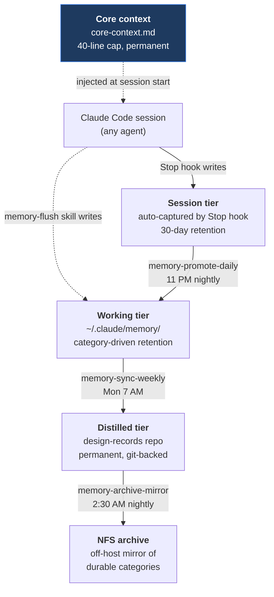
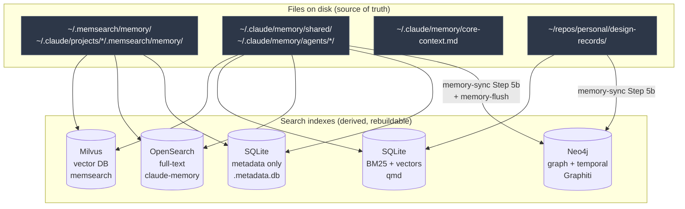
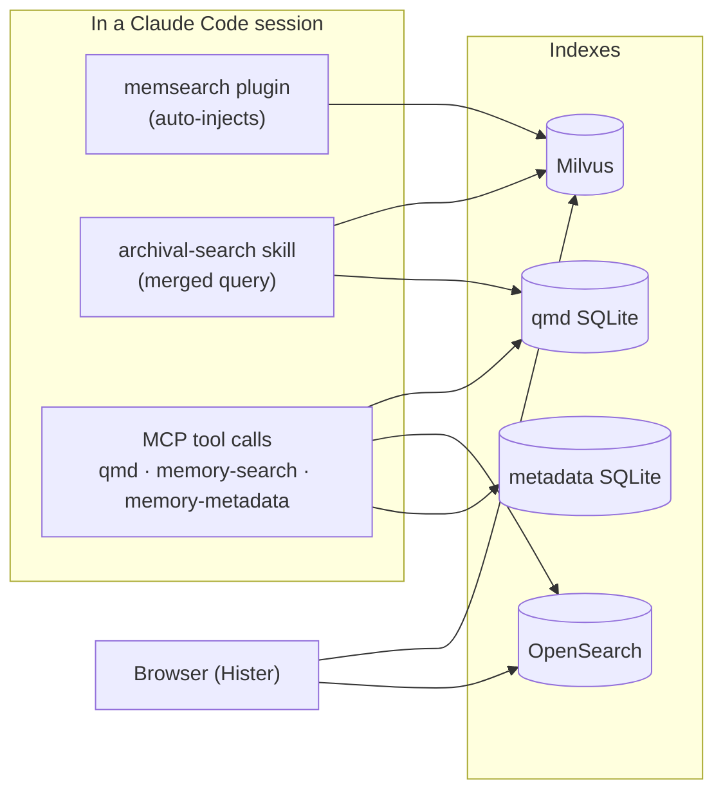
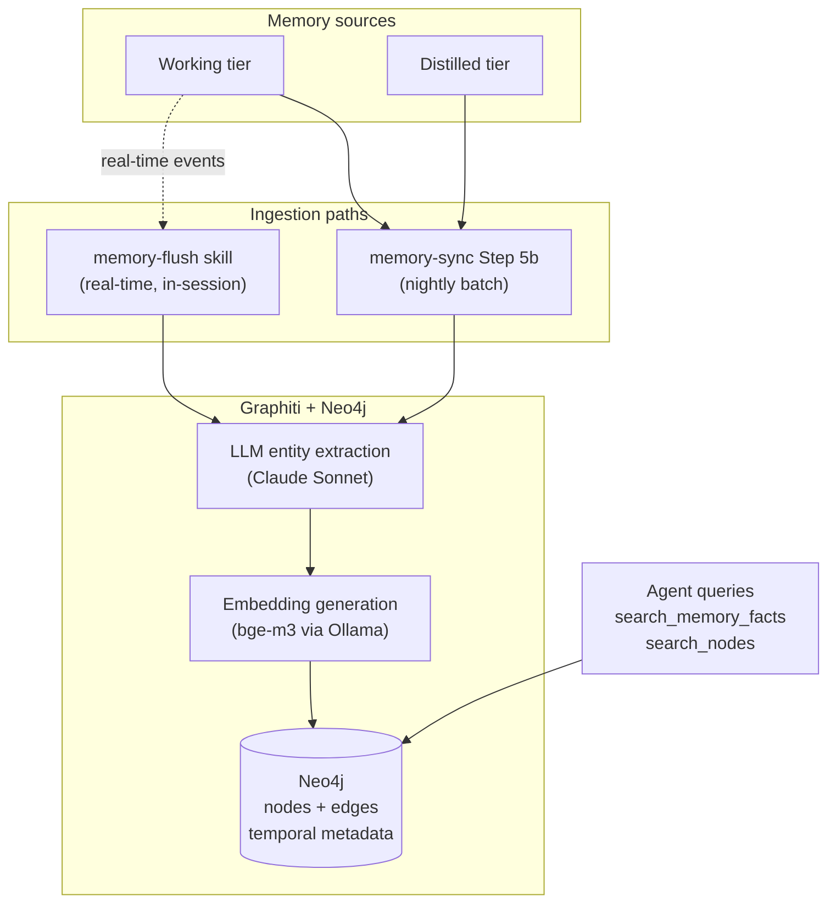

# Memory System Overview

This is the high-level tour of how persistent memory works across the homelab-agent stack — what the tiers are, where data lives, how it moves, and how agents pull it back out. Component-level deep dives live in [`components/`](components/); this doc exists so you can read a single page and understand the big picture before diving into any one piece.

If you're skimming for a specific answer: the [Memory Flow diagram in architecture.md](architecture.md#memory-flow-knowledge-accumulation) is the single most important visual in the system. Everything below builds on it.

## The Problem

LLM sessions are stateless. Every workaround — CLAUDE.md files, memory directories, vector search, knowledge graphs — is a hack to make the next session start with context from the last one.

The naive version is one big bucket: dump everything an agent says into a folder and let semantic search find it later. That works for a week. Then it doesn't, because session transcripts are noisy ("restarted the container three times before it worked"), durable decisions get buried under chatter, and there's no way to expire stale notes without deleting useful ones by accident.

The system documented here is what I built after the naive version stopped scaling. It has four surfaces with different lifetimes, an automated promotion pipeline that distills durable knowledge upward, and four search backends that agents reach for in different contexts.

## The Four Memory Surfaces

Memory is organized into tiers, each with its own location, retention, and purpose:

| Surface | Location | Retention | Purpose |
|---------|----------|-----------|---------|
| **Core context** | `~/.claude/memory/core-context.md` | Permanent (managed) | Always-visible profile, active projects, key constraints, recent decisions. Injected at every session start via SessionStart hook. 40-line cap. |
| **Session** | `~/.memsearch/memory/` and `~/.claude/projects/*/.memsearch/memory/` | 30 days | Raw session notes auto-captured by the memsearch Stop hook. The unfiltered transcript layer. |
| **Working** | `~/.claude/memory/shared/` and `~/.claude/memory/agents/<name>/` | Category-driven (90 days for `transient-finding`, never for durable categories) | Agent-curated knowledge — decisions, findings, design notes — written during work or promoted from sessions. |
| **Distilled** | `design-records` Gitea repo + NFS archive | Permanent (git-backed) | Working notes that survived the 14-day soak and pass the "would this matter in 3 months?" test. The long-term reference layer. |

Core context is the odd one out. It's not part of the promotion pipeline — it's a single file, manually curated via the `core-memory-update` skill, that gets injected into the prompt at session start so every agent sees it before any tool call runs. Think of it as the always-on header above everything else.

The other three tiers form a pipeline. Session notes are raw and disposable. Working notes are curated but expirable. Distilled notes are permanent. Knowledge moves upward as it earns durability.

## Knowledge Flow Between Tiers

Three things are happening here that are worth calling out separately:

**Auto-capture into session.** When a Claude Code session ends, a Stop hook writes a summary to the project's session memory directory. The agent doesn't have to think about it — the capture is automatic and complete (raw, unfiltered).

**Active write into working.** During an interactive session, an agent can write directly to working memory using the `memory-flush` skill. This is for genuinely durable findings the agent recognizes mid-session — design decisions, infrastructure changes, non-obvious constraints worth keeping around longer than 30 days.

**Promotion via cron.** The session → working → distilled progression is handled by scheduled jobs (covered below). Each step applies an editorial filter: session-to-working asks "does this contain anything durable?", working-to-distilled asks "would this matter in 3 months?" Notes that fail the filter expire on their TTL.

## Working-Tier Categories

Within the working tier, every note carries a `category:` frontmatter field that determines retention. There are six categories across two groups:

| Category | Expires | When to use |
|----------|---------|-------------|
| `transient-finding` | 90 days | Default for session findings, debugging notes, one-off research |
| `session-summary` | 30 days | End-of-session or mid-session summaries |
| `decision-record` | Never | Architecture decisions, tradeoffs chosen, non-obvious constraints |
| `design-document` | Never | System design docs, specs, plans that remain reference material |
| `research-finding-permanent` | Never | Benchmark results, evaluations, discoveries with lasting value |
| `competitive-snapshot` | Never | Tool/vendor comparisons, market state at a point in time |

Notes in durable categories are mirrored to the NFS archive nightly and seeded into a permanent Gitea repo (`ted/design-records`) for off-host retention. The expiring categories get pruned by the weekly memory-sync pass once they're past their TTL.

The inference rule for agents writing notes: if Ted asked for a writeup, evaluation, or design → durable category. If recording what happened in a session → `transient-finding` or `session-summary`. The default is conservative; durable categories are opt-in by intent.

## On-Disk Storage and Search Backends

Memory is just markdown files on disk. Search is provided by separate index databases that read those files. This is deliberate — the markdown is the source of truth, and any index can be wiped and rebuilt from scratch.

The five indexes serve different access patterns:

- **Milvus** — vector store for memsearch. Embeddings via `bge-m3` on a remote Ollama instance (1024-dim). Used for automatic in-session memory recall.
- **qmd's SQLite** — hybrid index (BM25 keyword + local GGUF vectors). Used for on-demand semantic search across repos, infra docs, and distilled memory.
- **OpenSearch** — full-text index over the first 2KB of every memory note. Isolated on a dedicated `memory-search-net` Docker network. Personal-agent only.
- **Metadata SQLite** — frontmatter-only index for structured filtered queries (category, tier, tag, date). All agents.
- **Neo4j (Graphiti)** — temporal knowledge graph capturing entity relationships. Fed from working and distilled tiers.

If any index gets corrupted, drops a schema version, or needs a model swap, you stop the indexer, wipe the database volume, and re-run the indexing job. The markdown files are untouched. This has been run end-to-end multiple times during embedding model upgrades — it's a non-event.

## How Agents Recall Memory

Five tools cover the full retrieval surface. Each has a different access pattern and a different scope:

| Tool | How agents reach it | What it searches | When agents use it |
|------|---------------------|------------------|-------------------|
| **memsearch** (plugin) | Automatic, in-session | Session + working tiers (Milvus) | Always-on. Plugin auto-injects relevant memories at session start and on each prompt. |
| **qmd** (MCP) | Explicit tool call | Repos + infra docs + distilled memory (SQLite) | "Search my docs for X." Broader than memory; covers all indexed collections. |
| **memory-search-mcp** (MCP, personal-agent only) | Explicit tool call | Full-text bodies (OpenSearch) | Personal-agent specifically — keyword/phrase search across all note bodies. |
| **memory-metadata-mcp** (MCP) | Explicit tool call | Frontmatter only (SQLite) | Inventory and audit queries — "list all decision-records from the last 30 days." |
| **archival-search** (skill) | Explicit skill invocation | All tiers via memsearch + qmd, merged | Recommended default for manual recall — runs both backends, labels results by tier. |

Plus a sixth surface for humans, not agents:

- **Hister** (browser UI) — self-hosted semantic + keyword search over the full memory corpus, accessible from any browser via SWAG behind Authelia. Independent of any live Claude session. Useful when you want to look something up without spawning an agent.

The redundancy between memsearch and qmd is intentional. Both index `~/.claude/memory/`, but they serve different access patterns: memsearch is silent and automatic during sessions; qmd is explicit and broader. An agent in flow doesn't have to remember to query — memsearch already injected the context. When the agent does have a specific question, qmd is the right tool.

## The Knowledge Graph as a Parallel Surface

Flat-file memory handles narrative knowledge well — decisions, rationale, session context. It's poor at relational queries. If you want to know which services depend on the SWAG reverse proxy, you'd have to grep across multiple docs and assemble the relationships in your head.

That's what the [Graphiti](components/graphiti.md) knowledge graph adds: a Neo4j-backed temporal graph where infrastructure entities are nodes and their relationships are edges with temporal validity. Agents query it with `search_memory_facts` and `search_nodes` for "what connects to what" answers.

The graph is populated automatically — agents don't think about graph maintenance. The `memory-flush` skill calls `add_memory` for real-time infrastructure events (deploys, network changes, service adds/removes). The nightly `memory-sync` Step 5b ingests touched notes in batch, using a content hash manifest to avoid duplicate work.

The entity ontology is constrained: Service, Host, Network, Configuration, Agent, User, Port. This keeps the graph focused on infrastructure topology rather than trying to model everything.

The graph supplements file-based memory rather than replacing it. CLAUDE.md instructions tell agents to prefer the graph for topology queries and file-based memory for historical decisions. Both surfaces are consulted as needed.

## Nightly Automation

Three PM2 cron jobs handle the promotion and indexing pipeline. They run at staggered times so each one inherits the settled state of the previous:

| Job | Schedule | Model | What It Does |
|-----|----------|-------|-------------|
| `memory-promote-daily` | 11:00 PM daily | Haiku | Scans the last 48 hours of session transcripts, promotes durable items to working tier (memory-sync Steps 1–3). Cheap and fast — runs every night. |
| `memory-pipeline` | 4:00 AM daily | — | Orchestrator. Runs memsearch compaction → qmd reindex. Refreshes search indexes against the latest working-tier state. |
| `memory-sync-weekly` | Mon 7:00 AM | Opus | Promotes 14-day-old working notes to distilled, ingests touched notes into Graphiti, expires 90-day notes, runs graph entity dedup (Steps 4–8). The expensive judgment-heavy pass. |
| `memory-archive-mirror` | 2:30 AM daily | — | rsync of durable-category notes to the NFS backup host. Off-host retention with point-in-time recovery (`current/` + dated `changes/`). |
| `memory-os-sync` | always-on | — | Batch-syncs memory notes to OpenSearch (30s intervals, 50-doc batches). Cursor-based incremental — only changed notes get pushed. |
| `memsearch-watch` | always-on | — | Watches all session and working memory directories. Re-indexes Milvus within 5 seconds of any write — so notes flushed mid-session are searchable in the same session. |

The split between daily Haiku and weekly Opus is a cost decision. Step 1–3 (transcript scanning, promotion) is mechanical and benefits from running every night with a faster model. Steps 4–8 (distillation judgment, graph dedup) need a more capable model and only need to run weekly. Splitting them by cadence cuts the API spend significantly versus running everything nightly with Opus.

The two always-on services (`memsearch-watch`, `memory-os-sync`) keep the search indexes current in near-real-time. Without them, you'd have a 24-hour window where memory writes weren't searchable. With them, the window is seconds.

## What This Looks Like in Practice

When I start a Claude Code session on a Monday morning:

1. The SessionStart hook injects core context (profile, active projects, recent decisions) into the prompt before any tool runs.
2. The memsearch plugin queries Milvus for memories relevant to the project context and silently injects them.
3. As I type, each new prompt triggers another memsearch query — relevant context surfaces without me asking.
4. If I need to look something up explicitly, I either invoke `archival-search` (merged across tiers) or call qmd directly through MCP.
5. As the session progresses, anything genuinely durable gets written to working memory via `memory-flush` (real-time, also fed to Graphiti).
6. When the session ends, the Stop hook writes a transcript summary to the session tier.
7. At 11 PM, `memory-promote-daily` scans those session transcripts and promotes durable items to working notes.
8. By Tuesday morning, the day's work is searchable through every backend.
9. The following Monday at 7 AM, `memory-sync-weekly` looks at notes from two weeks ago and promotes the ones that aged well to distilled.

Knowledge accumulates without manual curation. The pipeline is what makes that true.

## Standalone Adoption

You don't need the whole stack to get value out of this. The components compose, but each is independently useful:

- **Just memsearch + a memory directory.** Auto-recall in Claude Code sessions. No promotion pipeline, no graph. Useful immediately.
- **Add memory-sync.** Automatic distillation. The system starts self-curating.
- **Add qmd.** Broader search across repos and docs. Now the system isn't just memory — it's all your markdown.
- **Add Graphiti.** Topology and relationship queries. Useful once you have enough notes for the graph to be populated.
- **Add OpenSearch + memory-search-mcp.** Full-text body search. Niche but powerful for specific agents.

Start small. The minimum viable version is a memory directory and memsearch — that alone makes Claude Code sessions stop forgetting things. Everything else is layering.

## Related Docs

- [Architecture overview](architecture.md) — the broader system context, including the memory flow diagram in detail
- [memory-lifecycle](components/memory-lifecycle.md) — categories, retention, OpenSearch + SQLite metadata indexes
- [memory-pipeline](components/memory-pipeline.md) — nightly orchestrator (cron schedule, lock file, timeouts)
- [memory-sync](components/memory-sync.md) — the LLM-backed 9-step distillation agent
- [memsearch](components/memsearch.md) — session-tier semantic search (Milvus + bge-m3 via Ollama)
- [qmd](components/qmd.md) — broader hybrid search (BM25 + vectors), dual transport
- [graphiti](components/graphiti.md) — Neo4j temporal knowledge graph
- [hister](components/hister.md) — browser-based memory search UI
